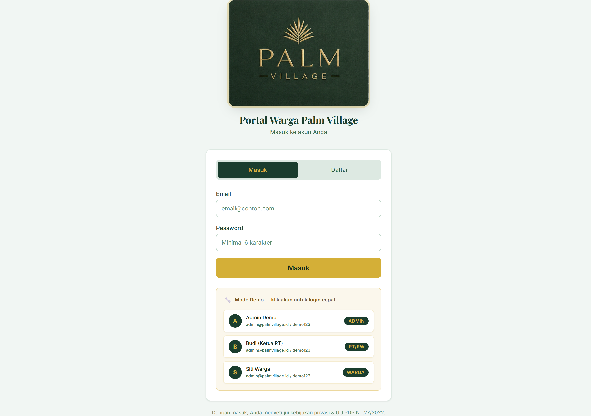
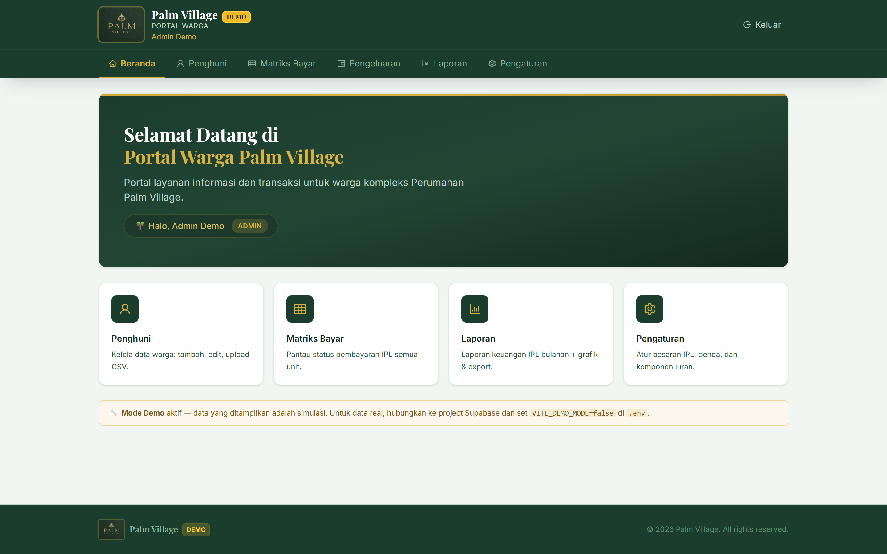
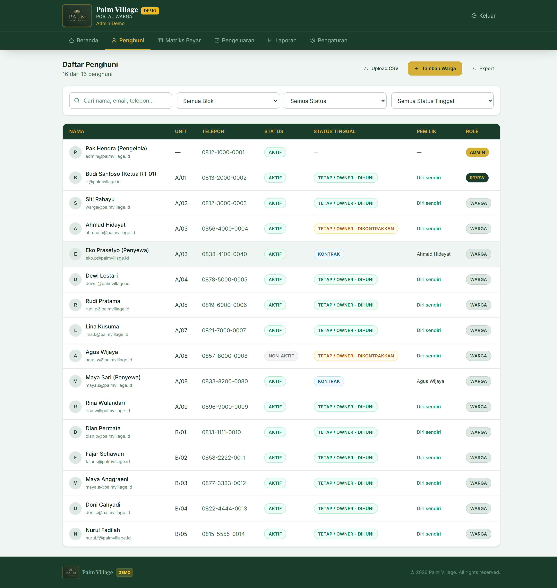
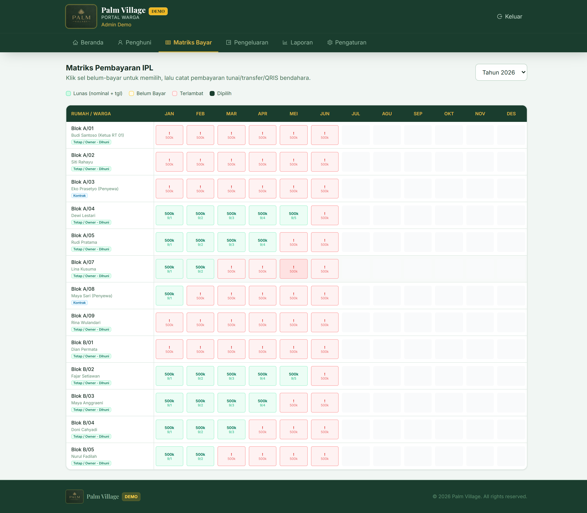
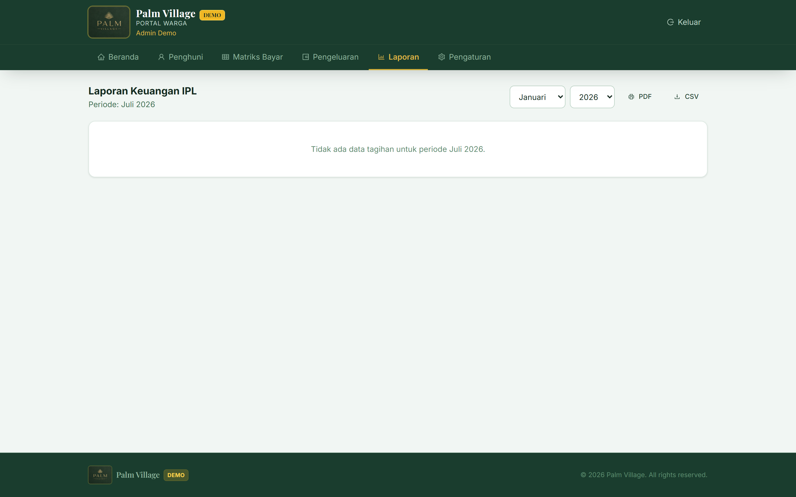
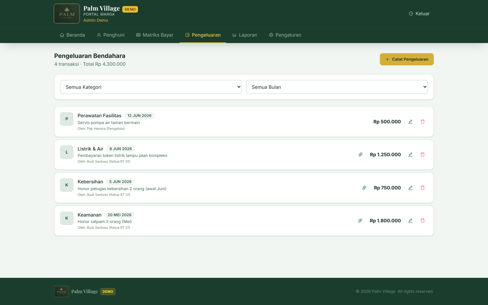
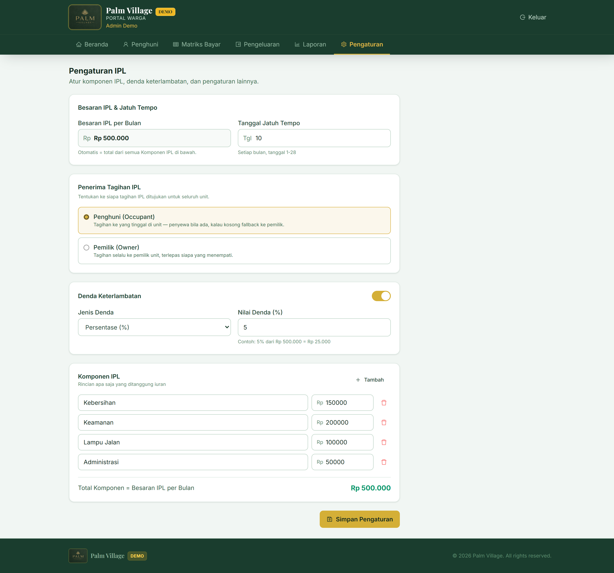

<div align="center">

# 🌳 Portal Warga Palm Village

### Portal Digital Terpadu untuk Kompleks Perumahan Palm Village

Kelola data warga, tagihan IPL (Iuran Pemeliharaan Lingkungan), pembayaran QRIS, laporan keuangan, dan transparansi pengelolaan dana RT/RW — semua dalam satu platform modern yang terinstal sebagai PWA di HP warga.

</div>

---

<p align="center">
  <a href="#-fitur"><kbd>🚀 Fitur</kbd></a>&nbsp;&nbsp;
  <a href="#-demo"><kbd>🎯 Demo</kbd></a>&nbsp;&nbsp;
  <a href="#%EF%B8%8F-arsitektur"><kbd>🏗️ Arsitektur</kbd></a>&nbsp;&nbsp;
  <a href="#-quick-start"><kbd>⚡ Quick Start</kbd></a>&nbsp;&nbsp;
  <a href="#-dokumentasi"><kbd>📚 Dokumentasi</kbd></a>
</p>

---

<div align="center">


</div>

---

## 🌟 Sorotan Fitur

<table>
<tr>
<td width="50%" valign="top">

### 🏠 Dashboard Interaktif
Ringkasan status IPL real-time: total tagihan, jumlah terkumpul, tunggakan, dan **rasio koleksi** — semua dalam kartu statistik yang ringkas.

### 👨‍👩‍👧‍👦 Manajemen Warga
Database warga lengkap dengan **import/export CSV massal**, pencarian cerdas, filter multi-kriteria, dan pelacakan status hunian (pemilik/penyewa).

### 💳 Matriks Pembayaran Multi-Tahun
Grid pembayaran **lintas tahun** yang memvisualkan status setiap unit per bulan. Pilih & bayar beberapa bulan **sekaligus** via QRIS.

</td>
<td width="50%" valign="top">

### 💰 Pelacakan Pengeluaran
Catat setiap pengeluaran RT dengan **bukti kwitansi**, kategori terstruktur, dan filter bulanan. Transparansi penuh untuk warga.

### 📊 Laporan Keuangan & Neraca
Grafik batang & pie interaktif, **neraca arus kas** otomatis (pemasukan vs pengeluaran), export CSV & print PDF siap audit.

### ⚙️ Konfigurasi IPL Fleksibel
Besaran IPL = **penjumlahan komponen** (Kebersihan, Keamanan, dll). Atur denda keterlambatan, jatuh tempo, dan penerima tagihan.

</td>
</tr>
</table>

---

## 🚀 Inovasi & Fitur Unggulan Phase 5 (Terbaru)

Portal Warga Palm Village telah dilengkapi dengan inovasi arsitektur mutakhir untuk kenyamanan, transparansi, dan keamanan maksimal:

<div align="center">
  <table>
    <tr>
      <td width="33%" valign="top" align="center">
        <h3>✨ 100% Solid Mobile Drawer</h3>
        <p>Menggunakan arsitektur <b>React Portal</b> (<code>document.body</code>) dengan rendering terisolasi. Navigasi drawer mobile bebas dari interferensi CSS transform/overflow container, menghasilkan animasi geser yang mulus, solid, dan tidak tembus pandang di semua perangkat HP.</p>
      </td>
      <td width="33%" valign="top" align="center">
        <h3>🔐 Google Auth & n8n JWT</h3>
        <p>Integrasi arsitektur pertukaran token <b>Google OAuth 2.0</b> dengan webhook automation n8n untuk menghasilkan klaim JWT berstandar Supabase. Login satu klik (One-Tap Sign-In) yang ultra-cepat dan aman dengan sinkronisasi profil otomatis.</p>
      </td>
      <td width="33%" valign="top" align="center">
        <h3>🛡️ Registration Approval</h3>
        <p>Sistem keamanan alur pendaftaran berjenjang. Setiap warga baru yang mendaftar via HP masuk dalam status <b>Pending Approval</b> dan wajib diverifikasi oleh Ketua RT/Pengurus sebelum memperoleh hak akses data lingkungan.</p>
      </td>
    </tr>
    <tr>
      <td width="33%" valign="top" align="center">
        <h3>💸 Verifikasi Transfer & Zoom</h3>
        <p>Modul verifikasi pembayaran transfer oleh Bendahara dilengkapi <b>High-Res Zoom Modal</b> untuk memeriksa bukti bayar, opsi Approve/Reject dengan catatan revisi, dan <b>Client-Side Image Compression</b> (&lt;500 KB) otomatis tanpa blur.</p>
      </td>
      <td width="33%" valign="top" align="center">
        <h3>📈 Running Balance System</h3>
        <p>Transformasi laporan keuangan menjadi neraca kumulatif berkelanjutan dengan <b>carry-forward</b> saldo awal dari bulan sebelumnya secara real-time dari Jan 2025. Dilengkapi grafik arus kas 3 garis dan ekspor CSV siap audit.</p>
      </td>
      <td width="33%" valign="top" align="center">
        <h3>🔔 Proactive Notifications</h3>
        <p>Sistem peringatan cerdas berlapis via <b>Interactive Banner</b> di Dashboard dan <b>Bell Badge Notification</b> di Header yang aktif memberi tahu warga jika terdapat tagihan IPL tertunggak atau status verifikasi pembayaran.</p>
      </td>
    </tr>
  </table>
</div>

---

## 📋 Status Fitur

| Fitur | Status | Detail |
|:------|:------:|:-------|
| 🔐 Autentikasi (Login/Register) | ✅ | Google OAuth 2.0 + Supabase JWT (n8n API ready), 4 role hierarki |
| 🏠 Dashboard & Menu Terkelompok | ✅ | Statistik real-time, navigasi terkelompok rapi & mobile drawer 100% solid |
| ✏️ Update Profil Mandiri | ✅ | Warga & staff dapat merubah Nama dan No. HP/WhatsApp secara langsung via modal |
| 👥 Manajemen Warga | ✅ | CRUD, CSV import/export, search, multi-filter |
| 💳 Matriks Pembayaran | ✅ | Multi-tahun, multi-bulan, validasi sequential |
| 📋 Daftar Tagihan IPL | ✅ | Filter periode/status, detail modal, bukti bayar |
| 📊 Laporan Keuangan | ✅ | Bar chart, pie chart, neraca, CSV export, print |
| 💰 Pengeluaran | ✅ | CRUD dengan kwitansi, kategori, filter bulan |
| ⚙️ Pengaturan IPL | ✅ | Komponen IPL, denda, jatuh tempo, penerima |
| 📱 PWA (Installable) | ✅ | Service worker, manifest, icon, update prompt |
| 💵 Integrasi Mayar QRIS | 🚧 | Schema siap, integrasi Edge Function Phase 2 |
| 📅 Kalender Acara | 🚧 | Schema DB siap, UI placeholder Phase 2 |
| 💬 Forum Diskusi | 🚧 | Schema DB siap (nested comments), UI Phase 2 |
| 🤖 Otomasi n8n | 🚧 | 4 workflow: webhook, billing, denda, notifikasi |
| 📲 Notifikasi WA/Email | 🚧 | Via n8n (Fonnte/Wablas + SMTP) |

> **Legenda:** ✅ Implemented &nbsp;|&nbsp; 🚧 Phase 2 / Planned &nbsp;|&nbsp; ⏳ Future

---

## 🎯 Demo

### Mode Demo Tanpa Backend

Aplikasi bisa langsung dijalankan **tanpa Supabase** menggunakan mode demo. Semua fitur UI berfungsi penuh dengan mock data realistis (15 unit, 16 warga, 100+ tagihan).

| Role | Email | Password | Akses |
|:-----|:------|:---------|:------|
| 👑 **Admin** | `admin@palmvillage.id` | `demo123` | Akses penuh sistem (Kelola User & Log) |
| 💰 **Bendahara** | `bendahara@palmvillage.id` | `demo123` | CRUD Pengeluaran, catat tunai & transfer |
| 📋 **Pengurus** | `pengurus@palmvillage.id` | `demo123` | Read-only pengeluaran, catat transfer only |
| 🧑 **Warga** | `warga@palmvillage.id` | `demo123` | Lihat unit & bayar IPL rumah sendiri |

---

## 📸 Screenshots

<div align="center">

### 🔐 Login Page


### 🏠 Dashboard Admin


### 👥 Manajemen Warga


### 💳 Matriks Pembayaran IPL


### 📊 Laporan Keuangan


### 💰 Pengeluaran


### ⚙️ Pengaturan IPL


</div>

---

## 🏗️ Arsitektur

```
┌─────────────────────────────────────────────────────────────────┐
│                         👤 WARGA / ADMIN                         │
│                   (Browser / PWA di HP & Desktop)                │
└──────────────────────────────┬──────────────────────────────────┘
                               │ HTTPS
                               ▼
┌─────────────────────────────────────────────────────────────────┐
│                    ⚡ VERCEL (React SPA + PWA)                   │
│  ┌──────────┐  ┌───────────┐  ┌──────────┐  ┌───────────────┐  │
│  │ Dashboard │  │ Payment   │  │ Reports  │  │ Settings &    │  │
│  │ & Warga   │  │ Matrix    │  │ & Charts │  │ Expenses      │  │
│  └──────────┘  └───────────┘  └──────────┘  └───────────────┘  │
│         React 18 · Vite 5 · TailwindCSS · React Query           │
└──────┬────────────────────────────────────────────┬─────────────┘
       │ Supabase JS SDK                           │ Webhook / REST
       ▼                                           ▼
┌──────────────────────────────┐   ┌──────────────────────────────┐
│    🟢 SUPABASE CLOUD         │   │      🔄 n8n AUTOMATION       │
│  ┌────────────────────────┐  │   │  ┌────────────────────────┐  │
│  │ Auth (Email/OTP)       │  │   │  │ Webhook Mayar          │  │
│  │ PostgreSQL + RLS       │◄─┼───┼─▶│ Cron Billing Bulanan   │  │
│  │ Edge Functions (QRIS)  │  │   │  │ Cek Denda Otomatis     │  │
│  │ Storage (Kwitansi)     │  │   │  │ Notifikasi WA + Email  │  │
│  └────────────────────────┘  │   │  └────────────────────────┘  │
└──────────────┬───────────────┘   └──────────────┬───────────────┘
               │ API Call                         │ API Call
               ▼                                  ▼
          ┌─────────┐                    ┌─────────────────┐
          │ Mayar   │                    │ WhatsApp / SMTP │
          │ (QRIS)  │                    │ (Fonnte/Wablas) │
          └─────────┘                    └─────────────────┘
```

### Alur Pembayaran IPL

```
Warga pilih bulan ──▶ Generate QRIS (Mayar) ──▶ Scan & Bayar
                                                       │
                                                       ▼
                                              Webhook Mayar → n8n
                                                       │
                                       ┌───────────────┼───────────────┐
                                       ▼               ▼               ▼
                                  Update DB      Notifikasi WA    Kirim Email
                                  (paid)         "Terima kasih"    (Receipt)
```

---

## 👥 Role-Based Access Control (RBAC)

Sistem memiliki 4 role dengan pembagian hak akses terperinci. Keamanan diterapkan dua lapis: frontend route guard + database RLS.

| Halaman / Fitur | 👑 Admin | 💰 Bendahara | 📋 Pengurus | 🧑 Warga |
|:----------------|:--------:|:------------:|:-----------:|:-------:|
| 🏠 Dashboard | ✅ | ✅ | ✅ | ✅ |
| 👥 Daftar Warga | ✅ CRUD + CSV | ✅ CRUD + CSV | ✅ CRUD + CSV | 👁️ Lihat saja |
| 💳 Matriks Pembayaran | ✅ Semua unit | ✅ Semua unit | ✅ Semua unit | ✅ Unit sendiri |
| 📝 Catat Bayar Tunai | ✅ | ✅ | ❌ | ❌ |
| 📝 Catat Bayar Transfer | ✅ | ✅ | ✅ | ❌ |
| 💵 Bayar IPL (QRIS) | ❌ | ❌ | ❌ | ✅ |
| 📊 Laporan Keuangan | ✅ | ✅ | ✅ | 🔒 Blocked |
| 💰 Pengeluaran (CRUD) | ✅ | ✅ | 👁️ Lihat saja | 🔒 Blocked |
| ⚙️ Pengaturan IPL (Edit)| ✅ | 👁️ Lihat saja | 👁️ Lihat saja | 🔒 Blocked |
| 👤 Kelola User (CRUD) | ✅ | ❌ | ❌ | ❌ |
| 📋 Log Sistem (Audit) | ✅ | ❌ | ❌ | ❌ |
| 📅 Kalender Acara | 🚧 | 🚧 | 🚧 | 🚧 |
| 💬 Forum Diskusi | 🚧 | 🚧 | 🚧 | 🚧 |

---

## 🛠️ Tech Stack

| Kategori | Teknologi | Versi |
|:---------|:----------|:-----:|
| ⚛️ **Frontend Framework** | React | 18.2 |
| ⚡ **Build Tool** | Vite | 5.0 |
| 🎨 **Styling** | TailwindCSS | 3.4 |
| 🔄 **State Management** | @tanstack/react-query | 5.17 |
| 📊 **Charts** | Recharts | 3.9 |
| 🎯 **Icons** | React Icons | 4.12 |
| 📄 **CSV Processing** | PapaParse | 5.5 |
| 📱 **PWA** | vite-plugin-pwa (Workbox) | 1.3 |
| 🟢 **Backend & Auth** | Supabase (PostgreSQL + Auth + RLS) | 2.39 |
| ⚡ **Edge Functions** | Supabase (Deno/TypeScript) | — |
| 🔄 **Automation** | n8n (self-hosted) | — |
| 💵 **Payment Gateway** | Mayar (QRIS) | — |
| 📲 **Notifikasi** | WhatsApp (Fonnte/Wablas) + Email (SMTP) | — |
| 🚀 **Deployment** | Vercel (frontend) + Supabase Cloud (backend) | — |

---

## ⚡ Quick Start

### Opsi A: Mode Demo (Tanpa Backend) — ⚡ 2 Menit

```bash
# 1. Clone repository
git clone https://github.com/kodok-ijho/PortalWarga.git
cd PortalWarga/client

# 2. Install dependencies
npm install

# 3. Buat file .env (demo mode)
echo "VITE_DEMO_MODE=true" > .env

# 4. Jalankan!
npm run dev
```

Buka `http://localhost:5173`, login dengan akun demo (lihat tabel di atas).

---

### Opsi B: Production Setup (Dengan Supabase)

<details>
<summary><strong>🔧 Setup lengkap (klik untuk expand)</strong></summary>

#### 1. Clone & Install
```bash
git clone https://github.com/kodok-ijho/PortalWarga.git
cd PortalWarga/client
npm install
```

#### 2. Setup Supabase
1. Buat project baru di [supabase.com](https://supabase.com)
2. Buka **SQL Editor** → paste & run [`supabase/schema.sql`](./supabase/schema.sql)
3. Buka **Authentication** → enable Email/OTP
4. Buat akun admin awal manual di **Auth → Users**
5. Set role admin di tabel `profiles`

#### 3. Konfigurasi Environment
```bash
cp .env.example .env
```
Edit `.env`:
```env
VITE_DEMO_MODE=false
VITE_SUPABASE_URL=https://your-project.supabase.co
VITE_SUPABASE_ANON_KEY=your-anon-public-key
```

#### 4. Jalankan
```bash
npm run dev
```

#### 5. (Opsional) Setup n8n Automation
- Impor 4 workflow: webhook Mayar, cron billing bulanan, cek denda, notifikasi
- Set credentials: Mayar API, WhatsApp gateway, SMTP
- Detail: lihat [`PLAN.md`](./PLAN.md)

</details>

---

## 🔧 Environment Variables

| Variable | Deskripsi | Required | Default |
|:---------|:----------|:--------:|:-------:|
| `VITE_DEMO_MODE` | Aktifkan mode demo (tanpa Supabase) | ✅ | `true` |
| `VITE_SUPABASE_URL` | URL project Supabase | ❌* | — |
| `VITE_SUPABASE_ANON_KEY` | Anon public key Supabase | ❌* | — |

> *\*Wajib jika `VITE_DEMO_MODE=false`*

<details>
<summary><strong>🔐 Backend Secrets (Supabase & n8n)</strong></summary>

Set via Supabase Dashboard → Edge Function Secrets:
```
MAYAR_API_KEY=your_mayar_sandbox_key
MAYAR_API_SECRET=your_mayar_sandbox_secret
```

n8n Credentials:
```
N8N_MAYAR_WEBHOOK_SECRET=your_webhook_secret
WA_GATEWAY_TOKEN=your_fonnte_or_wablas_token
SMTP_HOST=smtp.your-provider.com
SMTP_USER=your@email.com
SMTP_PASS=your_smtp_password
```

</details>

---

## 📊 Database Schema

Supabase PostgreSQL dengan **9 tabel**, **Row Level Security** di semua tabel, dan trigger otomatis.

### Core Tables (Phase 1)

```
┌─────────────────┐     ┌──────────────────┐     ┌─────────────────┐
│    profiles     │     │      units       │     │    ipl_bills    │
├─────────────────┤     ├──────────────────┤     ├─────────────────┤
│ id (uuid) 🔑    │◀────│ id (bigint) 🔑   │◀────│ id (uuid) 🔑    │
│ full_name       │     │ block            │     │ unit_id → units │
│ phone           │     │ unit_number      │     │ resident_id     │
│ role (enum)     │     │ floor            │     │ period (YYYY-MM)│
│ unit_id → units │     │ size             │     │ amount          │
│ is_active       │     │ is_occupied      │     │ late_fee        │
└─────────────────┘     └──────────────────┘     │ due_date        │
                                                 │ status (enum)   │
┌─────────────────┐                              │ qris_ref        │
│   payments      │◀─────────────────────────────│ payment_id      │
├─────────────────┤                              └─────────────────┘
│ id (uuid) 🔑    │
│ ipl_bill_id     │     ┌──────────────────┐
│ resident_id     │     │    expenses      │
│ amount          │     ├──────────────────┤     (Phase 1 — di mockData)
│ method (enum)   │     │ category         │
│ transaction_id  │     │ amount           │
│ status (enum)   │     │ description      │
│ paid_at         │     │ receipt_url      │
│ metadata (json) │     │ recorded_by      │
└─────────────────┘     └──────────────────┘
```

### Community Tables (Phase 2 — Schema siap)

```
┌─────────────────┐  ┌──────────────────┐  ┌─────────────────┐
│     events      │  │      rsvp        │  │ forum_categories│
├─────────────────┤  ├──────────────────┤  ├─────────────────┤
│ title           │  │ event_id → events│  │ name (unique)   │
│ description     │  │ resident_id      │  │ description     │
│ event_date      │  │ status (enum)    │  └─────────────────┘
│ location        │  └──────────────────┘  ┌─────────────────┐
│ created_by      │                        │  forum_threads  │
└─────────────────┘                        ├─────────────────┤
                                           │ title           │
                                           │ author_id       │
                                           │ is_pinned       │
                                           │ is_locked       │
                                           └─────────────────┘
                                                      │
                                           ┌─────────────────┐
                                           │   forum_posts   │
                                           ├─────────────────┤
                                           │ thread_id       │
                                           │ author_id       │
                                           │ parent_id (nsted)│
                                           │ content         │
                                           └─────────────────┘
```

<details>
<summary><strong>🔒 Row Level Security (RLS) Policy Details</strong></summary>

RLS diaktifkan di **semua 9 tabel**. Helper functions: `current_role()` dan `is_staff()` (admin + rt_rw).

| Tabel | SELECT | INSERT | UPDATE | DELETE |
|:------|:------:|:------:|:------:|:------:|
| `profiles` | Self / Staff | Self | Self | — |
| `units` | Everyone | Admin | Admin | Admin |
| `ipl_bills` | Own / Staff | Staff | Staff | Staff |
| `payments` | Own / Staff | Self / Staff | Staff | Staff |
| `events` | Everyone | Staff | Staff | Staff |
| `rsvp` | Everyone | Self | Self | Self |
| `forum_categories` | Everyone | Staff | Staff | Staff |
| `forum_threads` | Everyone | Author | Author / Staff | Author / Staff |
| `forum_posts` | Everyone | Author | Author / Staff | Author / Staff |

**Triggers otomatis:**
- `handle_new_user()` — auto-buat row `profiles` saat signup
- `touch_updated_at()` — auto-update `updated_at` di profiles, ipl_bills, forum_threads

</details>

---

## 📦 Struktur Project

```
PortalPalmVillage/
│
├── 📄 README.md                    ← Anda di sini!
├── 📄 PLAN.md                      ← Detail arsitektur & roadmap
├── 🔧 vercel.json                  ← SPA rewrite config
├── 🚫 .gitignore
│
├── 📁 supabase/
│   └── 📄 schema.sql               ← Full DB schema + RLS + triggers + seed
│
├── 📁 image/                       ← Aset gambar project
│
├── 📁 legacy-backend/              ← ⚠️ DEPRECATED (Express + MongoDB, arsip)
│
└── 📁 client/                      ← 🎯 MAIN FRONTEND (React + Vite)
    │
    ├── 📄 package.json             ← Dependencies & scripts
    ├── ⚙️ vite.config.js           ← Vite + PWA config
    ├── 🎨 tailwind.config.js       ← Custom theme (Forest + Gold)
    ├── 🔧 postcss.config.js
    ├── 📄 index.html               ← Entry HTML + PWA meta tags
    │
    ├── 📁 public/                  ← Static assets & PWA icons
    │   ├── 🖼️ logo.png
    │   ├── 🖼️ pwa-192x192.png
    │   ├── 🖼️ pwa-512x512.png
    │   ├── 🖼️ pwa-maskable-*.png
    │   └── 🖼️ favicon-*.png
    │
    └── 📁 src/
        │
        ├── 📄 main.jsx             ← Entry point
        ├── 📄 App.jsx              ← Router + Providers + Lazy loading
        ├── 🎨 index.css            ← Tailwind + custom component classes
        │
        ├── 📁 context/
        │   ├── 🔐 AuthContext.jsx  ← Dual-mode auth (Demo + Supabase)
        │   └── 🔔 ToastContext.jsx ← Global notification system
        │
        ├── 📁 hooks/
        │   ├── 📄 useAuth.js       ← Re-export AuthContext
        │   └── 📄 useToast.js      ← Re-export ToastContext
        │
        ├── 📁 services/
        │   ├── 🟢 supabaseClient.js← Supabase client init
        │   └── 📦 mockData.js      ← ~800 baris mock data + helpers
        │
        ├── 📁 components/
        │   ├── 🧩 Layout.jsx       ← ProtectedLayout (auth guard)
        │   ├── 🧭 Header.jsx       ← Top nav, role-based menu
        │   ├── 📦 Footer.jsx
        │   ├── 🪟 Modal.jsx        ← Reusable modal dialog
        │   ├── 📭 Placeholder.jsx  ← Phase 2 placeholder
        │   └── 🔄 PWAUpdatePrompt.jsx
        │
        └── 📁 pages/
            ├── 🏠 Home.jsx         ← Dashboard
            ├── 🔐 Login.jsx        ← Login/Register
            ├── 👥 Residents.jsx    ← CRUD + CSV (lazy)
            ├── 💳 PaymentMatrix.jsx← Multi-tahun grid (lazy)
            ├── 📋 IPLBills.jsx     ← Daftar tagihan
            ├── 📊 Reports.jsx      ← Charts + neraca (lazy)
            ├── 💰 Expenses.jsx     ← CRUD pengeluaran (lazy)
            ├── ⚙️ Settings.jsx     ← Konfigurasi IPL (lazy)
            ├── 📅 Calendar.jsx     ← Phase 2
            ├── 💬 Forum.jsx        ← Phase 2
            └── ❌ NotFound.jsx     ← 404
```

---

## 🎨 Design System

### Color Palette

Didesain mengikuti logo Palm Village — nuansa **hijau hutan** yang menenangkan dengan aksen **emas** yang elegan.

<table>
<tr>
<td width="50%" valign="top">

#### 🌲 Forest (Primary)

| Shade | Hex | Usage |
|:-----:|:----|:------|
| `forest-50` | `#f1f6f3` | Background |
| `forest-100` | `#dde9e2` | Borders |
| `forest-500` | `#2d6a4f` | Accents |
| **`forest-800`** | **`#1a3d2e`** | **Primary (Logo)** |
| `forest-900` | `#0f2620` | Headings |
| `forest-950` | `#0a1813` | Darkest |

</td>
<td width="50%" valign="top">

#### ✨ Gold (Accent / CTA)

| Shade | Hex | Usage |
|:-----:|:----|:------|
| `gold-50` | `#fbf7ec` | Light bg |
| `gold-100` | `#f6eed3` | Hover bg |
| **`gold-500`** | **`#d4af37`** | **CTA / Active** |
| `gold-600` | `#bf9b2e` | Hover |
| `gold-700` | `#9e8024` | Pressed |

</td>
</tr>
</table>

### Typography

| Type | Font | Usage |
|:-----|:-----|:------|
| **Sans** | Inter (400-700) | Body text, UI |
| **Display** | Playfair Display (600-700) | Headings |

### Custom CSS Classes

```css
.pv-card         /* Standard card: rounded-xl, shadow, border */
.pv-btn-primary  /* Gold CTA button */
.pv-btn-ghost    /* Transparent hover button */
.pv-btn-danger   /* Red danger button */
.pv-badge        /* Small uppercase badge */
.pv-input        /* Form input with gold focus ring */
```

---

## 🔐 Keamanan

### Two-Layer Security

```
┌─────────────────────────────────┐
│   Layer 1: Frontend Route Guard │  ← Cegit akses halaman
│   (React Router + role check)   │     berdasarkan role
└────────────────┬────────────────┘
                 ▼
┌─────────────────────────────────┐
│   Layer 2: Database RLS         │  ← Cegit akses data
│   (Supabase Row Level Security) │     di level PostgreSQL
└─────────────────────────────────┘
```

| Aspek | Implementasi |
|:------|:-------------|
| 🔒 **Data Access** | RLS di semua 9 tabel — warga hanya akses data sendiri |
| 🔑 **Authentication** | Google Account OAuth 2.0 via Supabase Auth + JWT Bearer Token (n8n backend ready) |
| 🛡️ **Route Protection** | `ProtectedLayout` guard + per-page role check |
| 🔁 **Session** | Auto-refresh token, persist via HttpOnly cookie |
| 🚫 **Sequential Payment** | `canPayBill()` — cegit bayar bulan yang belum wajib |

---

## 🚀 Deployment

### Frontend → Vercel

1. **Push** ke GitHub repo ini
2. **Import** project di [Vercel](https://vercel.com)
3. **Set Root Directory** → `client`
4. **Set Environment Variables:**
   ```
   VITE_DEMO_MODE=false
   VITE_SUPABASE_URL=your_url
   VITE_SUPABASE_ANON_KEY=your_key
   ```
5. **Deploy!** Build command & output auto-detected (`npm run build` → `dist/`)

### Backend → Supabase Cloud
- Database: managed PostgreSQL
- Auth: built-in Email/OTP
- Storage: untuk kwitansi & receipt
- Edge Functions: deploy QRIS integration

### Automation → n8n (self-hosted)
- 4 workflow: webhook Mayar, cron billing, cek denda, notifikasi

---

## 📚 Dokumentasi

| Dokumen | Isi |
|:--------|:----|
| 📄 **[README.md](./README.md)** | Dokumen ini — overview & quick start |
| 📄 **[PLAN.md](./PLAN.md)** | Detail arsitektur, skema data, roadmap pengembangan |
| 🗄️ **[schema.sql](./supabase/schema.sql)** | Full database schema + RLS policies + triggers |

---

## 🗺️ Roadmap

### ✅ Phase 1 & Phase 5 — Core & Advanced RBAC (Current)
- [x] Autentikasi dual-mode (Demo + Supabase) & Registrasi Mandiri (HP)
- [x] 4-Tier RBAC (Warga, Pengurus, Bendahara, Admin) & Kontrol UI/UX per Role
- [x] Workflow Approval User baru oleh Pengurus
- [x] Workflow Verifikasi Bukti Pembayaran Transfer oleh Bendahara (Revisi & Batal)
- [x] Kompresi Gambar otomatis sisi klien (Canvas API, <500 KB)
- [x] Manajemen warga + CSV & Kelola User oleh Admin
- [x] Matriks pembayaran multi-tahun & status pending verifikasi
- [x] Laporan keuangan Running Balance & Neraca Alur Kas
- [x] Pengeluaran + kwitansi & Audit Log Sistem (Login, Akses, Transaksi)
- [x] Pengaturan IPL (komponen-based) & Dasbor Proaktif dengan Banner/Badge
- [x] PWA (installable, offline-ready)

### 🚧 Phase 2 — Integrasi & Komunitas
- [ ] Integrasi Mayar QRIS via Edge Function
- [ ] Otomasi n8n (billing, denda, notifikasi)
- [ ] Kalender acara + RSVP
- [ ] Forum diskusi (nested comments)
- [ ] Notifikasi WhatsApp & Email

### ⏳ Phase 3 — Enhancement
- [ ] Push notifications
- [ ] Multi-complex support
- [ ] Mobile app (React Native / Capacitor)
- [ ] Advanced analytics dashboard

---

## 📄 License

Distributed under the **MIT License**. See `LICENSE` file for details.

---

<div align="center">

### 🌳 Portal Warga Palm Village

**Dibuat dengan ❤️ untuk warga Palm Village**

[⬆ Kembali ke atas](#-portal-warga-palm-village)

</div>
