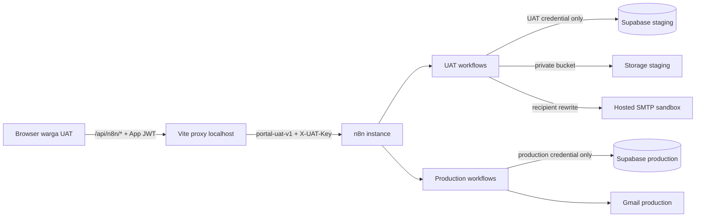

# Plan dan Desain UAT Portal Warga

> Sistem: Portal Warga Palm Village  
> Status: Approved design baseline — belum dieksekusi  
> Tanggal: 10 Agustus 2026  
> Requirement: `WargaUAT_Requirement.md`  
> Task: `WargaUAT_Task.md`

## 1. Ringkasan Desain

UAT memakai frontend Vite lokal dan Supabase staging yang sudah disiapkan pemilik. Workflow UAT ditempatkan pada instance n8n yang sama dengan production, tetapi dipisahkan secara struktural melalui webhook namespace, credential, transport key, data, storage, dan email provider. Production tetap melayani warga pilot dan tidak menjadi target test.

Penamaan workflow membantu operasi, tetapi bukan kontrol keamanan. Kontrol utama adalah:

- production: `/webhook/portal-v1/*` dan credential production;
- UAT: `/webhook/portal-uat-v1/*` dan credential staging;
- browser hanya mengakses same-origin proxy;
- proxy memilih environment secara server-side;
- startup/build guard menolak konfigurasi silang;
- workflow UAT hanya aktif selama jendela test.

`WargaUAT_Plan.md` berfungsi sebagai design document dalam alur spec-driven Kiro: requirement menjelaskan apa yang wajib terjadi, plan ini menjelaskan desain dan kontraknya, sedangkan task menjelaskan urutan implementasi.

## 2. Baseline yang Telah Diketahui

- Frontend memakai `/api/n8n` secara default melalui `client/src/services/apiClient.js`.
- Proxy development saat ini menambahkan `/webhook/portal-v1` pada `client/vite.config.js`.
- Proxy Vercel pada `api/n8n.js` dan salinannya di `client/api/n8n.js` juga menambahkan `/webhook/portal-v1`.
- Route `/houses` sudah ada, tetapi hak akses warga harus dibuktikan konsisten di helper frontend dan workflow backend.
- Payment Matrix menerima multi-bill pada sebagian alur, tetapi submission warga dan atomicity backend harus diaudit.
- Batas file Payment Matrix saat ini 2 MB sebelum kompresi; target produk adalah 5 MB.
- Endpoint `/auth/demo` dan data credential demo masih harus diperlakukan sebagai temuan keamanan sampai dinonaktifkan dan dibersihkan pada fase remediasi.
- `client/src/staging.env` berisi variable berprivilege tinggi dengan awalan `VITE_`; key berprivilege staging wajib dirotasi dan dipindah sebelum UAT.

## 3. Arsitektur Target



### Trust boundary

1. Browser tidak dipercaya memilih target n8n, namespace, Supabase service key, atau environment.
2. Vite proxy adalah boundary lokal yang menyimpan `X-UAT-Key` dan credential transport n8n.
3. n8n memvalidasi transport key, App JWT, actor dari database staging, role, ownership, dan status approval.
4. Supabase staging dan private bucket adalah source of truth UAT.
5. SMTP sandbox mencegah notifikasi UAT mencapai warga sebenarnya.

Risiko residual instance n8n bersama adalah salah konfigurasi operator, konsumsi resource bersama, dan visibility credential bagi admin n8n. Risiko diterima hanya dengan asumsi editor n8n terbatas pada admin tepercaya, workflow UAT diberi concurrency/timeout, execution log dibersihkan, dan production workflow tidak diedit.

## 4. Konfigurasi Environment

### Browser-safe local UAT

- `VITE_APP_ENV=uat`
- `VITE_SUPABASE_URL=<staging-url>`
- `VITE_SUPABASE_ANON_KEY=<staging-anon-key>` atau publishable key ekuivalen
- `VITE_USE_N8N_PROXY=true`

### Server-only local proxy

- `N8N_API_BASE_URL=<n8n-host>`
- `N8N_WEBHOOK_NAMESPACE=portal-uat-v1`
- `N8N_UAT_KEY=<rotated-random-secret>`
- credential Basic Auth n8n bila host masih memerlukannya

### n8n credential store

- `UAT Supabase Service Role`
- `UAT App JWT Verification`
- `UAT SMTP Sandbox`
- `UAT Webhook Header Auth`

Service-role key dan legacy JWT secret tidak boleh memiliki awalan `VITE_`, tidak boleh masuk `client/src`, dan tidak boleh ditulis dalam workflow export. Export workflow hanya menyimpan credential reference tanpa secret.

### Guard rules

- UAT startup membandingkan hostname Supabase dan namespace terhadap allowlist staging.
- Production proxy hardcodes `portal-v1` dan mengabaikan input environment dari request.
- Build scan memeriksa source map dan bundle untuk hostname/namespace/secret yang salah.
- Cleanup script/RPC membutuhkan `APP_ENV=uat`, staging project reference, dan `uat_run_id` eksplisit.

Tidak ada langkah “mengganti env ke production sebelum push”. Source yang sama dipakai semua environment; Vercel menentukan production melalui env server-side.

## 5. Struktur Workflow n8n UAT

Workflow UAT digabung berdasarkan domain, bukan satu workflow untuk setiap endpoint:

| Workflow | Tanggung jawab |
| --- | --- |
| `UAT - Auth & Profile` | Login/registrasi Google, current profile, approval/rejection profil |
| `UAT - Directory & Units` | Daftar unit, data penghuni yang boleh dilihat, ownership dan isolation check |
| `UAT - IPL Payment & Verification` | Tagihan, matriks, submission multi-bulan, upload metadata, approve/reject per periode |
| `UAT - Notifications & Operations` | Outbox/dispatcher sandbox, dedupe, reconciler, health, cleanup support |

Setiap workflow memakai router dengan allowlist method + path. Unknown path harus `404`; method salah harus `405`. Endpoint terproteksi menjalankan urutan:

1. validasi `X-UAT-Key`/header-auth;
2. ekstrak App JWT dari header yang diteruskan proxy;
3. validasi signature, issuer, audience, expiry, dan required claims;
4. ambil actor profile dari staging;
5. validasi approval, active status, role, ownership/capability;
6. validasi payload dan object relationship;
7. jalankan mutasi atomik/RPC;
8. tulis audit dengan `request_id` dan `uat_run_id`;
9. respons dengan envelope yang konsisten dan tanpa secret.

Workflow production tidak dipindahkan atau digabung dalam fase ini. Hasil UAT hanya menjadi bukti apakah pengelompokan domain layak dipromosikan nanti.

## 6. Model Data UAT

### Penanda UAT

Entitas profil, unit, tagihan, submission, alokasi, audit, outbox, dan metadata file harus dapat ditelusuri melalui `uat_run_id`. Profil/unit sintetis memakai `is_demo = true`. Bila schema production belum mempunyai kolom tersebut, penambahan diterapkan hanya pada staging selama tahap UAT dan didokumentasikan sebagai kandidat migration additive.

### Pembayaran multi-bulan

Model logis:

```text
payment_submission
  id
  uat_run_id
  unit_id
  actor_profile_id
  total_amount
  proof_object_path
  submitted_at
  aggregate_status

payment_allocation
  id
  submission_id
  bill_id / period
  allocated_amount
  status: pending | approved | rejected
  verified_by
  verified_at
  rejection_note
```

Kontrak submit menerima satu bukti dan array periode/alokasi. Server menghitung ulang ownership, eligibility, total, dan duplikasi dalam satu transaksi. Status parent adalah turunan dari child, bukan sumber kebenaran yang dapat diedit bebas.

Kontrak keputusan menerima satu `allocation_id`, keputusan `approved|rejected`, dan catatan opsional. Reject hanya mengubah alokasi terkait. Pengajuan ulang membuat submission/alokasi baru untuk periode rejected/unpaid dan menyimpan hubungan audit dengan pengajuan sebelumnya.

### Storage

Object path dibentuk server-side, misalnya `uat/<uat_run_id>/<unit_id>/<submission_id>/<safe-name>`. Bucket privat menolak public listing. Signed URL berumur pendek dan hanya dibuat setelah ownership/role check.

## 7. Alur Pengujian

### Persiapan

1. Catat baseline Git, checksum workflow production, migration level, dan identifier staging tanpa menyalin secret.
2. Rotasi secret staging yang berisiko, siapkan env local ignored, dan jalankan secret scan.
3. Clone schema/migration saja ke staging.
4. Buat `uat_run_id`, admin/staff staging, unit sintetis, tagihan lima bulan, serta fixture warga lain.
5. Import/publish workflow UAT dalam keadaan inactive; validasi route, credential reference, dan guard.
6. Aktifkan kill switch dan workflow hanya saat test dimulai.

### Happy path warga

1. Pastikan `ngatormatic@gmail.com` belum terdaftar di staging.
2. Login Google, registrasi pertama, periksa pending state dan email sandbox.
3. Login sebagai `denmas.dyudhiantoro@gmail.com`, setujui profil sebagai warga dan kaitkan unit UAT.
4. Login ulang sebagai warga, periksa navigasi, profil, daftar rumah, data penghuni, dan matriks IPL.
5. Pilih lima bulan, unggah bukti antara 2–5 MB, lalu catat Rp700.000 sekali.
6. Pastikan satu submission, lima alokasi pending, satu bukti privat, dan notifikasi submission terdeduplikasi.
7. Approve beberapa periode dan reject satu periode; periksa matrix dan satu email per keputusan.
8. Ajukan ulang periode rejected dan pastikan periode approved tidak berubah/terduplikasi.

### Negative/security path

- akses sebelum approval, setelah rejection, dan saat akun inactive;
- token kosong, rusak, expired, issuer/audience salah, role claim dimanipulasi;
- akses `/houses` yang sah versus endpoint staff yang dilarang;
- mengganti unit, bill, allocation, submission, atau storage object dengan milik fixture lain;
- file bukan gambar, file >5 MB, nama file berbahaya, dan upload gagal;
- duplikasi request/idempotency, timeout, dan kegagalan salah satu child insert;
- `X-UAT-Key` kosong/salah dan percobaan memilih namespace melalui browser;
- pemeriksaan bahwa tidak ada request menuju hostname Supabase production atau `/portal-v1`;
- pemeriksaan email seluruhnya masuk sandbox dan tidak dikirim ke alamat asli.

## 8. Notifikasi dan Deep Link

Transaksi bisnis commit lebih dahulu dan email diproses asynchronous melalui outbox. Event key harus deterministik agar retry tidak menggandakan email.

| Event | Email logis |
| --- | --- |
| Registrasi diterima | Warga dan staff yang perlu menindaklanjuti |
| Submission pembayaran dibuat | Warga, kelompok admin, kelompok bendahara |
| Satu periode approved | Satu email keputusan ke warga |
| Satu periode rejected | Satu email keputusan ke warga |

Deep link menggunakan base URL environment dan membawa pengguna ke Payment Matrix dengan identifier aman. Link tidak memuat token, signed URL, atau PII. Setelah login, server kembali memeriksa ownership sebelum menampilkan objek.

Dalam UAT, dispatcher mengganti tujuan SMTP dengan inbox sandbox. Field `intended_recipient` boleh disimpan sebagai metadata terbatas untuk assertion, tetapi tidak boleh digunakan sebagai tujuan delivery.

## 9. Laporan dan Release Gate

Setiap test case menghasilkan: ID, requirement terkait, prasyarat, langkah, expected, actual, bukti tersamarkan, status, dan severity. Laporan akhir memuat:

- baseline commit/schema/workflow;
- coverage requirement dan test;
- temuan Critical/High/Medium/Low;
- temuan positif;
- keterbatasan bahwa production tidak diuji end-to-end;
- rekomendasi dan urutan remediasi;
- bukti cleanup.

Gate:

- **Gate A — Isolation:** tidak ada secret client-side atau referensi production dalam UAT.
- **Gate B — Workflow:** seluruh workflow UAT valid, inactive-by-default, dan production tidak berubah.
- **Gate C — Functional:** alur warga dan staff UAT dapat dijalankan lengkap.
- **Gate D — Security:** seluruh negative authorization test lulus atau tercatat sebagai temuan.
- **Gate E — Cleanup:** query residu nol, workflow inactive, key dicabut.
- **Gate F — Remediation:** hanya dibuka dengan approval pemilik setelah laporan diterima.

## 10. Cleanup dan Rollback

Urutan cleanup:

1. tutup akses local proxy dan aktifkan kill switch;
2. hentikan dispatcher/reconciler UAT;
3. simpan bukti audit yang telah disamarkan;
4. hapus email sandbox dan execution payload UAT;
5. hapus storage objects berdasarkan prefix `uat/<uat_run_id>/`;
6. hapus outbox/audit/allocation/submission/bill/profile/unit secara child-to-parent;
7. hapus atau unregistrasikan auth identity staging yang khusus test;
8. jalankan query residu nol;
9. nonaktifkan workflow UAT dan rotasi/cabut `X-UAT-Key`.

Rollback selama implementasi UAT berarti mengembalikan code local UAT melalui patch terkontrol tanpa menyentuh perubahan pengguna, menonaktifkan workflow, dan menghapus hanya data dengan `uat_run_id`. Tidak ada rollback production karena production tidak dimutasi.

## 11. Backlog Remediasi Setelah Approval

Backlog berikut direncanakan tetapi tidak dikerjakan dalam fase audit:

1. nonaktifkan endpoint dan credential Admin Demo; menyembunyikan tombol saja tidak cukup;
2. selaraskan guard frontend/backend agar warga dapat membuka Rumah;
3. tampilkan kontak penghuni sesuai kebijakan sambil mempertahankan privasi bukti/transaksi;
4. ubah batas file warga menjadi 5 MB sebelum kompresi;
5. implementasikan submission multi-bulan atomik dan keputusan per periode;
6. kirim notifikasi submission serta keputusan per periode dengan deep link;
7. konsisten menonjolkan bendahara sebagai verifikator di UI/email;
8. lanjutkan code splitting dan optimasi bundle berdasarkan hasil pengukuran;
9. pertimbangkan penggabungan workflow production hanya setelah parity, security, load test, dan approval.

## 12. Asumsi

- Supabase staging merupakan project terpisah dari production dan pemilik dapat merotasi key-nya.
- Instance n8n hanya dapat diedit oleh admin tepercaya.
- SMTP sandbox hosted tersedia sebelum email end-to-end test.
- Akun Google UAT dapat digunakan secara interaktif dari mesin lokal.
- Tidak ada commit, push, deploy, migration production, atau product fix tanpa approval eksplisit baru.
