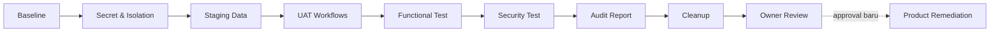

# Task Implementasi dan Audit Warga UAT

> Sistem: Portal Warga Palm Village  
> Status: Planned — belum dieksekusi  
> Tanggal: 10 Agustus 2026  
> Requirement: `WargaUAT_Requirement.md`  
> Plan: `WargaUAT_Plan.md`

## 1. Aturan Eksekusi untuk Sesi Baru

1. Baca ketiga dokumen Warga UAT sampai selesai sebelum menjalankan command.
2. Kerjakan task sesuai dependency dan jangan melompati approval gate.
3. Perbarui checkbox, kolom status, bukti, dan catatan blocker selama implementasi.
4. Jangan menampilkan secret pada chat, log, screenshot, atau dokumen.
5. Jangan menyentuh data/workflow production, commit, push, atau deploy tanpa approval eksplisit.
6. Jangan mengerjakan backlog remediasi produk pada fase audit.
7. Jika kondisi repository berbeda dari baseline dokumen, hentikan task yang terdampak dan laporkan perbedaannya.

Status yang diperbolehkan: `Pending`, `In Progress`, `Blocked`, `Done`, `Skipped (approved)`.

## 2. Alur dan Gate

## 3. Daftar Task Berurutan

| Urutan | Task ID | Tugas | Dependency | Requirement | Status |
| ---: | --- | --- | --- | --- | --- |
| 1 | WUAT-001 | Baseline repository dan environment | - | WUAT-REQ-001 | Done |
| 2 | WUAT-002 | Inventory route, workflow, schema, dan credential reference | WUAT-001 | WUAT-REQ-001–004 | In Progress |
| 3 | WUAT-003 | Rotasi dan relokasi secret staging | WUAT-001 | WUAT-REQ-002–003 | In Progress |
| 4 | WUAT-004 | Implement environment guard dan local proxy UAT | WUAT-002–003 | WUAT-REQ-002–004 | Done |
| 5 | WUAT-005 | Siapkan schema dan storage staging | WUAT-002–003 | WUAT-REQ-005, WUAT-REQ-008 | Blocked |
| 6 | WUAT-006 | Buat kontrak `uat_run_id`, demo marker, dan cleanup | WUAT-005 | WUAT-REQ-005, WUAT-REQ-014 | Blocked |
| 7 | WUAT-007 | Bangun `UAT - Auth & Profile` | WUAT-004–006 | WUAT-REQ-004, WUAT-REQ-006, WUAT-REQ-012 | Pending |
| 8 | WUAT-008 | Bangun `UAT - Directory & Units` | WUAT-004–006 | WUAT-REQ-004–005, WUAT-REQ-007, WUAT-REQ-012 | Pending |
| 9 | WUAT-009 | Bangun `UAT - IPL Payment & Verification` | WUAT-004–006 | WUAT-REQ-008–010, WUAT-REQ-012 | Pending |
| 10 | WUAT-010 | Bangun `UAT - Notifications & Operations` | WUAT-004–006 | WUAT-REQ-011, WUAT-REQ-014 | Pending |
| 11 | WUAT-011 | Validasi workflow, credential isolation, dan kill switch | WUAT-007–010 | WUAT-REQ-002–004, WUAT-REQ-012 | Pending |
| 12 | WUAT-012 | Seed identitas, unit, tagihan, dan fixture UAT | WUAT-006, WUAT-011 | WUAT-REQ-005–006 | Pending |
| 13 | WUAT-013 | Jalankan registrasi dan approval warga | WUAT-012 | WUAT-REQ-006, WUAT-REQ-011 | Pending |
| 14 | WUAT-014 | Uji direktori rumah dari POV warga | WUAT-013 | WUAT-REQ-007, WUAT-REQ-012 | Pending |
| 15 | WUAT-015 | Uji upload dan pembayaran lima bulan | WUAT-013 | WUAT-REQ-008–009, WUAT-REQ-011 | Pending |
| 16 | WUAT-016 | Uji approve/reject per periode dan resubmission | WUAT-015 | WUAT-REQ-010–011 | Pending |
| 17 | WUAT-017 | Jalankan negative authorization dan routing test | WUAT-013–016 | WUAT-REQ-002–004, WUAT-REQ-007–012 | Pending |
| 18 | WUAT-018 | Jalankan build, bundle, reliability, dan secret checks | WUAT-011–017 | WUAT-REQ-002–004, WUAT-REQ-008–012 | Pending |
| 19 | WUAT-019 | Susun laporan temuan dan severity | WUAT-013–018 | WUAT-REQ-013 | Done |
| 20 | WUAT-020 | Cleanup seluruh residu UAT | WUAT-019 | WUAT-REQ-014 | Blocked |
| 21 | WUAT-021 | Verifikasi cleanup dan tutup jendela UAT | WUAT-020 | WUAT-REQ-004, WUAT-REQ-014 | Blocked |
| 22 | WUAT-022 | Review pemilik dan keputusan remediasi | WUAT-019–021 | WUAT-REQ-013, WUAT-REQ-015 | Pending |

## 4. Detail Task

### WUAT-001 — Baseline repository dan environment

- [x] Catat working directory, branch, HEAD, remote origin, dan `git status --short`.
- [x] Fetch metadata origin secara read-only dan bandingkan commit tanpa pull/reset.
- [x] Catat perubahan existing yang harus dipertahankan.
- [x] Catat versi Node/npm, Vite, Supabase CLI bila ada, dan dependency lockfile.
- [x] Buat record baseline berisi timestamp dan commit yang akan diuji.

**Bukti selesai:** baseline reproducible dan tidak ada perubahan pengguna yang tertimpa.  
**Gate:** perbedaan local/origin yang material telah dijelaskan sebelum lanjut.

### WUAT-002 — Inventory route, workflow, schema, dan credential reference

- [x] Petakan seluruh frontend call `/api/n8n/*` yang dipakai alur warga.
- [x] Petakan proxy local dan Vercel, termasuk namespace yang di-hardcode.
- [ ] Export/read-only inventory workflow production yang relevan tanpa menyalin secret.
- [ ] Catat webhook path, active version, credential reference, dan checksum workflow.
- [x] Inventaris tabel/RPC/bucket untuk auth, profile, unit, bill, payment, audit, dan email dari source repository.
- [x] Tandai gap antara source repository dan workflow live sebagai risiko, bukan asumsi.

**Output:** matriks endpoint → workflow → tabel/storage → role.

### WUAT-003 — Rotasi dan relokasi secret staging

- [x] Rotasi service-role key dan legacy JWT secret staging yang pernah berada di `client/src/staging.env`; legacy anon/service-role lama ditolak 401 dan modern server secret diterima 200 pada host UAT (tanpa mencetak body/key).
- [x] Pastikan file tersebut tidak menjadi sumber konfigurasi aktif dan tidak dapat ter-commit.
- [x] Buat env local ignored yang hanya memuat browser-safe key dengan prefix `VITE_`.
- [x] Pisahkan konfigurasi server-only ke file root ignored tanpa prefix `VITE_`; credential n8n tetap belum tersedia.
- [x] Lindungi `client/uat.env` dengan ignore khusus dan loader allowlist; file dipertahankan dan privileged entries tidak dimuat.
- [x] Prioritaskan publishable key modern pada browser; legacy anon hanya fallback dan privileged key tidak dibundle.
- [ ] Buat `N8N_UAT_KEY` acak untuk satu jendela UAT.
- [x] Jalankan secret scan pada tracked/untracked source yang relevan dan output build.

**Bukti selesai:** key lama tidak berlaku; bundle dan Git tidak memuat secret server-side.  
**Gate A:** jangan memulai UAT jika rotasi/scan gagal.

### WUAT-004 — Environment guard dan local proxy UAT

- [x] Pisahkan konfigurasi proxy berdasarkan mode server-side, bukan input browser.
- [x] Mode UAT selalu meneruskan ke `/webhook/portal-uat-v1/*`.
- [x] Tambahkan `X-UAT-Key` dan transport auth hanya pada hop proxy → n8n.
- [x] Pertahankan App JWT pada header terpisah yang divalidasi workflow.
- [x] Bind dev server/proxy ke localhost kecuali ada approval untuk akses LAN.
- [x] Tambahkan fail-closed check terhadap hostname Supabase production dan namespace `portal-v1`.
- [x] Pastikan proxy Vercel tetap fail-closed ke `/webhook/portal-v1/*`.
- [x] Tambahkan test yang membuktikan query/header/path tidak dapat memilih environment.
- [x] Buktikan mode UAT memakai allowlist `uat.env`, sedangkan mode normal kembali ke `.env`.

**Bukti selesai:** capture network local hanya menunjukkan namespace UAT dan staging target.

### WUAT-005 — Schema dan storage staging

- [x] Tetapkan 17 migration berurutan sebagai source of truth; `supabase/schema.sql` dikecualikan karena legacy.
- [x] Jalankan preflight lokal yang membuktikan tidak ada row/auth/storage object production dalam migration.
- [x] Siapkan overlay safety UAT dan query verifikasi seluruh entitas staging kosong sebelum seed.
- [ ] Bandingkan migration/schema staging dengan baseline code yang diuji.
- [ ] Terapkan hanya migration yang diperlukan ke staging setelah dry-run/review.
- [ ] Jangan import row, auth identity, audit, atau file production.
- [ ] Buat/verifikasi private bucket dan policy ownership/role.
- [ ] Validasi signed URL pendek, tidak dapat di-list publik, dan tidak lintas unit.

**Bukti selesai:** schema cukup untuk UAT dan tidak mengandung PII production.

### WUAT-006 — Kontrak UAT dan cleanup

- [x] Definisikan format `uat_run_id` dan propagasinya ke setiap mutasi dalam migration UAT terpisah; remote apply masih menunggu WUAT-005.
- [x] Siapkan `is_demo`/marker ekuivalen pada entitas staging yang relevan; belum diterapkan remote.
- [x] Siapkan validasi server-side agar marker konsisten/immutable dan browser role tidak memperoleh execute grant.
- [x] Siapkan inventory residu per tabel/bucket/Auth; email sandbox dan workflow execution tetap diinventaris lewat provider masing-masing.
- [x] Siapkan cleanup child-to-parent yang memvalidasi marker environment UAT serta menolak residu Storage/Auth.
- [ ] Uji cleanup pada fixture disposable sebelum UAT utama.

**Bukti selesai:** satu `uat_run_id` disposable dapat dibuat dan dihapus sampai residu nol.

### WUAT-007 — Workflow Auth & Profile

- [ ] Buat workflow bernama `UAT - Auth & Profile` dalam keadaan inactive.
- [ ] Implement router allowlist untuk endpoint auth/profile/approval yang diperlukan.
- [ ] Gunakan credential staging saja dan header-auth UAT.
- [ ] Validasi Google identity, App JWT, actor profile, active/approval status, dan role.
- [ ] Pastikan `ngatormatic@gmail.com` dapat berawal dari kondisi unregistered.
- [ ] Izinkan bendahara/admin staging menyetujui profil UAT sesuai capability.
- [ ] Tambahkan audit `request_id` dan `uat_run_id` tanpa token.
- [ ] Validasi node dan workflow sebelum publish/activate.

### WUAT-008 — Workflow Directory & Units

- [ ] Buat workflow bernama `UAT - Directory & Units` dalam keadaan inactive.
- [ ] Implement daftar unit/penghuni untuk role warga approved.
- [ ] Kembalikan nama, email, telepon, unit, occupancy, dan status matriks yang disetujui.
- [ ] Jangan kembalikan bukti, transfer detail, internal notes, atau signed URL.
- [ ] Terapkan ownership/role check untuk unit UAT dan fixture lain.
- [ ] Tolak seluruh master-data mutation oleh warga.
- [ ] Validasi `403/404`, pagination/filter, dan object enumeration.

### WUAT-009 — Workflow IPL Payment & Verification

- [ ] Buat workflow bernama `UAT - IPL Payment & Verification` dalam keadaan inactive.
- [ ] Definisikan payload satu submission + array alokasi periode.
- [ ] Validasi unit ownership, bill eligibility, duplicate period, nominal, dan total server-side.
- [ ] Buat parent/children serta file metadata secara atomik melalui transaksi/RPC.
- [ ] Terapkan idempotency untuk retry request.
- [ ] Izinkan approve/reject per allocation oleh bendahara/admin.
- [ ] Pastikan reject tidak mengubah allocation approved lainnya.
- [ ] Izinkan resubmission hanya untuk rejected/unpaid period.
- [ ] Pastikan signed URL bukti hanya untuk owner/bendahara/admin.

### WUAT-010 — Workflow Notifications & Operations

- [ ] Buat workflow bernama `UAT - Notifications & Operations` dalam keadaan inactive.
- [ ] Hubungkan ke SMTP sandbox hosted dengan credential UAT.
- [ ] Rewrite seluruh tujuan email ke sandbox; simpan intended recipient sebagai metadata test.
- [ ] Implement event/dedupe key untuk registrasi, submission, dan keputusan per periode.
- [ ] Pastikan email gagal tidak menggagalkan transaksi bisnis.
- [ ] Tambahkan deep link environment-aware tanpa token/PII.
- [ ] Tambahkan health check, bounded retry, dan cleanup execution support.

### WUAT-011 — Validasi dan aktivasi terbatas workflow

- [ ] Validasi seluruh node/config/workflow dengan tooling n8n yang tersedia.
- [ ] Periksa export tidak memuat raw credential atau production identifier.
- [ ] Uji unknown route, wrong method, missing/invalid UAT key, dan invalid JWT.
- [ ] Tetapkan timeout/concurrency dan batas payload.
- [ ] Verifikasi kill switch menutup seluruh route UAT.
- [ ] Capture checksum production workflow sebelum/sesudah dan buktikan tidak berubah.
- [ ] Aktifkan UAT hanya setelah Gate A lulus dan segera catat waktu aktivasi.

**Gate B:** production tidak berubah dan UAT inactive-by-default.

### WUAT-012 — Seed data UAT

- [ ] Buat `uat_run_id` sesi.
- [ ] Pastikan `ngatormatic@gmail.com` unregistered pada staging sebelum test.
- [ ] Siapkan `denmas.dyudhiantoro@gmail.com` sebagai bendahara approved staging.
- [ ] Buat unit sintetis UAT, skema IPL, dan lima tagihan yang eligible.
- [ ] Buat fixture warga/unit lain untuk negative authorization test.
- [ ] Pastikan seluruh row/file memakai marker UAT dan tidak masuk agregasi nyata.
- [ ] Uji visibility: owner + admin sesuai kebijakan; role lain memperoleh minimum data.

### WUAT-013 — Registrasi dan approval warga

- [ ] Login Google pertama sebagai warga dan selesaikan registrasi.
- [ ] Verifikasi profil pending dan pembatasan sebelum approval.
- [ ] Verifikasi email konfirmasi/tindakan di SMTP sandbox.
- [ ] Setujui profil menggunakan staff UAT.
- [ ] Login ulang sebagai warga dan verifikasi role/unit/session.
- [ ] Uji rejection, resubmission, inactive account, dan pesan pengguna.

**Bukti:** screenshot/log tersamarkan dan row/audit yang terkait `uat_run_id`.

### WUAT-014 — Direktori rumah dari POV warga

- [ ] Buka navigasi dan route `/houses` sebagai warga.
- [ ] Verifikasi nama, email, telepon, unit, occupancy, dan status matriks.
- [ ] Verifikasi data privat pembayaran/bukti/internal notes tidak tersedia.
- [ ] Uji search/filter/pagination dan empty/error state dari ponsel/desktop.
- [ ] Coba akses/mutasi unit lain melalui request langsung.

### WUAT-015 — Upload dan pembayaran lima bulan

- [ ] Uji file gambar <=2 MB, antara 2–5 MB, >5 MB, dan tipe invalid.
- [ ] Ukur original/compressed size dan pastikan preview benar.
- [ ] Pilih lima periode dan catat satu transfer Rp700.000.
- [ ] Verifikasi satu submission, satu object bukti, dan lima allocation pending.
- [ ] Verifikasi total/alokasi, ownership, audit, dan idempotency.
- [ ] Verifikasi email submission warga/admin/bendahara terdeduplikasi di sandbox.
- [ ] Inject child-insert/upload failure dan pastikan tidak ada partial payment.

### WUAT-016 — Keputusan per periode dan resubmission

- [ ] Approve allocation satu per satu sebagai bendahara.
- [ ] Verifikasi matrix hanya berubah untuk periode terkait.
- [ ] Reject satu allocation dan verifikasi periode lain tetap approved.
- [ ] Verifikasi satu email warga per keputusan dengan deep link valid.
- [ ] Ajukan ulang rejected period sebagai warga.
- [ ] Pastikan approved period tidak dapat diajukan ulang/diduplikasi.
- [ ] Uji admin juga dapat memverifikasi sementara UI/email tetap menonjolkan bendahara.

### WUAT-017 — Negative authorization dan routing

- [ ] Jalankan matriks endpoint tanpa token dan dengan token invalid/expired.
- [ ] Manipulasi role/unit claim dan pastikan database actor tetap source of truth.
- [ ] Ganti ID profile/unit/bill/submission/allocation/file dengan fixture lain.
- [ ] Coba endpoint approval, verification, users, logs, settings, reports privat sebagai warga.
- [ ] Coba akses signed URL kedaluwarsa dan object path hasil tebakan.
- [ ] Coba request tanpa/salah `X-UAT-Key` langsung ke webhook.
- [ ] Buktikan browser tidak dapat memilih `/portal-v1` atau hostname production.
- [ ] Audit log/error untuk memastikan secret dan PII sensitif teredaksi.

**Gate D:** setiap kegagalan test dicatat sebagai temuan; Critical menghentikan perluasan test yang berisiko.

### WUAT-018 — Build, reliability, dan secret checks

- [x] Jalankan lint/test/build production tanpa memodifikasi source lewat formatter.
- [x] Periksa bundle dan source map terhadap secret/identifier UAT yang tidak semestinya.
- [ ] Catat ukuran chunk utama dan halaman berat sebelum/sesudah perubahan prasyarat UAT.
- [ ] Uji timeout, retry, duplicate request, dan provider email unavailable.
- [ ] Uji workflow domain router dengan seluruh method/path yang digunakan frontend.
- [ ] Bandingkan daftar endpoint frontend dengan route UAT yang aktif.
- [ ] Simpan command, hasil, dan timestamp tanpa secret.

### WUAT-019 — Laporan audit

- [x] Buat matriks requirement/test dengan status Pass/Fail/Blocked/Not Tested.
- [x] Dokumentasikan temuan, langkah reproduksi, actual/expected, dampak warga, dan bukti tersamarkan.
- [x] Beri severity Critical/High/Medium/Low sesuai requirement.
- [x] Pisahkan temuan terbukti, static risk, keterbatasan environment, dan pemeriksaan positif.
- [x] Susun rekomendasi dan urutan remediasi tanpa mengimplementasikannya.
- [x] Nyatakan production tidak diuji langsung dan laporan bukan sertifikasi end-to-end production.

**Gate:** laporan harus selesai sebelum data UAT dihapus agar bukti yang diperlukan sudah tersimpan.

### WUAT-020 — Cleanup residu UAT

- [ ] Aktifkan kill switch dan hentikan seluruh request baru.
- [ ] Hentikan dispatcher/reconciler UAT.
- [ ] Hapus email sandbox dan execution payload UAT setelah bukti disamarkan.
- [ ] Hapus storage objects berdasarkan prefix `uat_run_id`.
- [ ] Hapus outbox/audit/allocation/submission/bill/profile/unit secara child-to-parent.
- [ ] Hapus/unregister auth identity staging yang khusus UAT bila diperlukan.
- [ ] Jangan menggunakan wildcard atau project reference yang belum diverifikasi.

### WUAT-021 — Verifikasi cleanup dan penutupan

- [ ] Jalankan inventory residu untuk setiap tabel, bucket, auth, email, dan execution log.
- [ ] Pastikan hasil nol atau dokumentasikan artifact non-data yang sengaja dipertahankan.
- [ ] Nonaktifkan seluruh workflow `UAT -`.
- [ ] Cabut/rotasi `N8N_UAT_KEY` dan credential temporer.
- [ ] Bandingkan checksum workflow production dan pastikan tidak berubah.
- [ ] Catat waktu penutupan jendela UAT.

**Gate E:** sesi tidak selesai sebelum bukti residu nol tersedia.

### WUAT-022 — Review pemilik

- [ ] Serahkan laporan, coverage, hasil cleanup, dan daftar rekomendasi.
- [ ] Tunggu keputusan pemilik untuk setiap remediasi.
- [ ] Jangan commit/push/deploy tanpa approval eksplisit.
- [ ] Bila disetujui, buat task/remediation branch terpisah dan test ulang sesuai severity.

## 5. Traceability Requirement ke Task

| Requirement | Task utama |
| --- | --- |
| WUAT-REQ-001 | WUAT-001–002, WUAT-019 |
| WUAT-REQ-002 | WUAT-003–004, WUAT-011, WUAT-017–018 |
| WUAT-REQ-003 | WUAT-003–004, WUAT-011, WUAT-018 |
| WUAT-REQ-004 | WUAT-004, WUAT-007–011, WUAT-021 |
| WUAT-REQ-005 | WUAT-005–006, WUAT-008, WUAT-012, WUAT-020–021 |
| WUAT-REQ-006 | WUAT-007, WUAT-012–013 |
| WUAT-REQ-007 | WUAT-008, WUAT-014, WUAT-017 |
| WUAT-REQ-008 | WUAT-005, WUAT-009, WUAT-015, WUAT-017 |
| WUAT-REQ-009 | WUAT-009, WUAT-015, WUAT-018 |
| WUAT-REQ-010 | WUAT-009, WUAT-016–017 |
| WUAT-REQ-011 | WUAT-010, WUAT-013, WUAT-015–016, WUAT-018 |
| WUAT-REQ-012 | WUAT-007–009, WUAT-011, WUAT-014, WUAT-017 |
| WUAT-REQ-013 | WUAT-019, WUAT-022 |
| WUAT-REQ-014 | WUAT-006, WUAT-010, WUAT-020–021 |
| WUAT-REQ-015 | WUAT-019, WUAT-022 |

## 6. Approval Gate yang Tidak Boleh Dianggap Implisit

Approval baru dari pemilik wajib diperoleh sebelum:

- memperbaiki temuan produk setelah audit;
- menonaktifkan/mengubah endpoint production;
- mengubah atau mengganti workflow n8n production;
- menerapkan migration ke Supabase production;
- commit, push, membuat PR, atau deploy;
- menjalankan test yang menulis data production.

## 7. Log Eksekusi

Isi bagian ini selama implementasi. Jangan menaruh secret atau PII mentah.

| Waktu | Task ID | Tindakan/hasil | Bukti aman | Pelaksana |
| --- | --- | --- | --- | --- |
| 2026-08-10 22:38 +07 | WUAT-001 | Baseline Git/environment selesai; HEAD sama dengan origin, existing changes dipertahankan | `docs/uat/WARGA_UAT_BASELINE.md` | Codex |
| 2026-08-10 22:38 +07 | WUAT-002 | Inventaris source dan metadata workflow dimulai; tidak ada resource `UAT -` | `docs/uat/WARGA_UAT_BASELINE.md` | Codex |
| 2026-08-10 23:05 +07 | WUAT-003/004/018/019 | Secret isolation lokal, guard/proxy, QC, dan laporan audit selesai; remote UAT diblokir | `docs/uat/WARGA_UAT_AUDIT_REPORT.md` | Codex |
| 2026-08-10 23:15 +07 | WUAT-020/021 | Tidak ada entitas UAT remote; snapshot secret lokal lama dihapus, exact workflow `UAT -` tetap nol | `docs/uat/WARGA_UAT_AUDIT_REPORT.md` | Codex |
| 2026-08-10 23:30 +07 | WUAT-003/004/018 | QC lokal diulang dan lulus; recheck metadata remote mengonfirmasi staging serta credential UAT/sandbox belum terverifikasi | `docs/uat/WARGA_UAT_AUDIT_REPORT.md` | Codex |
| 2026-08-11 08:10 +07 | WUAT-003/004/018 | `uat.env` dilindungi dan hanya dibaca pada mode UAT melalui allowlist; endpoint Auth staging read-only 200; mode normal kembali ke `.env`; 8/8 test lulus | `docs/uat/WARGA_UAT_AUDIT_REPORT.md` | Codex |
| 2026-08-11 08:30 +07 | WUAT-003/005/018 | Publishable key modern diprioritaskan; preflight 17 migration lulus tanpa production rows; overlay safety dan empty-state verifier siap tetapi belum diterapkan remote | `docs/uat/WARGA_UAT_SCHEMA_CLONE_PLAN.md` | Codex |
| 2026-08-11 09:00 +07 | WUAT-003/005 | Rotasi legacy diverifikasi read-only pada host UAT: key lama ditolak dan modern server secret diterima; root PostgREST publishable 401 kemudian dikoreksi melalui Auth-specific check; MCP menunjuk production dan dilarang untuk UAT | `docs/uat/WARGA_UAT_AUDIT_REPORT.md` | Codex |
| 2026-08-11 09:20 +07 | WUAT-003/004/018 | Loader diperbaiki untuk format raw `uat.env` append-only; 9/9 test, secret scan, preflight, UAT synthetic bundle, negative fail-closed build, dan production rebuild lulus | `docs/uat/WARGA_UAT_AUDIT_REPORT.md` | Codex |
| 2026-08-11 09:45 +07 | WUAT-006 | Kontrak UUID run/marker, propagasi outbox, inventory, dan cleanup fail-closed disiapkan lokal; belum diterapkan remote | `supabase/uat/202608110002_uat_run_contract.sql` | Codex |
| 2026-08-11 10:05 +07 | WUAT-003/005 | Entry append-only diperiksa: root PostgREST masih 401 karena schema kosong dan DB URL masih HTTPS, bukan PostgreSQL; loader/validator mendukung suffix versi `_V2+` | `docs/uat/WARGA_UAT_AUDIT_REPORT.md` | Codex |
| 2026-08-11 10:15 +07 | WUAT-003 | Publishable key dikonfirmasi valid melalui Auth settings/health 200; blocker publishable ditutup | `docs/uat/WARGA_UAT_AUDIT_REPORT.md` | Codex |
| 2026-08-11 10:30 +07 | WUAT-005 | PostgreSQL direct URL terverifikasi UAT, tetapi dry-run dan retry DNS-over-HTTPS gagal resolve endpoint IPv6 direct; tidak ada migration diterapkan | `docs/uat/WARGA_UAT_SCHEMA_CLONE_PLAN.md` | Codex |
| 2026-08-13 | WUAT-003/005 | Session pooler V3 terverifikasi UAT dan password berbeda dari credential terekspos; dry-run tetap timeout/terminated. DNS 3 IP dan TCP terbuka, tetapi seluruh handshake PostgreSQL SSL timeout; tidak ada migration diterapkan | `docs/uat/WARGA_UAT_SCHEMA_CLONE_PLAN.md` | Codex |

## 8. Blocker dan Keputusan

| ID | Tanggal | Blocker/keputusan | Dampak | Pemilik keputusan | Status |
| --- | --- | --- | --- | --- | --- |
| BLK-001 | 2026-08-11 | Rotasi legacy dan publishable staging terverifikasi; Auth settings/health menerima publishable dengan 200 | Browser credential gate lulus; modern server secret tetap tidak boleh dikirim ke browser | Pemilik environment | Closed |
| BLK-002 | 2026-08-11 | Recheck: exact-prefix workflow `UAT -` dan credential UAT/staging tetap nol; SMTP/header-auth yang ada hanya generik dan belum terbukti sandbox/UAT | Gate A/B dan checksum penuh belum dapat lulus | Pemilik environment | Open |
| BLK-003 | 2026-08-13 | Direct dan Session pooler UAT terverifikasi; runner dapat resolve/TCP-connect pooler tetapi handshake PostgreSQL tidak dibalas. MCP tetap menunjuk production | Migration remote memerlukan MCP yang di-scope ke project UAT atau eksekusi bundle melalui SQL Editor UAT | Pemilik environment | Open |
