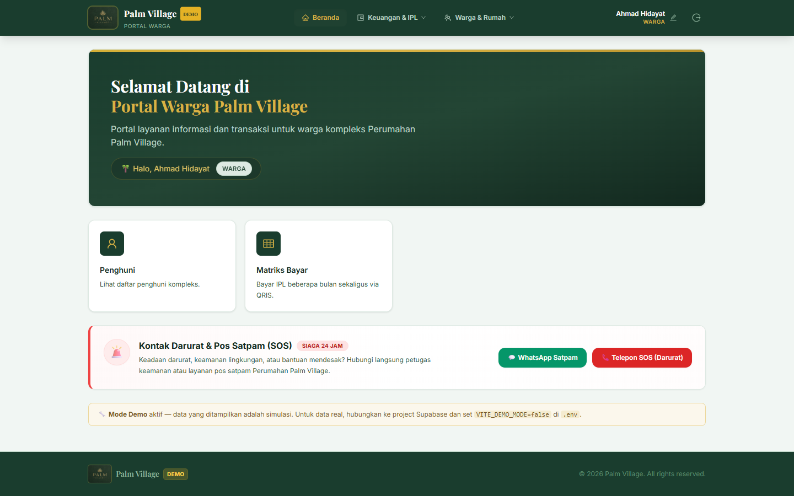
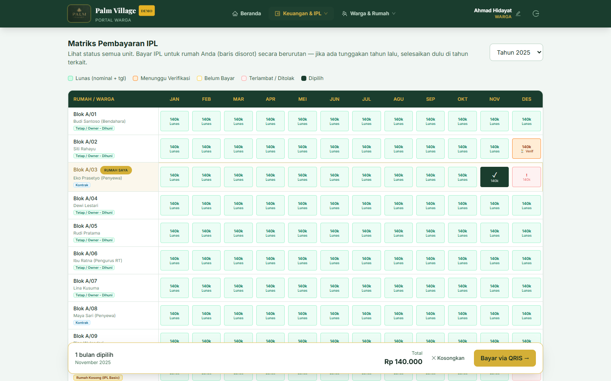
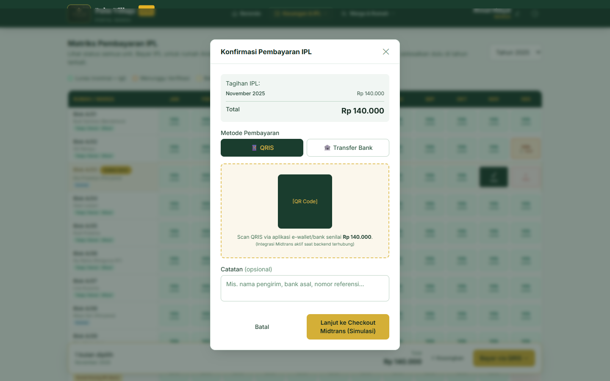
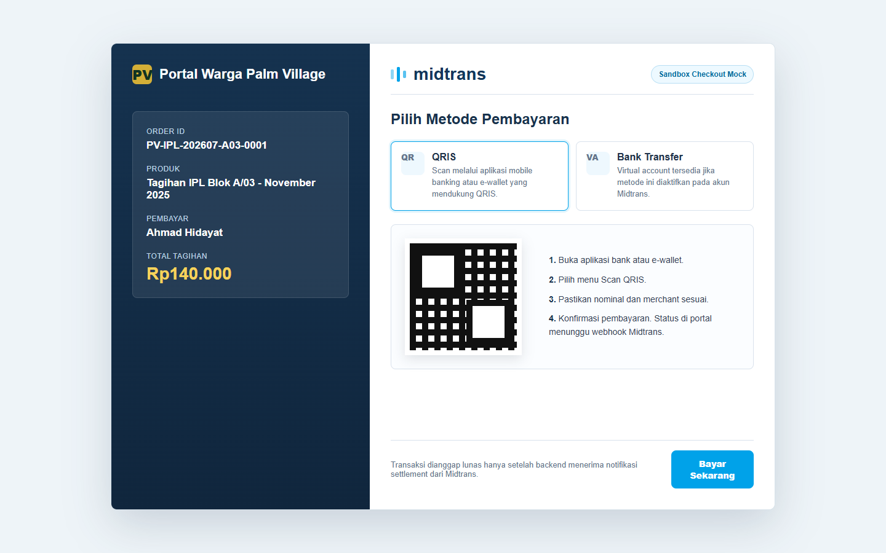
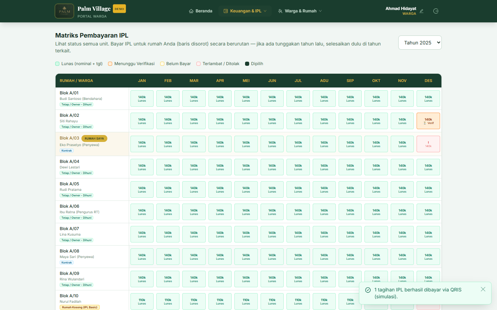
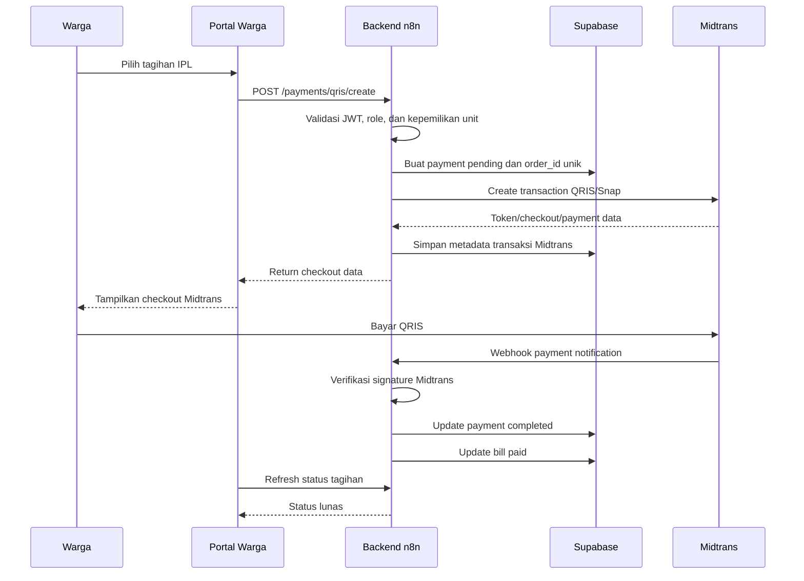

# Dokumen Flow Transaksi Pembayaran IPL dengan Midtrans

Portal Warga Palm Village

Tanggal dokumen: 8 Juli 2026

## Tujuan Dokumen

Dokumen ini menjelaskan alur transaksi pembayaran IPL dari tahap pemesanan/tagihan di Portal Warga Palm Village sampai proses checkout pembayaran melalui Midtrans.

Dokumen ini disiapkan sebagai lampiran data tambahan onboarding Midtrans. Surat penunjukan PIC merchant disiapkan sebagai dokumen terpisah.

## Ringkasan Alur

1. Warga login ke Portal Warga Palm Village.
2. Warga membuka menu `Keuangan & IPL` lalu memilih `Matriks Pembayaran IPL`.
3. Sistem menampilkan daftar tagihan IPL per unit dan periode.
4. Warga memilih tagihan yang akan dibayar.
5. Sistem menampilkan ringkasan tagihan dan total pembayaran.
6. Warga memilih metode pembayaran `QRIS`.
7. Sistem membuat transaksi pembayaran dan mengarahkan warga ke checkout Midtrans.
8. Warga menyelesaikan pembayaran di halaman checkout Midtrans.
9. Midtrans mengirim notifikasi/webhook ke backend.
10. Backend memverifikasi notifikasi Midtrans, lalu memperbarui status pembayaran menjadi `Lunas`.

## Catatan Implementasi

Saat dokumen ini dibuat, UI demo Portal Warga Palm Village sudah memiliki alur pemilihan tagihan dan konfirmasi pembayaran QRIS. Integrasi production Midtrans akan mengganti simulasi QRIS demo dengan pembuatan transaksi melalui backend/n8n dan checkout Midtrans.

Screenshot checkout Midtrans pada dokumen ini menggunakan tampilan sandbox/mock untuk menggambarkan target halaman checkout Midtrans, karena Snap/checkout live belum terhubung langsung pada UI demo lokal.

## Data Contoh Transaksi

| Field | Nilai contoh |
| --- | --- |
| Merchant | Portal Warga Palm Village |
| Pengguna | Ahmad Hidayat |
| Unit | Blok A/03 |
| Produk/tagihan | Tagihan IPL November 2025 |
| Metode | QRIS via Midtrans |
| Nominal | Rp140.000 |
| Contoh order ID | PV-IPL-202607-A03-0001 |

## Step-by-Step Flow dengan Screenshot

### 1. Warga membuka dashboard portal

Setelah login, warga masuk ke dashboard Portal Warga Palm Village. Dari dashboard, warga dapat mengakses menu `Keuangan & IPL`.

### 2. Warga memilih tagihan IPL

Pada halaman `Matriks Pembayaran IPL`, sistem menampilkan status tagihan per bulan. Warga memilih tagihan yang masih belum dibayar untuk unitnya sendiri.

### 3. Sistem menampilkan konfirmasi pembayaran

Setelah tagihan dipilih, sistem menampilkan ringkasan transaksi berisi periode tagihan, total nominal, dan pilihan metode pembayaran. Warga memilih `QRIS`, lalu melanjutkan ke checkout Midtrans.

### 4. Warga menyelesaikan pembayaran di checkout Midtrans

Backend membuat transaksi Midtrans dengan `order_id` unik, nominal transaksi, detail customer, dan item tagihan. Setelah token/checkout URL diterima, warga diarahkan ke checkout Midtrans untuk menyelesaikan pembayaran QRIS.

### 5. Status tagihan diperbarui menjadi lunas

Setelah pembayaran berhasil, Midtrans mengirim notifikasi/webhook ke backend. Backend memverifikasi signature dan status transaksi, lalu memperbarui status payment dan tagihan di database. Portal kemudian menampilkan tagihan sebagai `Lunas`.

## Alur Teknis Backend

## Kontrol Keamanan dan Validasi

- `order_id` dibuat unik untuk setiap transaksi.
- Frontend tidak menyimpan Midtrans Server Key.
- Payment hanya dibuat melalui backend yang memvalidasi JWT dan kepemilikan unit.
- Status `Lunas` tidak dipercaya dari frontend atau return page saja.
- Status `Lunas` hanya ditetapkan setelah webhook Midtrans diverifikasi backend.
- Webhook Midtrans diproses secara idempotent agar notifikasi ganda tidak menggandakan pembayaran.
- Semua aksi penting dicatat pada audit log.

## Endpoint Production yang Direncanakan

| Endpoint | Fungsi |
| --- | --- |
| `POST /portal-v1/payments/qris/create` | Membuat transaksi QRIS Midtrans untuk tagihan IPL |
| `POST /portal-v1/payments/midtrans/webhook` | Menerima dan memverifikasi notifikasi pembayaran Midtrans |
| `GET/POST /portal-v1/bills/list` | Mengambil daftar tagihan dan status pembayaran terbaru |

## Status Dokumen

Dokumen ini siap dipakai sebagai lampiran flow transaksi untuk onboarding Midtrans, dengan catatan bahwa screenshot checkout Midtrans adalah representasi sandbox/mock sampai integrasi Midtrans production tersambung ke backend.
