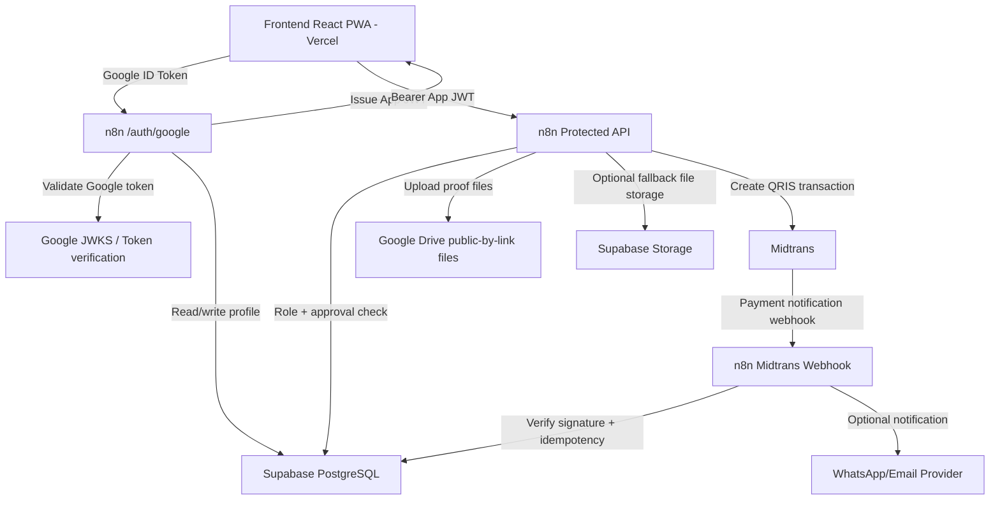

# Portal Warga Palm Village - Production Upgrade Planning

> Purpose: dokumen rencana garis besar untuk membawa aplikasi Portal Warga Palm Village dari demo/state development menuju production-ready state.
>
> Reader: AI agent, developer, pengurus teknis, atau maintainer berikutnya.
>
> Related documents:
> - `docs/production/REQUIREMENTS.md` untuk spesifikasi teknikal detail.
> - `docs/production/TASKLIST.md` untuk daftar pekerjaan kecil yang harus dieksekusi satu per satu.

---

## 1. Goal

### 1.1 Primary Goal

Membangun versi production Portal Warga Palm Village dengan:

- Frontend tetap di Vercel sebagai React PWA.
- n8n menjadi backend/API orchestration layer.
- Supabase menjadi database dan object storage utama.
- Login hanya menggunakan Google Account.
- n8n memvalidasi Google ID Token dan menerbitkan App JWT internal.
- Semua data penting dibaca/ditulis melalui API n8n, bukan langsung dari frontend.
- Payment QRIS menggunakan Midtrans, dengan webhook masuk ke n8n dan status final disimpan di Supabase.

### 1.2 Success Criteria

Sistem dianggap production-ready jika:

- User hanya bisa login dengan Google.
- User baru otomatis masuk status `pending_approval`.
- Pengurus/admin harus approve user baru sebelum user dapat mengakses data warga/tagihan.
- Semua endpoint n8n protected dengan App JWT.
- Role dan approval status diverifikasi di backend.
- Tagihan, pembayaran, pengeluaran, laporan, dan audit log tersimpan di Supabase.
- Payment manual dan QRIS aman terhadap duplikasi, manipulasi role, dan webhook retry.
- Demo mode tetap tersedia untuk pengembangan lokal.
- Staging sudah lolos UAT sebelum production launch.

---

## 2. Product Vision

Portal ini adalah sistem operasional lingkungan Palm Village untuk:

- Membantu warga melihat tagihan IPL dan status pembayaran.
- Membantu pengurus memverifikasi warga baru dan memantau pembayaran.
- Membantu bendahara mencatat pembayaran, pengeluaran, dan laporan kas.
- Membantu admin menjaga konfigurasi, user, dan audit sistem.

Production upgrade harus memprioritaskan keamanan data, auditability, dan workflow uang yang jelas.

---

## 3. Architecture Direction

### 3.1 Target Architecture

### 3.2 Responsibility Split

| Layer | Responsibility |
| --- | --- |
| Frontend | UI, Google login button, local App JWT session, API calls to n8n, optimistic UI only where safe |
| n8n | Backend API, auth validation, role enforcement, workflow orchestration, Midtrans integration, notifications |
| Supabase PostgreSQL | Source of truth for users, units, bills, payments, expenses, settings, audit logs |
| Google Drive | Zero-monthly-cost payment proof files; only individual files are public-by-link |
| Supabase Storage | Fallback/private storage option for proofs, receipts, optional avatars |
| Midtrans | QRIS transaction creation and payment notification |
| WhatsApp/Email provider | Notification delivery only, not source of truth |

### 3.3 Key Decision

n8n is the backend/API layer, but not the application database. All durable state belongs in Supabase.

---

## 4. Users and Roles

### 4.1 Roles

| Role | Level | Description |
| --- | ---: | --- |
| `warga` | 1 | Warga biasa; melihat data unit sendiri dan membayar tagihan sendiri |
| `pengurus` | 2 | Pengurus non-bendahara; approve warga, lihat pembayaran/laporan, catat transfer bila diperlukan |
| `bendahara` | 3 | Pengelola keuangan; semua akses pengurus plus pembayaran tunai, pengeluaran, verifikasi pembayaran |
| `admin` | 4 | Super admin; semua akses plus user management, settings, audit/system controls |

### 4.2 Approval States

| State | Meaning |
| --- | --- |
| `pending_approval` | User sudah login Google tetapi belum diverifikasi |
| `approved` | User sudah di-assign unit/role dan boleh mengakses data sesuai role |
| `rejected` | User ditolak, tidak boleh login ke aplikasi |
| `suspended` | User pernah aktif tetapi dinonaktifkan sementara/permanen |

---

## 5. User Stories

### 5.1 Authentication and Approval

| ID | User Story | Priority | Story Points |
| --- | --- | --- | ---: |
| US-AUTH-01 | Sebagai warga, saya ingin login hanya dengan akun Google agar tidak perlu membuat password baru. | Must | 5 |
| US-AUTH-02 | Sebagai pengurus, saya ingin warga baru masuk antrean approval agar akses data lingkungan tetap aman. | Must | 5 |
| US-AUTH-03 | Sebagai admin, saya ingin App JWT berisi role dan unit agar API dapat memverifikasi akses user. | Must | 8 |
| US-AUTH-04 | Sebagai warga pending, saya ingin melihat status menunggu approval agar paham kenapa belum bisa masuk. | Should | 3 |

### 5.2 Data and Billing

| ID | User Story | Priority | Story Points |
| --- | --- | --- | ---: |
| US-DATA-01 | Sebagai admin, saya ingin data unit/warga tersimpan di Supabase agar menjadi sumber data resmi. | Must | 8 |
| US-BILL-01 | Sebagai bendahara, saya ingin generate tagihan bulanan tanpa duplikasi. | Must | 8 |
| US-BILL-02 | Sebagai warga, saya ingin melihat tagihan sendiri dan riwayat pembayaran. | Must | 5 |
| US-BILL-03 | Sebagai pengurus, saya ingin melihat matrix pembayaran semua unit. | Must | 5 |

### 5.3 Payment

| ID | User Story | Priority | Story Points |
| --- | --- | --- | ---: |
| US-PAY-01 | Sebagai warga, saya ingin membayar IPL lewat QRIS Midtrans. | Must | 13 |
| US-PAY-02 | Sebagai warga, saya ingin upload bukti transfer manual jika tidak memakai QRIS. | Must | 8 |
| US-PAY-03 | Sebagai bendahara, saya ingin approve/reject bukti transfer. | Must | 8 |
| US-PAY-04 | Sebagai sistem, saya ingin webhook Midtrans idempotent agar pembayaran tidak tercatat dobel. | Must | 8 |

### 5.4 Finance and Reporting

| ID | User Story | Priority | Story Points |
| --- | --- | --- | ---: |
| US-FIN-01 | Sebagai bendahara, saya ingin mencatat pengeluaran dengan bukti. | Must | 5 |
| US-FIN-02 | Sebagai pengurus, saya ingin melihat laporan running balance. | Must | 8 |
| US-FIN-03 | Sebagai admin, saya ingin audit log untuk login, approval, payment, settings, dan expenses. | Must | 8 |

### 5.5 Notifications

| ID | User Story | Priority | Story Points |
| --- | --- | --- | ---: |
| US-NOTIF-01 | Sebagai warga, saya ingin menerima notifikasi tagihan dan pembayaran sukses. | Should | 5 |
| US-NOTIF-02 | Sebagai bendahara, saya ingin menerima notifikasi payment pending verification. | Should | 3 |
| US-NOTIF-03 | Sebagai admin, saya ingin workflow error n8n tercatat dan terlihat. | Should | 5 |

---

## 6. Scrum Style Planning

### 6.1 Epic List

| Epic | Name | Goal | Weight |
| --- | --- | --- | ---: |
| E0 | Architecture Freeze | Mengunci arah production dan env strategy | 5% |
| E1 | Supabase Production Contract | Menyiapkan database, constraints, storage, RLS reference | 15% |
| E2 | n8n API Foundation | Membuat pola endpoint, JWT middleware, role check, audit log | 15% |
| E3 | Google Login + App JWT | Login Google-only dan session internal production | 15% |
| E4 | Approval + User Management | Approval user baru dan pengelolaan role/unit | 10% |
| E5 | Frontend API Migration | Mengalihkan frontend dari mock/Supabase direct ke n8n API | 10% |
| E6 | Billing + Manual Payment | Tagihan, transfer, tunai, bukti, verifikasi | 10% |
| E7 | Midtrans QRIS | QRIS create transaction, webhook, idempotency | 10% |
| E8 | Reports + Automation + Launch | Reports DB real, notifications, staging, production launch | 10% |

### 6.2 Suggested Sprint Plan

| Sprint | Scope | Output |
| --- | --- | --- |
| Sprint 0 | Fase 0 | Env/architecture decision, API naming, schema checklist |
| Sprint 1 | Fase 1-2 | Supabase schema contract and n8n base API conventions |
| Sprint 2 | Fase 3-4 | Google login, App JWT, approval enforcement |
| Sprint 3 | Fase 5-6 | Frontend API client, master data, profile/unit migration |
| Sprint 4 | Fase 7-8 | Billing, manual payment, upload proof, verification |
| Sprint 5 | Fase 9 | Midtrans sandbox QRIS end-to-end |
| Sprint 6 | Fase 10-11 | Reports from DB, automation, notifications |
| Sprint 7 | Fase 12-14 | Security, staging UAT, production launch |

### 6.3 Definition of Ready

A task is ready if:

- The affected files or n8n workflows are identified.
- The request/response contract is clear.
- Role/approval behavior is defined.
- Data model impact is known.
- Rollback or safe fallback is understood.

### 6.4 Definition of Done

A task is done if:

- Implementation is complete.
- It passes build or the best available validation.
- Security and role behavior are checked.
- UI/UX impact is reviewed when frontend is affected.
- Documentation and `TASKLIST.md` status are updated.
- If the task closes a phase, the phase review is performed before moving on.

---

## 7. Phase Roadmap

### Phase 0 - Architecture and Environment Freeze

Goal: lock the production direction before building.

Deliverables:

- Production/staging/local environment naming.
- n8n endpoint naming pattern.
- App JWT claim design.
- Secret inventory.
- Migration rule: production frontend calls n8n only.

### Phase 1 - Supabase Production Contract

Goal: make Supabase the stable source of truth.

Deliverables:

- Production schema migration.
- Storage bucket design.
- Constraints and indexes.
- Seed/import plan.
- RLS reference policies.

### Phase 2 - n8n API Foundation

Goal: make every n8n endpoint consistent and protected.

Deliverables:

- Standard JSON response shape.
- Auth middleware workflow pattern.
- Role hierarchy helper.
- Audit log helper.
- Error handling pattern.

### Phase 3 - Google Login and App JWT

Goal: production login works only with Google and internal JWT.

Deliverables:

- `/auth/google`.
- `/auth/me`.
- Pending approval behavior.
- App JWT generation.
- Frontend Google login integration.

### Phase 4 - Approval and User Management

Goal: pending users become approved only through authorized workflow.

Deliverables:

- Pending user list.
- Approve/reject endpoints.
- Assign unit/role.
- Audit approval actions.
- UI integrated with n8n.

### Phase 5 - Frontend API Migration

Goal: production mode frontend reads/writes through n8n.

Deliverables:

- `apiClient`.
- Auth header injection.
- Demo mode compatibility.
- Page-by-page migration.

### Phase 6 - Master Data and Billing

Goal: data unit/warga and bills are production usable.

Deliverables:

- Units/profiles CRUD through n8n.
- CSV import support.
- IPL settings.
- Generate bills without duplicates.

### Phase 7 - Manual Payment

Goal: transfer/tunai can be handled safely before QRIS.

Deliverables:

- Payment proof upload.
- Pending verification state.
- Approve/reject payment.
- Audit payment action.

### Phase 8 - Midtrans QRIS

Goal: QRIS sandbox and production-ready payment flow.

Deliverables:

- Create QRIS transaction endpoint.
- Midtrans notification webhook.
- Signature validation.
- Idempotent payment finalization.
- Payment expiry/failure handling.

### Phase 9 - Reports and Running Balance from Real DB

Goal: reports are computed from Supabase records, not mock data.

Deliverables:

- Monthly finance report endpoint.
- Running balance endpoint.
- Export data source migration.
- Reconciliation checks.

### Phase 10 - n8n Automation and Notifications

Goal: automate reminders and operational messages after core flows are stable.

Deliverables:

- Bill reminder workflow.
- Overdue reminder workflow.
- Payment success notification.
- Pending verification notification.
- Workflow error logging.

### Phase 11 - Security, Performance, and Observability

Goal: harden the system before UAT.

Deliverables:

- Negative authorization tests.
- Rate limit/proxy strategy.
- Backup/restore plan.
- Monitoring and alerting.
- Performance review for heavy pages.

### Phase 12 - Staging UAT

Goal: validate production-like environment with real workflows and non-production keys.

Deliverables:

- Staging frontend.
- Staging n8n.
- Staging Supabase.
- Midtrans sandbox end-to-end.
- UAT sign-off checklist.

### Phase 13 - Production Launch

Goal: launch safely and monitor.

Deliverables:

- Production env variables.
- Production Google OAuth.
- Production Midtrans keys.
- Production data import.
- Smoke test.
- Launch monitoring.

---

## 8. Risk Register

| Risk | Impact | Mitigation |
| --- | --- | --- |
| Frontend accidentally writes directly to Supabase production | Security and data integrity issue | Production mode uses n8n API only; no service role in frontend |
| n8n workflows duplicate auth logic inconsistently | Authorization gaps | Shared auth/role workflow pattern and task review every phase |
| Midtrans webhook sent multiple times | Duplicate payments | Unique `order_id`, `transaction_id`, idempotency check |
| User approved with wrong unit | Payment/data leakage | Approval UI requires unit review and audit log |
| App JWT stolen | Unauthorized access until expiry | Short expiry, inactive user check on sensitive endpoints, HTTPS only |
| Reports slow as data grows | Poor UX | Indexes, date filters, aggregated query strategy |
| n8n production downtime | API unavailable | Backups, health checks, queue mode consideration, recovery playbook |

---

## 9. Phase Review Rule

After each phase is completed, the agent must perform a review before starting the next phase:

1. Re-read `docs/production/PLANNING.md`.
2. Re-read relevant sections of `docs/production/REQUIREMENTS.md`.
3. Update checkboxes/status in `docs/production/TASKLIST.md`.
4. Run available validation.
5. Review security impact.
6. Review performance impact.
7. Review UI/UX impact if frontend changed.
8. Add notes under the phase review section in `TASKLIST.md`.
9. Only continue if no blocker remains.

---

## 10. Recommended First Implementation Scope

Do not start with QRIS.

Start with:

1. Phase 0 - Architecture and environment freeze.
2. Phase 1 - Supabase production contract.
3. Phase 2 - n8n API foundation.
4. Phase 3 - Google login and App JWT.
5. Phase 4 - Approval enforcement.

Payment begins only after authentication, approval, role, and database contracts are stable.
