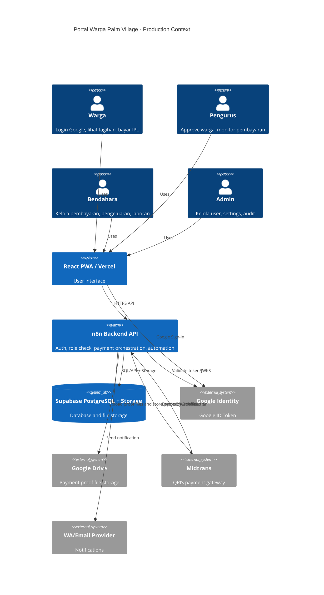
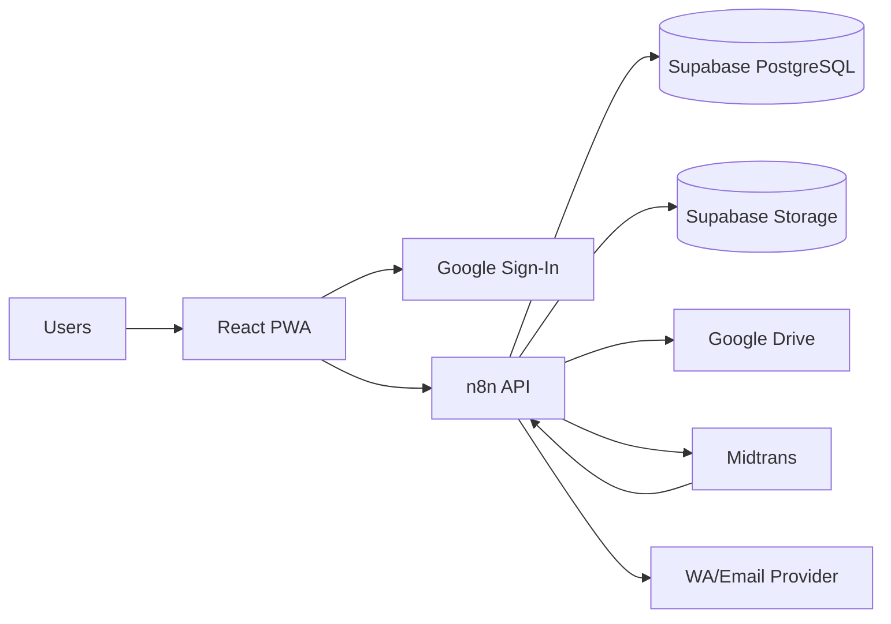
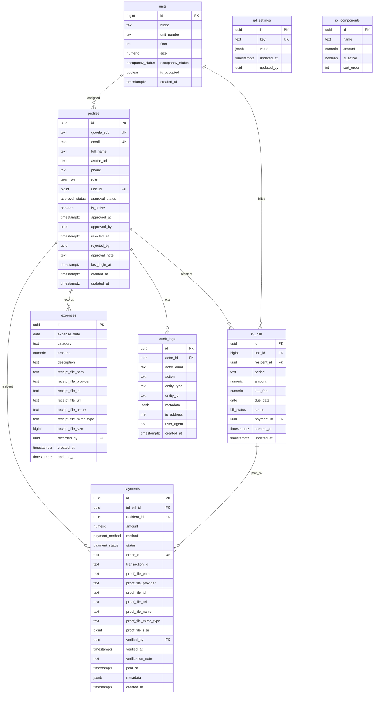
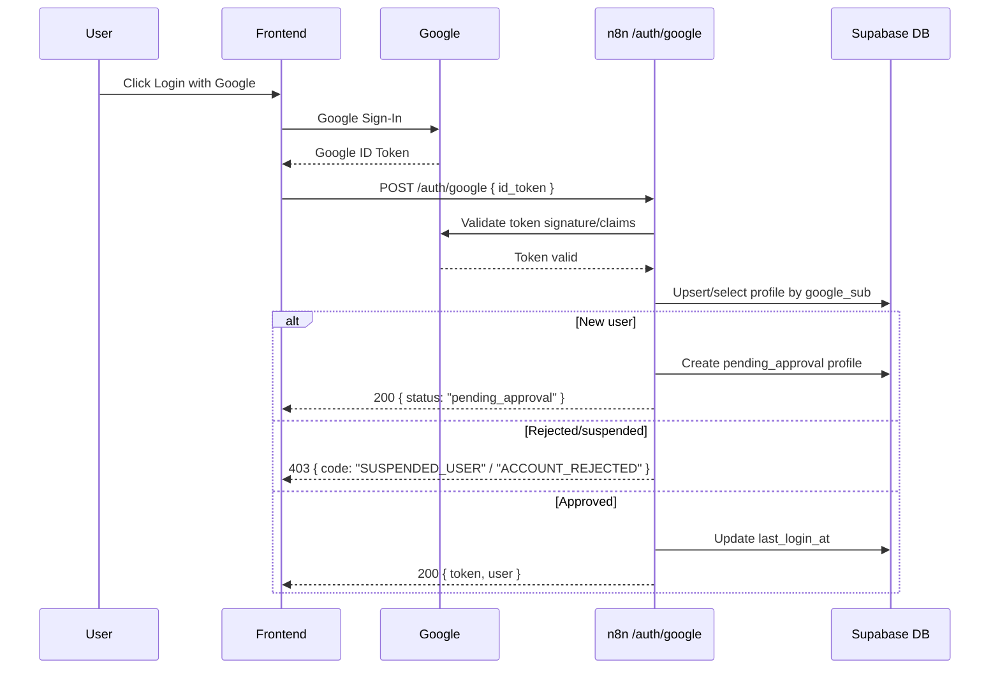
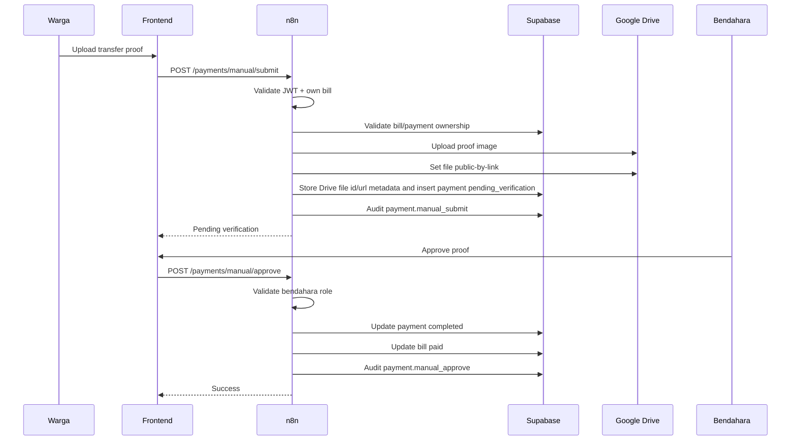

# Portal Warga Palm Village - Production Technical Requirements

> Purpose: dokumentasi teknikal mendetail untuk upgrade production.
>
> Reader: AI agent atau developer yang akan mengeksekusi implementasi.
>
> Source of truth:
> - Planning: `docs/production/PLANNING.md`
> - Execution tasks: `docs/production/TASKLIST.md`

---

## 1. Non-Negotiable Architecture Requirements

1. Supabase is the source of truth for persistent data.
2. n8n is the backend/API orchestration layer.
3. Frontend production mode must call n8n API endpoints, not write directly to Supabase.
4. Login production mode must use Google Account only.
5. Google ID Token is used only for login exchange.
6. n8n must issue an internal App JWT after Google token validation and profile checks.
7. Every protected n8n endpoint must validate App JWT.
8. Every protected n8n endpoint must verify `is_active`, `approval_status`, and role.
9. New Google users must become `pending_approval` before they can access app data.
10. Payment status must be finalized only by trusted backend logic: n8n + Supabase + Midtrans webhook verification.
11. QRIS webhook processing must be idempotent.
12. All financially meaningful actions must create audit logs.

---

## 2. System Context



If the renderer does not support C4 Mermaid syntax, use the flowchart below:



---

## 3. Environments

### 3.1 Required Environments

| Environment | Purpose | Data | Payment |
| --- | --- | --- | --- |
| `local` | Development | Local/demo/staging-safe data | None or sandbox |
| `staging` | UAT and integration testing | Production-like fake/sanitized data | Midtrans sandbox |
| `production` | Real warga and real payment | Real data | Midtrans production |

### 3.2 Environment Variables

Frontend:

| Name | Required | Example | Notes |
| --- | --- | --- | --- |
| `VITE_DEMO_MODE` | Yes | `true` or `false` | Demo uses mock data; production uses n8n |
| `VITE_N8N_API_BASE_URL` | Production | `https://api.palmvillage.id/webhook/portal-v1` | Base URL for portal n8n API; frontend appends routes like `/auth/google` |
| `VITE_GOOGLE_CLIENT_ID` | Production | `xxxxx.apps.googleusercontent.com` | Public Google OAuth client ID |
| `VITE_APP_ENV` | Yes | `local`, `staging`, `production` | UI diagnostics and guardrails |

n8n:

| Name | Required | Notes |
| --- | --- | --- |
| `APP_JWT_SECRET` | Yes | HS256 secret or private key if using RS256 |
| `APP_JWT_ISSUER` | Yes | Example: `portal-palm-village` |
| `APP_JWT_AUDIENCE` | Yes | Example: `portal-palm-village-web` |
| `GOOGLE_CLIENT_ID` | Yes | Must match frontend client ID |
| `SUPABASE_URL` | Yes | Project URL |
| `SUPABASE_SERVICE_ROLE_KEY` | Yes | Backend only; never expose to frontend |
| `GOOGLE_DRIVE_CREDENTIAL` | File upload | n8n credential for uploading proof files |
| `GOOGLE_DRIVE_PAYMENT_PROOF_FOLDER_ID` | File upload | Private parent folder id; never expose to frontend |
| `MIDTRANS_SERVER_KEY` | Payment | Backend only |
| `MIDTRANS_CLIENT_KEY` | Payment | If needed for Snap/frontend display, still avoid secret exposure |
| `MIDTRANS_ENV` | Payment | `sandbox` or `production` |
| `WA_PROVIDER_API_KEY` | Notification | Provider-specific |
| `SMTP_HOST`, `SMTP_USER`, `SMTP_PASS` | Notification | Optional email |

Supabase:

| Name | Required | Notes |
| --- | --- | --- |
| `DATABASE_URL` | Yes | Managed by Supabase |
| File storage policies | Yes | Google Drive proof files may be public-by-link; parent folders must not be publicly browsable |

---

## 4. Data Model Requirements

### 4.1 Entity Relationship Overview



### 4.2 Enums

`user_role`:

```sql
create type user_role as enum ('admin', 'bendahara', 'pengurus', 'warga');
```

`approval_status`:

```sql
create type approval_status as enum (
  'pending_approval',
  'approved',
  'rejected',
  'suspended'
);
```

`bill_status`:

```sql
create type bill_status as enum (
  'pending',
  'paid',
  'overdue',
  'cancelled'
);
```

`payment_status`:

```sql
create type payment_status as enum (
  'draft',
  'pending',
  'pending_verification',
  'completed',
  'failed',
  'expired',
  'cancelled',
  'refunded',
  'rejected'
);
```

`payment_method`:

```sql
create type payment_method as enum (
  'qris',
  'bank_transfer',
  'cash',
  'other'
);
```

`occupancy_status`:

```sql
create type occupancy_status as enum (
  'owner_occupied',
  'owner_vacant',
  'owner_rented',
  'tenant',
  'unknown'
);
```

### 4.3 Table Requirements

#### 4.3.1 `profiles`

Required columns:

| Column | Type | Required | Rule |
| --- | --- | --- | --- |
| `id` | uuid | Yes | Primary key, generated by DB or application |
| `google_sub` | text | Yes after Google login | Unique; primary Google identity |
| `email` | text | Yes | Unique, normalized lowercase |
| `full_name` | text | Yes | From Google initially, editable by user/staff |
| `avatar_url` | text | No | From Google |
| `phone` | text | No | Must be normalized for WhatsApp if used |
| `role` | user_role | Yes | Default `warga` |
| `unit_id` | bigint | Required when approved as warga | Nullable for admin/pending |
| `approval_status` | approval_status | Yes | Default `pending_approval` |
| `is_active` | boolean | Yes | Default true |
| `approved_by` | uuid | No | Staff/admin profile id |
| `approved_at` | timestamptz | No | Required when approved |
| `rejected_by` | uuid | No | Staff/admin profile id |
| `rejected_at` | timestamptz | No | Required when rejected |
| `approval_note` | text | No | Optional note |
| `last_login_at` | timestamptz | No | Updated by `/auth/google` |

Constraints:

- `unique (google_sub)`
- `unique (email)`
- `check (email = lower(email))`
- If `approval_status = 'approved'` and `role = 'warga'`, then `unit_id` should not be null. This may be enforced by application logic first if SQL check is too rigid for admin accounts.

#### 4.3.2 `units`

Required rules:

- `unique (block, unit_number)`.
- Do not delete units with payment history. Use soft state if needed.

#### 4.3.3 `ipl_bills`

Required rules:

- `unique (unit_id, period)`.
- `period` format must be `YYYY-MM`.
- `amount >= 0`.
- `late_fee >= 0`.
- `status` transitions:
  - `pending -> paid`
  - `pending -> overdue`
  - `overdue -> paid`
  - `pending/overdue -> cancelled` by admin/bendahara only.
- A bill must not become `paid` unless a completed payment exists.

#### 4.3.4 `payments`

Required rules:

- `order_id` must be unique when present.
- `transaction_id` should be indexed.
- QRIS payment uses `order_id` generated before calling Midtrans.
- Manual transfer starts as `pending_verification`.
- Cash payment can become `completed` immediately only by bendahara/admin.
- Payment amount must match bill amount + late fee unless an explicit admin/bendahara override is recorded.
- Manual transfer proof uses Google Drive as the zero-monthly-cost default.
- Google Drive proof files may be public-by-link, but the parent Drive folder must not be publicly browsable.
- Store `proof_file_url` and `proof_file_id` in Supabase for Google Drive uploads.
- Keep `proof_file_path` only for Supabase Storage fallback/legacy use.

#### 4.3.5 `expenses`

Required rules:

- Only bendahara/admin can create/update/delete.
- Pengurus can read.
- Warga cannot read by default unless a future public transparency feature is explicitly built.

#### 4.3.6 `audit_logs`

All significant backend actions must write audit logs:

- `auth.login_success`
- `auth.login_pending`
- `auth.login_rejected`
- `user.approve`
- `user.reject`
- `user.suspend`
- `bill.generate`
- `payment.qris_create`
- `payment.webhook_received`
- `payment.complete`
- `payment.manual_submit`
- `payment.manual_approve`
- `payment.manual_reject`
- `expense.create`
- `expense.update`
- `expense.delete`
- `settings.update`

Audit logs must include:

- actor id/email when available.
- target entity type/id.
- relevant metadata.
- timestamp.
- IP/user-agent if available from n8n request.

---

## 5. File Storage Requirements

### 5.1 Default Strategy

Production default:

- Payment proof files are uploaded by n8n to Google Drive.
- The Google Drive file itself may be public-by-link.
- The parent Google Drive folder must not be publicly browsable.
- Supabase stores file metadata and the file view URL.
- Supabase Storage remains a fallback/future option, not the primary zero-cost path.

### 5.2 Supabase Storage Fallback Buckets

| Bucket | Public | Used For |
| --- | --- | --- |
| `payment-proofs` | No | Optional fallback for transfer proof/cash receipt images |
| `expense-receipts` | No | Optional fallback for expense receipt images |
| `profile-avatars` | No | Optional uploaded/cached avatar image if needed |

### 5.3 Google Drive File Naming

Payment proof:

```text
{period}__unit-{unit_id}__payment-{payment_id}__{random_suffix}.{ext}
```

Expense receipt:

```text
{yyyy}-{mm}__expense-{expense_id}__{random_suffix}.{ext}
```

Rules:

- n8n must sanitize file names.
- File extensions must be allowlisted: `jpg`, `jpeg`, `png`.
- MIME types must be allowlisted: `image/jpeg`, `image/png`.
- Max file size must be 2 MB because the client should resize/compress before upload.
- Payment proof Google Drive file URLs may be public-by-link.
- Do not expose the parent Google Drive folder URL.
- Store `proof_file_provider`, `proof_file_id`, `proof_file_url`, `proof_file_name`, `proof_file_mime_type`, and `proof_file_size` in Supabase.
- If Supabase Storage fallback is used later, n8n must generate short-lived signed URLs only after JWT, role, approval, and ownership checks.

Detailed strategy:

- `docs/production/STORAGE_ACCESS_STRATEGY.md`

---

## 6. Authentication Requirements

### 6.1 Login Sequence



### 6.2 Google ID Token Validation

n8n must validate:

- Token signature using Google public keys/JWKS or a trusted verification endpoint.
- `iss` must be Google issuer.
- `aud` must equal `GOOGLE_CLIENT_ID`.
- `exp` must not be expired.
- `email_verified` must be true.
- `sub` must exist.

n8n must not trust user role, unit id, or approval status from frontend.

### 6.3 App JWT Claims

Recommended claims:

```json
{
  "iss": "portal-palm-village",
  "aud": "portal-palm-village-web",
  "sub": "profile_uuid",
  "email": "warga@gmail.com",
  "role": "warga",
  "unit_id": 12,
  "approval_status": "approved",
  "iat": 1780000000,
  "exp": 1780003600,
  "jti": "uuid"
}
```

Rules:

- Expiry: recommended 1-6 hours.
- Sensitive endpoints must still query DB for current `is_active` and `approval_status`.
- If refresh token/session is added later, store refresh tokens hashed in DB.

### 6.4 Protected Endpoint Middleware Contract

Every protected workflow must perform:

1. Read `Authorization: Bearer <token>`.
2. Verify token signature and `exp`.
3. Read profile from DB by `sub`.
4. Check `is_active = true`.
5. Check `approval_status = 'approved'`.
6. Check minimum role if endpoint requires staff/bendahara/admin.
7. Continue request.
8. Write audit log for significant actions.

Role helper:

```javascript
const ROLE_LEVEL = {
  warga: 10,
  pengurus: 20,
  bendahara: 30,
  admin: 40,
};

function hasMinRole(userRole, minRole) {
  return (ROLE_LEVEL[userRole] || 0) >= (ROLE_LEVEL[minRole] || 0);
}
```

---

## 7. n8n API Requirements

### 7.1 Standard Response Shape

Success:

```json
{
  "ok": true,
  "data": {},
  "error": null
}
```

Error:

```json
{
  "ok": false,
  "data": null,
  "error": {
    "code": "UNAUTHORIZED",
    "message": "Token tidak valid.",
    "details": {}
  }
}
```

### 7.2 Error Codes

| Code | HTTP | Meaning |
| --- | ---: | --- |
| `BAD_REQUEST` | 400 | Missing/invalid payload |
| `UNAUTHORIZED` | 401 | Missing/invalid/expired token |
| `PENDING_APPROVAL` | 403 | User exists but not approved |
| `ACCOUNT_REJECTED` | 403 | User rejected |
| `SUSPENDED_USER` | 403 | User inactive/suspended |
| `FORBIDDEN` | 403 | Role insufficient |
| `NOT_FOUND` | 404 | Entity not found |
| `CONFLICT` | 409 | Duplicate or invalid state transition |
| `VALIDATION_ERROR` | 422 | Payload shape valid but business validation failed |
| `INTERNAL_ERROR` | 500 | Unexpected backend error |
| `UPSTREAM_ERROR` | 502 | Midtrans/Supabase/WA provider error |

### 7.3 Endpoint Naming

Canonical public route pattern:

```text
{N8N_WEBHOOK_PUBLIC_BASE}/portal-v1/{resource}/{action}
```

Example:

```text
POST /portal-v1/auth/google
POST /portal-v1/auth/me
POST /portal-v1/users/pending
POST /portal-v1/users/approve
POST /portal-v1/bills/list
POST /portal-v1/payments/qris/create
POST /portal-v1/payments/midtrans/webhook
```

Frontend env convention:

```text
VITE_N8N_API_BASE_URL={N8N_WEBHOOK_PUBLIC_BASE}/portal-v1
```

Then frontend service functions call relative paths such as `/auth/google`.

Use POST if n8n webhook tooling makes GET awkward, but keep request/response semantics documented.

### 7.4 Required API Contracts

#### `POST /auth/google`

Public endpoint.

Request:

```json
{
  "id_token": "google_id_token"
}
```

Approved response:

```json
{
  "ok": true,
  "data": {
    "status": "approved",
    "token": "app_jwt",
    "user": {
      "id": "uuid",
      "email": "user@gmail.com",
      "full_name": "User Name",
      "role": "warga",
      "unit_id": 12,
      "approval_status": "approved"
    }
  },
  "error": null
}
```

Pending response:

```json
{
  "ok": true,
  "data": {
    "status": "pending_approval",
    "user": {
      "email": "user@gmail.com",
      "full_name": "User Name"
    }
  },
  "error": null
}
```

#### `GET/POST /auth/me`

Protected endpoint.

Response:

```json
{
  "ok": true,
  "data": {
    "user": {
      "id": "uuid",
      "email": "user@gmail.com",
      "full_name": "User Name",
      "phone": "62812...",
      "role": "warga",
      "unit_id": 12,
      "approval_status": "approved",
      "is_active": true
    }
  },
  "error": null
}
```

#### `GET/POST /users/pending`

Minimum role: `pengurus`.

Response data:

```json
{
  "users": [
    {
      "id": "uuid",
      "email": "new@gmail.com",
      "full_name": "New User",
      "avatar_url": "https://...",
      "created_at": "2026-07-07T00:00:00Z"
    }
  ]
}
```

#### `POST /users/approve`

Minimum role: `pengurus`.

Request:

```json
{
  "profile_id": "uuid",
  "unit_id": 12,
  "role": "warga",
  "approval_note": "Warga Blok A No. 12"
}
```

Rules:

- `pengurus` may approve only to `warga` unless business rule later allows more.
- Only `admin` should assign `admin`.
- `bendahara` assignment should require `admin`.
- `unit_id` required for role `warga`.

#### `POST /users/reject`

Minimum role: `pengurus`.

Request:

```json
{
  "profile_id": "uuid",
  "approval_note": "Tidak terdaftar sebagai warga."
}
```

#### `GET/POST /units/list`

Minimum role: `warga`.

Rules:

- Warga can see safe unit metadata.
- Staff can see more occupancy details.

#### `POST /units/upsert`

Minimum role: `admin`.

#### `GET/POST /bills/list`

Minimum role: `warga`.

Rules:

- Warga only gets bills for own `unit_id`.
- Pengurus+ can filter all units.

Request:

```json
{
  "period_from": "2026-01",
  "period_to": "2026-12",
  "unit_id": 12,
  "status": "pending"
}
```

#### `POST /bills/generate`

Minimum role: `bendahara`.

Request:

```json
{
  "period": "2026-08",
  "due_date": "2026-08-10",
  "dry_run": true
}
```

Rules:

- `dry_run = true` returns preview only.
- `dry_run = false` inserts bills.
- Must be idempotent through `unique(unit_id, period)`.

#### `POST /payments/manual/submit`

Minimum role: `warga`.

Rules:

- Warga can submit only for own bill.
- Pengurus+ can submit for any unit if allowed by business rule.
- `cash` method requires `bendahara`.
- `bank_transfer` requires proof upload.

Request:

```json
{
  "bill_id": "uuid",
  "method": "bank_transfer",
  "amount": 500000,
  "proof_file": "multipart-or-preuploaded-reference",
  "note": "Transfer BCA"
}
```

#### `POST /payments/manual/approve`

Minimum role: `bendahara`.

Request:

```json
{
  "payment_id": "uuid",
  "note": "Valid"
}
```

#### `POST /payments/manual/reject`

Minimum role: `bendahara`.

Request:

```json
{
  "payment_id": "uuid",
  "note": "Nominal tidak sesuai"
}
```

#### `POST /payments/qris/create`

Minimum role: `warga`.

Request:

```json
{
  "bill_ids": ["uuid"],
  "return_url": "https://portal.palmvillage.id/payment-result"
}
```

Rules:

- Warga can create QRIS only for own bills.
- Staff can create QRIS for all only if allowed by UI/business rule.
- Create `payments` row with `status = 'pending'`.
- Generate stable unique `order_id`.
- Call Midtrans.
- Return QRIS/payment instructions.

#### `POST /payments/midtrans/webhook`

Public endpoint but must verify Midtrans signature.

Rules:

- Never require App JWT because Midtrans calls it.
- Must verify signature/order status.
- Must be idempotent.
- Must record raw payload in metadata/audit log.

#### `GET/POST /reports/running-balance`

Minimum role: `pengurus`.

Request:

```json
{
  "period_to": "2026-08"
}
```

Response:

```json
{
  "months": [
    {
      "period": "2026-01",
      "opening_balance": 0,
      "income": 5000000,
      "expense": 2500000,
      "closing_balance": 2500000
    }
  ]
}
```

#### `POST /expenses/create`

Minimum role: `bendahara`.

#### `POST /settings/update`

Minimum role: `admin`.

---

## 8. Role Permission Matrix

| Feature / Endpoint Group | Warga | Pengurus | Bendahara | Admin |
| --- | --- | --- | --- | --- |
| Login Google | Yes | Yes | Yes | Yes |
| Pending approval page | Yes, own state only | Yes | Yes | Yes |
| Approve/reject user | No | Yes, warga only | Yes, warga only | Yes, all roles |
| View own bills | Yes | Yes | Yes | Yes |
| View all bills | No | Yes | Yes | Yes |
| Generate bills | No | No | Yes | Yes |
| Submit transfer own bill | Yes | Yes | Yes | Yes |
| Submit payment for others | No | Transfer only | Transfer/cash | Transfer/cash |
| Approve payment proof | No | No | Yes | Yes |
| Create QRIS own bill | Yes | Yes | Yes | Yes |
| Expenses read | No | Yes | Yes | Yes |
| Expenses create/update/delete | No | No | Yes | Yes |
| Reports | No | Yes | Yes | Yes |
| Settings read | No | Yes | Yes | Yes |
| Settings update | No | No | No | Yes |
| Audit logs | No | No | No | Yes |

---

## 9. Payment Requirements

### 9.1 Manual Transfer Flow



### 9.2 QRIS Flow

```mermaid
sequenceDiagram
  participant W as Warga
  participant FE as Frontend
  participant N as n8n
  participant S as Supabase
  participant M as Midtrans

  W->>FE: Choose bill and pay QRIS
  FE->>N: POST /payments/qris/create
  N->>N: Validate JWT + own bill
  N->>S: Insert payment pending with order_id
  N->>M: Create transaction
  M-->>N: QRIS transaction data
  N->>S: Save transaction metadata
  N-->>FE: QRIS data

  M->>N: POST /payments/midtrans/webhook
  N->>N: Verify signature
  N->>S: Find payment by order_id
  alt Already completed
    N->>S: Record duplicate webhook audit only
  else Settlement/success
    N->>S: Update payment completed
    N->>S: Update bill paid
    N->>S: Audit payment.complete
  else Failed/expired
    N->>S: Update payment failed/expired
  end
  N-->>M: 200 OK
```



### 9.3 Midtrans Idempotency Rules

- `order_id` must be unique.
- Webhook handler must lock or re-read current payment status before update.
- If payment already `completed`, do not create another completed payment.
- Store webhook payload in `payments.metadata.webhooks[]` if practical, or audit log at minimum.
- Do not trust frontend payment success page. Only webhook/backend verification finalizes payment.

---

## 10. Reporting Requirements

### 10.1 Running Balance Formula

For each period:

```text
opening_balance = previous_period.closing_balance
income = sum(payments.amount where status = completed and paid_at in period)
expense = sum(expenses.amount where expense_date in period)
closing_balance = opening_balance + income - expense
```

Rules:

- Start period default: `2025-01` unless configured otherwise.
- Reports must use completed payments only.
- Pending verification payments are not income.
- Failed/expired/rejected payments are not income.
- Deleted/void expenses must not be counted; if soft delete is added, filter it.

### 10.2 Report Access

- Minimum role: `pengurus`.
- Warga cannot view finance reports.

### 10.3 Performance

Required indexes:

- `payments(status, paid_at)`
- `payments(ipl_bill_id)`
- `payments(order_id)`
- `ipl_bills(unit_id, period)`
- `ipl_bills(period, status)`
- `expenses(expense_date)`
- `audit_logs(created_at)`

For large data, n8n should query aggregated SQL rather than load all rows and aggregate in workflow memory.

---

## 11. Frontend Requirements

### 11.1 Modes

Demo mode:

- `VITE_DEMO_MODE=true`
- Existing mock data and demo accounts continue working.
- Useful for UI development.

Production mode:

- `VITE_DEMO_MODE=false`
- Login page shows Google login only.
- App uses `VITE_N8N_API_BASE_URL`.
- All protected calls use `Authorization: Bearer <App JWT>`.

### 11.2 Session Handling

Recommended:

- Store App JWT in memory plus localStorage/sessionStorage initially if the current app pattern requires persistence.
- On app start, call `/auth/me`.
- If `/auth/me` fails with `UNAUTHORIZED`, clear session and redirect to login.
- If `PENDING_APPROVAL`, show pending approval screen.

Security note:

- HttpOnly cookie would be stronger, but requires n8n/domain cookie handling. If not feasible in first production iteration, use short-lived JWT and strict HTTPS.

### 11.3 UX Requirements

Login:

- One clear button: "Login dengan Google".
- No email/password in production mode.
- Pending approval state must be friendly and clear.
- Rejected/suspended state must be clear without exposing sensitive admin notes unless intended.

Payment:

- Never show "paid" based only on QR page return.
- Show "menunggu konfirmasi" until backend status is completed.

Approval:

- Approver must see user email, name, avatar if available, registration time.
- Approver must assign unit before approving warga.
- Confirmation dialog before reject/approve.

Reports:

- Show loading and empty states.
- Avoid table overflow on mobile; use horizontal scroll if needed.

---

## 12. n8n Workflow Implementation Requirements

### 12.1 Workflow Naming Convention

```text
PV API - Auth Google
PV API - Auth Me
PV API - Profile Update
PV API - Users Pending
PV API - Users Approve
PV API - Users Reject
PV API - Units List
PV API - Units Upsert
PV API - Residents List
PV API - Residents Create
PV API - Residents Update
PV API - Residents Delete
PV API - Residents Import CSV
PV API - Bills List
PV API - Bills Generate
PV API - Payments List
PV API - Payments QRIS Create
PV API - Payments Midtrans Webhook
PV API - Payments Manual Submit
PV API - Payments Manual Approve
PV API - Payments Manual Reject
PV API - Payments Cash Create
PV API - Files Payment Proof Upload
PV API - Files Expense Receipt Upload
PV API - Expenses List
PV API - Expenses Create
PV API - Expenses Update
PV API - Expenses Delete
PV API - Logs List
PV API - Reports Running Balance
PV API - Reports Monthly Finance
PV API - Settings Update
PV API - Health Check
PV JOB - Monthly Billing
PV JOB - Payment Reminder
PV JOB - Overdue Reminder
PV UTIL - Verify App JWT
PV UTIL - Audit Log
```

### 12.2 Workflow Design Rules

- Each public API workflow must have one clear input schema.
- Auth/role validation should be implemented with reusable sub-workflow or consistent copied block if sub-workflows are not practical.
- All database writes must handle failure explicitly.
- Payment workflows must write audit logs.
- Webhook workflows must return response quickly and consistently.
- Long notification jobs should not block payment finalization.

### 12.3 n8n Production Operations

Recommended:

- Use Postgres for n8n internal database.
- Set stable `N8N_ENCRYPTION_KEY`.
- Backup n8n database and workflows.
- Separate staging and production n8n.
- Use queue mode/worker when traffic or long-running jobs increase.
- Restrict editor access.
- Protect webhook URLs where possible, except public provider callbacks that use signature verification.

---

## 13. Security Requirements

### 13.1 Secrets

Must never appear in frontend:

- Supabase service role key.
- Midtrans server key.
- App JWT secret/private key.
- WA provider key.
- SMTP password.

### 13.2 Authorization

Every protected action must be authorized by backend state:

- JWT claims are useful but DB profile is final.
- Unit ownership must be checked from DB.
- Role must be checked from DB for sensitive actions.
- Approval status must be checked from DB.

### 13.3 Negative Tests

Before production:

- Missing JWT should fail.
- Expired JWT should fail.
- Warga accessing another unit bill should fail.
- Warga approving payment should fail.
- Pengurus creating cash payment should fail.
- Bendahara editing settings should fail.
- Duplicate Midtrans webhook should not duplicate payment.
- User suspended after token issue should fail sensitive endpoint after DB check.

---

## 14. Migration Requirements

### 14.1 Existing App Compatibility

Existing demo implementation must remain usable.

Required pattern:

```javascript
if (import.meta.env.VITE_DEMO_MODE === 'true') {
  // use mockData
} else {
  // use n8n API
}
```

### 14.2 Migration Order

1. Add production schema without breaking demo.
2. Add n8n API client without changing all pages at once.
3. Migrate login first.
4. Migrate `/auth/me`.
5. Migrate approval.
6. Migrate read-only data endpoints.
7. Migrate write endpoints.
8. Migrate payment.

---

## 15. Validation and Review Requirements

At the end of each phase:

1. Run build if frontend changed: `npm run build`.
2. Run available lint/tests if added.
3. Review console/runtime errors.
4. Review role/approval security.
5. Review performance impact.
6. Review UI/UX impact.
7. Update `docs/production/TASKLIST.md`.
8. Add phase review notes.

The agent must not silently skip phase review.

---

## 16. Open Decisions

These must be resolved before or during Phase 0:

1. Final production domain for frontend.
2. Final production domain for n8n API.
3. Whether App JWT is stored in localStorage/sessionStorage or HttpOnly cookie.
4. Whether n8n will use Supabase REST API or direct Postgres credentials.
5. WhatsApp provider selection.
6. Whether pengurus can approve only warga or can also assign pengurus role.
7. Whether QRIS can be created by staff on behalf of warga.
8. Exact IPL due date and overdue policy.
9. Whether public transparency reports are visible to warga in a later phase.

Default assumptions until changed:

- App JWT uses short-lived bearer token.
- n8n uses Supabase service role through REST/PostgREST or database node.
- Pengurus can approve only warga.
- Bendahara/admin approve payment proof.
- Admin only edits settings and assigns elevated roles.
