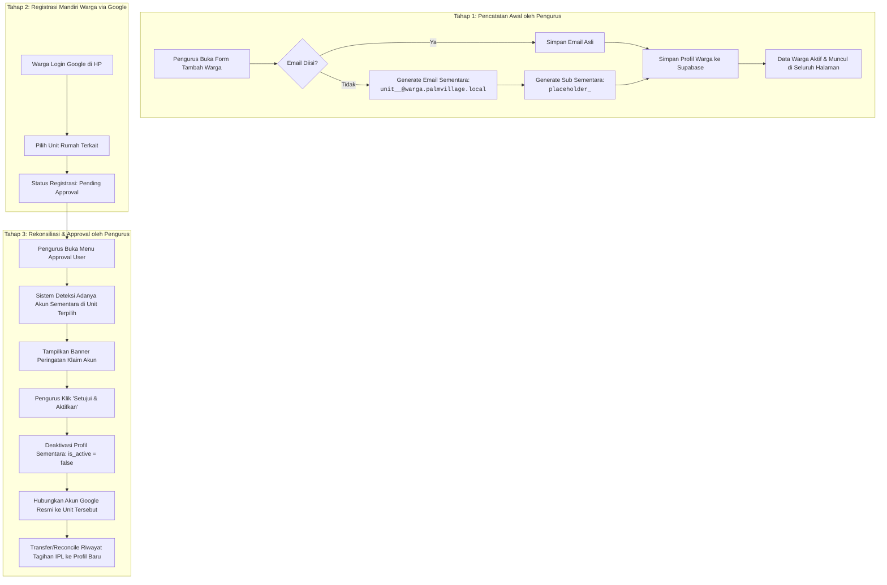

# Arsitektur & Panduan: Pengisian Data Warga Tanpa Email & Auto-Claim Akun Google

Dokumen ini merinci arsitektur teknis, desain database, alur rekonsiliasi akun, dan panduan operasional (SOP) untuk fitur pencatatan penghuni tanpa email (*Placeholder Profile*) serta mekanisme klaim otomatis saat warga login via Google OAuth di Portal Warga Palm Village.

---

## 📌 Latar Belakang & Masalah Bisnis

Pada praktiknya di lingkungan perumahan Palm Village:
1. **Ketidaksediaan Email Warga Secara Lengkap**: Pengurus RT/RW seringkali hanya mengantongi data nama lengkap, nomor rumah, dan nomor telepon/WhatsApp warga, tanpa mengetahui alamat email resmi warga.
2. **Kebutuhan Data Awal yang Lengkap**: Daftar Rumah, Matriks IPL, dan Laporan Keuangan memerlukan data nama penghuni sejak awal agar status hunian dan tagihan dapat dipetakan secara akurat.
3. **Kendala Database**: Skema database Supabase (`profiles`) menerapkan constraint `NOT NULL` dan `UNIQUE` pada kolom `email` dan `google_sub`.
4. **Pendaftaran Mandiri di Masa Depan**: Ketika warga suatu saat memutuskan untuk menggunakan aplikasi dengan login menggunakan akun Google (Gmail) pribadinya, sistem harus secara cerdas mengenali rumah yang dimaksud dan menggabungkan/menggantikan data sementara tersebut tanpa membuat duplikasi data atau merusak riwayat pembayaran IPL.

---

## 🏗️ Solusi Arsitektur

---

## 🗄️ Detail Teknis & Spesifikasi Database

### 1. Format Placeholder Profile
Ketika profil dibuat tanpa alamat email:
* **`email`**: `unit_<block>_<unit_number>@warga.palmvillage.local` (contoh: `unit_cb1_2@warga.palmvillage.local`) atau `unassigned_<timestamp>@warga.palmvillage.local` jika unit belum dipilih.
* **`google_sub`**: `placeholder_<uuid>` (memenuhi syarat `UNIQUE` & `NOT NULL`).
* **`full_name`**: Nama warga yang diisi oleh Pengurus.
* **`phone`**: Nomor HP / WA warga.
* **`unit_id`**: Foreign Key ke tabel `units`.
* **`role`**: `'warga'`.
* **`approval_status`**: `'approved'` (karena diinput langsung oleh Pengurus).
* **`is_active`**: `true`.

### 2. Tampilan Frontend
* Di halaman **Daftar Penghuni** (`Residents.jsx`):
  - Alamat email internal `.local` disembunyikan dari tabel dan kartu detail.
  - Digantikan dengan badge informatif: `🟡 Akun Sementara (Belum Login)`.
* Di halaman **Approval User** (`UserApproval.jsx`):
  - Dropdown unit menandai unit yang memiliki akun sementara: `Blok A/1 - Bpk. Contoh (Akun Sementara)`.
  - Banner informasi muncul otomatis saat unit tersebut dipilih pada modal persetujuan.

---

## 🔄 Alur Kerja n8n Backend

### 1. `PV API - Residents Create` (`LkUJdTKvdspl3hK4`)
* Menerima payload `POST /api/residents/create`.
* Jika properti `email` kosong / tidak disertakan:
  - Query data `units` untuk mendapatkan blok dan nomor unit.
  - Bentuk format `unit_<block>_<number>@warga.palmvillage.local`.
  - Bentuk `google_sub = placeholder_<uuid>`.
  - Lakukan insert ke Supabase `profiles`.

### 2. `PV API - Users Approve` (`dih5U9wvmuWHa48Q`)
* Menerima payload `POST /api/users/approve` dengan parameter `user_id`, `unit_id`, `role`, `occupancy_status`.
* Menjalankan logika rekonsiliasi:
  1. Cari profil aktif lain pada `unit_id` yang sama di mana `email LIKE '%@warga.palmvillage.local'`.
  2. Jika ditemukan, perbarui profil sementara tersebut menjadi `is_active = false` dan `approval_status = 'superseded'`.
  3. Perbarui seluruh tagihan `ipl_bills` yang sebelumnya terhubung ke `resident_id` akun sementara agar merujuk ke `user_id` yang baru disetujui.
  4. Aktifkan akun Google baru (`approval_status = 'approved'`, `is_active = true`, `unit_id = <unit_id>`).

---

## 📖 Panduan Operasional (SOP Pengurus)

### Skenario A: Menambah Warga Baru yang Belum Mendaftar
1. Masuk ke Portal Warga sebagai **Admin** atau **Pengurus**.
2. Buka menu **Daftar Penghuni** pada navigasi utama.
3. Klik tombol **"Tambah Warga"**.
4. Masukkan **Nama Lengkap**, **Nomor HP/WA**, dan pilih **Unit Rumah**.
5. Kolom **Email** biarkan kosong.
6. Klik **Tambah**. Data seketika muncul di Daftar Rumah dan Matriks Pembayaran.

### Skenario B: Menyetujui Warga yang Mendaftar via Akun Google
1. Buka menu **Approval User**.
2. Klik tombol **Setujui** pada pendaftaran warga yang masuk.
3. Pilih nomor unit rumah warga tersebut. Jika rumah tersebut sebelumnya telah diisi data sementara, sistem akan menampilkan pemberitahuan *Klaim & Penggantian Akun Sementara*.
4. Klik **Setujui & Aktifkan**. Akun Google warga resmi langsung aktif dan mengambil alih unit rumah tersebut.
