# Panduan Penggunaan Portal Warga Palm Village
**Sistem Layanan IPL, Informasi Hunian, dan Kontak Kompleks**

---

## 📌 Pengantar

Selamat datang di **Portal Warga Palm Village**!  
Portal ini dirancang untuk memudahkan seluruh warga perumahan Palm Village dalam:
1. Memantau transparansi status iuran pengelolaan lingkungan (**IPL**).
2. Melakukan pembayaran IPL secara praktis, baik via **QRIS Otomatis** (GoPay, OVO, ShopeePay, DANA, BCA, Mandiri, BRI, dll.) maupun **Transfer Bank Manual**.
3. Melihat direktori warga/penghuni kompleks.
4. Mengakses nomor darurat dan pos satpam komplek (**SOS Siaga 24 Jam**).

Panduan ini berisi langkah-langkah praktis dan visual untuk memandu warga dari proses masuk (*login*) hingga penyelesaian transaksi pembayaran.

---

## 📋 Daftar Isi

1. [Cara Masuk / Login ke Portal](#1-cara-masuk--login-ke-portal)
2. [Mengenal Beranda Utama](#2-mengenal-beranda-utama)
3. [Melihat Matriks Pembayaran IPL](#3-melihat-matriks-pembayaran-ipl)
4. [Pembayaran IPL - Metode 1: QRIS Otomatis (Rekomendasi)](#4-pembayaran-ipl---metode-1-qris-otomatis-rekomendasi)
5. [Pembayaran IPL - Metode 2: Transfer Bank Manual (Upload Bukti)](#5-pembayaran-ipl---metode-2-transfer-bank-manual-upload-bukti)
6. [Arti Status Warna Tagihan IPL](#6-arti-status-warna-tagihan-ipl)
7. [Fitur Lainnya (Daftar Penghuni & Kontak Darurat SOS)](#7-fitur-lainnya-daftar-penghuni--kontak-darurat-sos)
8. [Tanya Jawab (FAQ) & Bantuan](#8-tanya-jawab-faq--bantuan)

---

## 1. Cara Masuk / Login ke Portal

Portal Warga Palm Village menggunakan autentikasi akun Google yang aman dan terverifikasi.

### Langkah 1: Buka Halaman Login
Akses alamat Portal Warga melalui peramban (*browser*) HP Anda (Google Chrome / Safari). Pada halaman utama, klik tombol **"Sign in with Google"**.

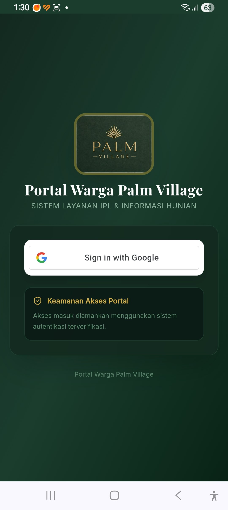

---

### Langkah 2: Pilih Akun Google Terdaftar
Pilih akun Google (email Gmail) Anda yang telah didaftarkan ke pengurus RT/RW Palm Village.

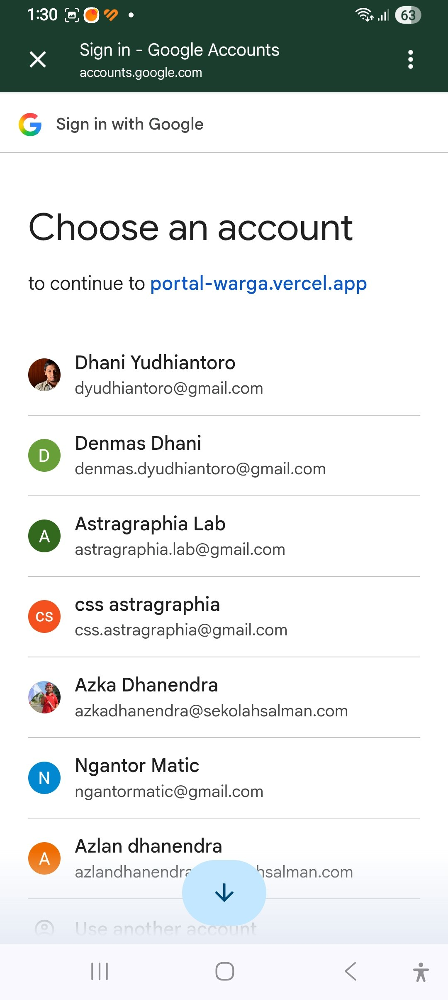

---

### Langkah 3: Konfirmasi Masuk
Jika perangkat meminta konfirmasi, klik akun Anda untuk langsung masuk ke portal.

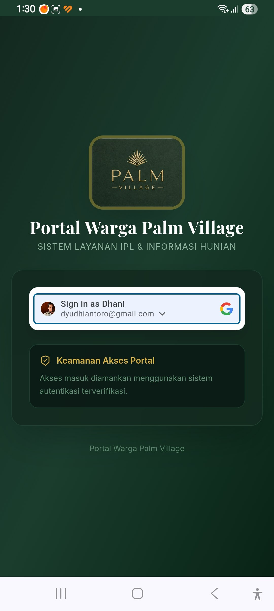

> 💡 **Catatan**: Jika email Anda belum terdaftar di sistem warga atau unit rumah Anda belum terhubung, hubungi pengurus perumahan untuk aktivasi akun.

---

## 2. Mengenal Beranda Utama

Setelah berhasil masuk, Anda akan disambut di halaman **Beranda**.

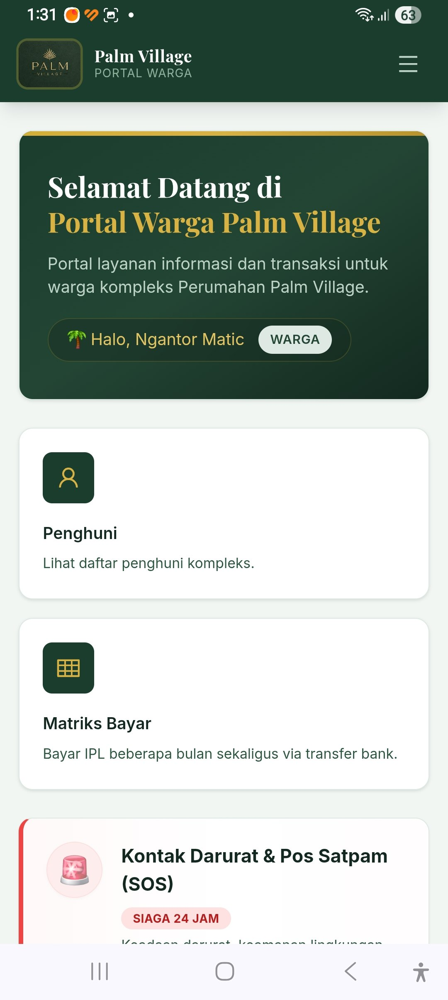

### Komponen Utama Beranda:
* **Kartu Selamat Datang & Profil**: Menampilkan nama warga dan badge peran (**WARGA**).
* **Menu Penghuni**: Melihat daftar warga dan nomor unit di kompleks Palm Village.
* **Menu Matriks Bayar**: Membuka matriks tagihan IPL dan melakukan pembayaran iuran.
* **Kontak Darurat & Pos Satpam (SOS)**: Tombol panggilan cepat satpam siaga 24 jam untuk kondisi darurat.

---

## 3. Melihat Matriks Pembayaran IPL

Menu **Matriks Bayar** menyajikan transparansi seluruh unit rumah beserta riwayat iuran setiap bulannya.

### Tampilan Halaman Matriks & Legenda
Pada bagian atas, terdapat pilihan **Tahun Buku** (contoh: *2026/2027*) dan keterangan status warna.

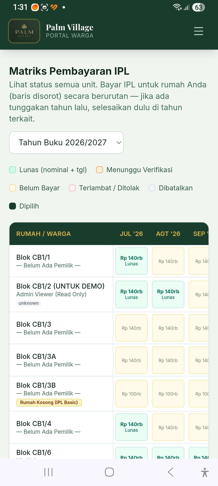

---

### Menemukan Unit Rumah Anda
Gulir layar ke bawah untuk menemukan unit rumah Anda. Baris rumah Anda akan disorot dengan tanda khusus **"RUMAH SAYA"** (contoh: `Blok CB1/8`).

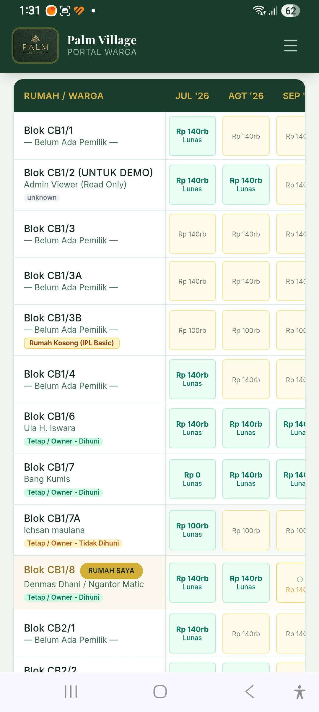

---

## 4. Pembayaran IPL - Metode 1: QRIS Otomatis (Rekomendasi)

Metode QRIS adalah cara tercepat karena verifikasi berlangsung otomatis dalam hitungan detik tanpa perlu menunggu konfirmasi manual pengurus.

### Langkah 1: Pilih Bulan Tagihan yang Ingin Dibayar
1. Ketuk kotak bulan yang belum lunas pada baris **RUMAH SAYA** (pembayaran harus berurutan jika ada tunggakan).
2. Kotak yang dipilih akan berwarna gelap dengan tanda centang (✓).

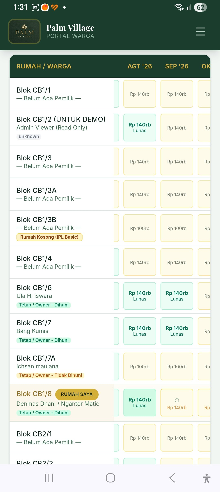

---

### Langkah 2: Periksa Total & Lanjutkan Pembayaran
Panel di bagian bawah layar akan menampilkan jumlah bulan yang dipilih beserta total nominalnya. Klik tombol kuning **"Lanjutkan Pembayaran →"**.

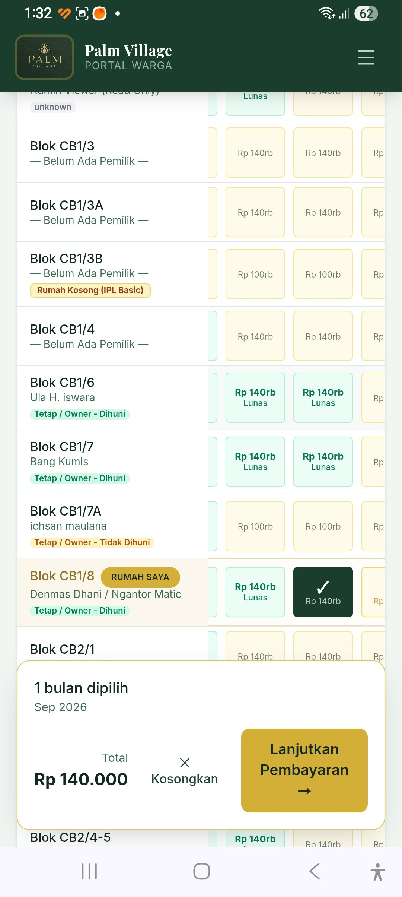

---

### Langkah 3: Pilih Metode QRIS
Pada pop-up *Konfirmasi Pembayaran IPL*, pilih tombol **"QRIS Midtrans"** atau **"QRIS DOKU"**, lalu klik tombol kuning **"Lanjut ke QRIS"**.

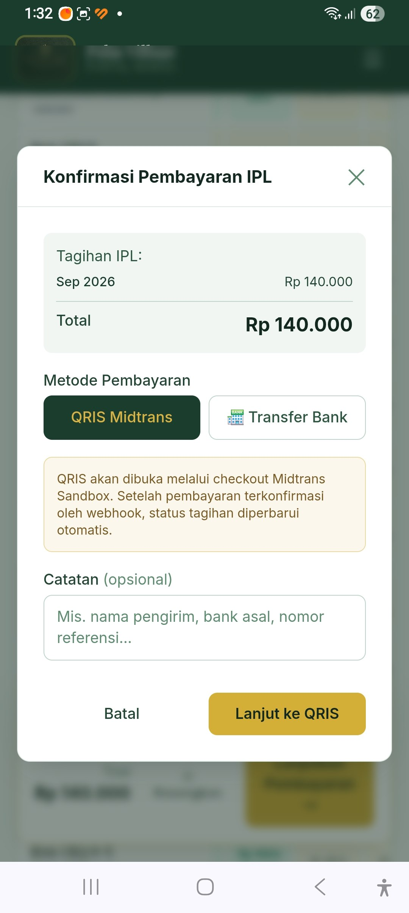

---

### Langkah 4: Tampilan Kode QRIS & Rincian Tagihan
Sistem akan menampilkan kode QR dinamis khusus untuk transaksi Anda beserta **Order ID**, **Total Tagihan**, dan **Periode Bulan**.

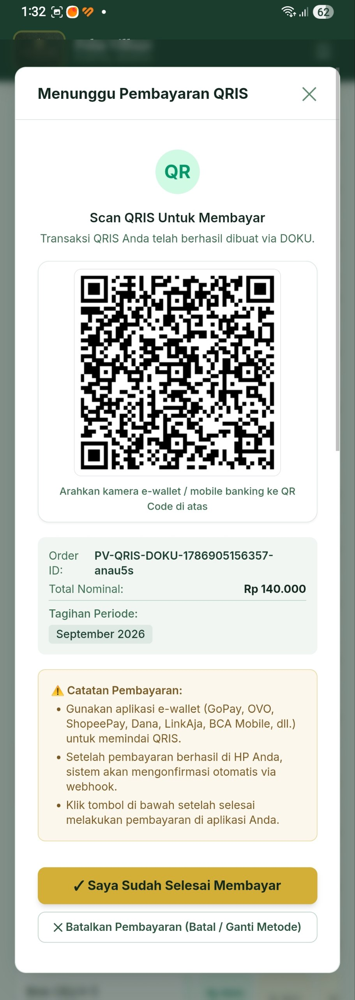

---

### Langkah 5: Pembayaran di Aplikasi Bank / E-Wallet
1. **Jika menggunakan HP yang sama**: Ambil *screenshot* kode QRIS tersebut, lalu buka aplikasi perbankan / e-wallet Anda (BCA Mobile, Mandiri Livin, BRImo, GoPay, OVO, ShopeePay, DANA, Jago, dll.), pilih menu **Scan QR / QRIS**, dan unggah screenshot dari galeri.
2. **Jika menggunakan HP lain**: Langsung arahkan kamera scanner aplikasi ke layar kode QR.
3. Periksa penerima pembayaran: **Palm Village - Social** dan nominalnya, lalu klik **"Bayar Sekarang"**.

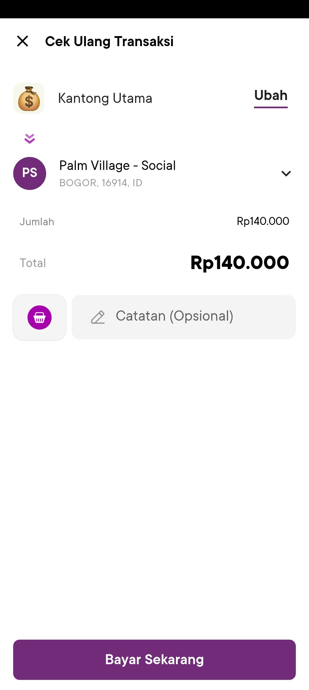

---

### Langkah 6: Selesai & Status Otomatis Lunas
Setelah pembayaran selesai di aplikasi Anda, kembali ke Portal Warga dan klik tombol **"✓ Saya Sudah Selesai Membayar"**. Sistem webhook akan memverifikasi pembayaran dan otomatis mengubah status bulan tersebut menjadi **Lunas (Warna Hijau)**.

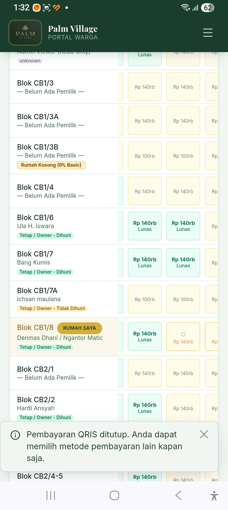

---

## 5. Pembayaran IPL - Metode 2: Transfer Bank Manual (Upload Bukti)

Jika warga memilih mentransfer langsung ke rekening kas pengurus, ikuti langkah berikut:

### Langkah 1: Pilih Metode "Transfer Bank"
Pada pop-up *Konfirmasi Pembayaran IPL*, pilih tab **"Transfer Bank"**.

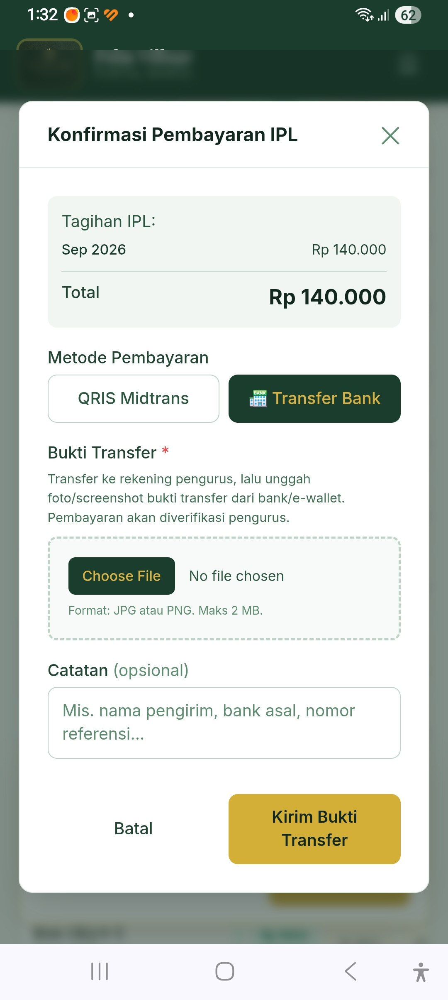

---

### Langkah 2: Unggah Foto Bukti Transfer
1. Lakukan transfer dana ke nomor rekening pengurus yang telah ditentukan.
2. Klik tombol **"Choose File"** pada form.
3. Pilih foto atau *screenshot* bukti transfer dari galeri HP Anda (format JPG/PNG, ukuran maksimal 2 MB).

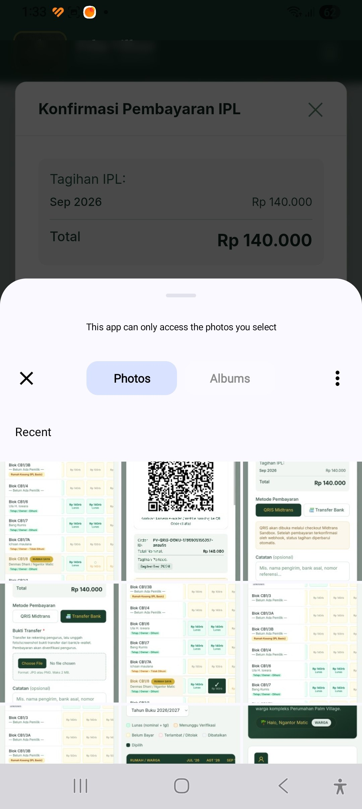

---

### Langkah 3: Beri Catatan & Kirim
1. Pastikan nama file bukti transfer muncul dengan tanda centang hijau (✓).
2. Isi kolom **Catatan (opsional)** dengan nama bank pengirim atau nama pemilik rekening asal.
3. Klik tombol kuning **"Kirim Bukti Transfer"**.

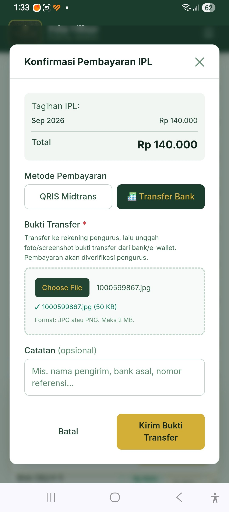

> ⏳ **Catatan**: Setelah bukti transfer dikirim, status tagihan akan berubah menjadi **Menunggu Verifikasi (Warna Oranye)** sampai pengurus memeriksa mutasi bank dan menyetujuinya menjadi **Lunas**.

---

## 6. Arti Status Warna Tagihan IPL

Pada tabel matriks, setiap sel bulan memiliki warna indikator status:

| Warna | Status | Penjelasan |
| :--- | :--- | :--- |
| 🟢 **Hijau Muda** | **Lunas** | Tagihan telah dibayar dan terverifikasi (tertera nominal & tanggal bayar). |
| 🟠 **Oranye / Kuning Tua** | **Menunggu Verifikasi** | Bukti transfer manual sudah diunggah, menunggu pengecekan bendahara. |
| 🟡 **Kuning Pucat** | **Belum Bayar** | Tagihan bulan berjalan/mendatang yang belum dibayarkan. |
| 🔴 **Merah Muda** | **Terlambat / Ditolak** | Pembayaran melewati jatuh tempo atau bukti transfer manual ditolak pengurus. |
| ⚪ **Abu-abu Muda** | **Dibatalkan** | Transaksi dibatalkan oleh sistem atau pengurus. |
| ⚫ **Hijau Tua / Gelap** | **Dipilih** | Kotak bulan yang sedang Anda tandai untuk dibayar. |

---

## 7. Fitur Lainnya (Daftar Penghuni & Kontak Darurat SOS)

1. **Daftar Penghuni Kompleks**:  
   Warga dapat melihat daftar nama tetangga dan status hunian unit (Dihuni Pemilik, Kontrak, atau Rumah Kosong) untuk memudahkan silaturahmi antarwarga.
2. **Kontak Darurat & Satpam (SOS Siaga 24 Jam)**:  
   Tersedia tombol panggilan cepat WhatsApp dan Telepon biasa langsung ke petugas satpam yang bertugas untuk laporan keamanan, bantuan penerimaan paket, maupun situasi medis darurat:
   * 👮 **Satpam Riki**: [WhatsApp (+62895323136366)](https://wa.me/62895323136366) | [Telepon (0895-3231-36366)](tel:+62895323136366)
   * 👮 **Satpam Roni**: [WhatsApp (+62881010357049)](https://wa.me/62881010357049) | [Telepon (0881-0103-57049)](tel:+62881010357049)

---

## 8. Tanya Jawab (FAQ) & Bantuan

**Q1: Mengapa saya tidak bisa memilih bulan Oktober jika bulan September belum dibayar?**  
*Jawab*: Sistem menerapkan prinsip pembayaran berurutan untuk menghindari tunggakan bulan sebelumnya terlewati. Harap pilih bulan yang paling lampau terlebih dahulu.

**Q2: Apakah saya bisa membayar beberapa bulan sekaligus (misal 3 bulan atau 1 tahun)?**  
*Jawab*: Ya! Anda cukup mengetuk beberapa bulan secara berurutan pada baris rumah Anda. Panel total di bawah akan otomatis mengakumulasikan nominal seluruh bulan yang dipilih.

**Q3: Berapa lama status pembayaran QRIS berubah menjadi Lunas?**  
*Jawab*: Pembayaran QRIS terverifikasi secara instan (real-time). Biasanya status langsung berubah menjadi hijau dalam hitungan detik setelah transaksi sukses di e-wallet/m-banking.

**Q4: Bagaimana jika saya salah unggah bukti transfer?**  
*Jawab*: Hubungi pengurus/bendahara RT melalui kontak yang tersedia untuk membantu membatalkan atau merevisi verifikasi transaksi tersebut.

---

*Portal Warga Palm Village &copy; 2026. Seluruh hak cipta dilindungi.*
