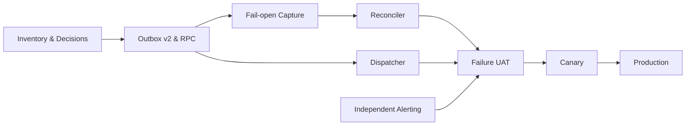

# Task Implementasi Notifikasi Email Transaksional

> Sistem: Portal Warga Palm Village
> Status: Planned — belum dieksekusi
> Tanggal: 5 Agustus 2026
> Requirement: `email-notification-requirement.md`
> Plan: `email-notification-plan.md`

## 1. Prinsip Pengerjaan

Task berjalan dari inventory dan keputusan, fondasi data, capture/recovery, delivery, monitoring, lalu rollout. Prototype lokal tidak dianggap production-ready sebelum task dan gate terkait lulus.

## 2. Daftar Task Berurutan

| Urutan | Task ID | Tugas | Dependency | Status |
| ---: | --- | --- | --- | --- |
| 1 | EMAIL-001 | Export dan baseline workflow production | - | Partial — inventory lokal selesai, export live belum lengkap |
| 2 | EMAIL-002 | Kunci sender, provider alert, penerima, retensi, dan SLO | EMAIL-001 | Partial — default tercatat, credential eksternal belum diverifikasi |
| 3 | EMAIL-003 | Finalisasi kontrak event dan dedupe key | EMAIL-001–002 | Done (local contract v1.0.0) |
| 4 | EMAIL-004 | Rancang dan buat migration outbox v2 additive | EMAIL-003 | Done (local, belum diterapkan) |
| 5 | EMAIL-005 | Implement atomic claim dan lease RPC | EMAIL-004 | Done (local, belum diuji PostgreSQL) |
| 6 | EMAIL-006 | Implement attempt history, dead-letter, dan safe replay | EMAIL-004–005 | Done (local foundation) |
| 7 | EMAIL-007 | Implement fail-open capture profil | EMAIL-004 | Done (local migration) |
| 8 | EMAIL-008 | Implement fail-open capture pembayaran IPL | EMAIL-003–004 | Done (local migration) |
| 9 | EMAIL-009 | Lengkapi actor pada workflow mutasi production | EMAIL-001, EMAIL-003 | Blocked — source live payment/approval belum tersedia |
| 10 | EMAIL-010 | Implement reconciler dan backfill dry-run | EMAIL-007–009 | Done (local workflow/helper, backfill belum dijalankan) |
| 11 | EMAIL-011 | Implement renderer template terversi | EMAIL-003–004 | Done (local workflow v2) |
| 12 | EMAIL-012 | Implement Gmail raw send dan deterministic Message-ID | EMAIL-005, EMAIL-011 | Done (local, credential/API belum diuji) |
| 13 | EMAIL-013 | Implement Gmail Sent reconciliation | EMAIL-012 | Done (local, belum UAT provider) |
| 14 | EMAIL-014 | Implement retry classification dan backoff | EMAIL-006, EMAIL-012–013 | Done (local workflow v2) |
| 15 | EMAIL-015 | Implement heartbeat, metrics, dan watchdog | EMAIL-004–006, EMAIL-010, EMAIL-014 | Done (local) |
| 16 | EMAIL-016 | Implement alert independen ke email owner | EMAIL-002, EMAIL-015 | Partial — workflow selesai, SMTP sekunder belum tersedia |
| 17 | EMAIL-017 | Implement retention dan cleanup PII | EMAIL-002, EMAIL-004, EMAIL-006 | Done (local) |
| 18 | EMAIL-018 | Security, concurrency, dan load test | EMAIL-005–017 | Partial — test matrix/static checks tersedia, DB/load test belum dijalankan |
| 19 | EMAIL-019 | Failure-injection UAT seluruh skenario | EMAIL-018 | Blocked — membutuhkan staging, Gmail, dan SMTP sekunder |
| 20 | EMAIL-020 | Staging shadow dan backfill review | EMAIL-019 | Blocked — gate sebelumnya belum lulus |
| 21 | EMAIL-021 | Canary production | EMAIL-020 | Blocked — gate sebelumnya belum lulus |
| 22 | EMAIL-022 | Rollout production dan observasi | EMAIL-021 | Blocked — gate sebelumnya belum lulus |
| 23 | EMAIL-023 | Dokumentasi operasi dan handover | EMAIL-019–022 | Done (local runbook; handover production menunggu rollout) |

## 3. Traceability Requirement ke Task

| Requirement | Task utama |
| --- | --- |
| REQ-EMAIL-001 — Pendaftaran | EMAIL-007, EMAIL-010–011, EMAIL-019 |
| REQ-EMAIL-002 — Pencatatan IPL | EMAIL-008–011, EMAIL-019 |
| REQ-EMAIL-003 — Verifikasi user | EMAIL-007, EMAIL-009–011, EMAIL-019 |
| REQ-EMAIL-004 — Verifikasi IPL | EMAIL-008–011, EMAIL-019 |
| REQ-EMAIL-005 — Fail-open | EMAIL-007–010, EMAIL-019 |
| REQ-EMAIL-006 — Outbox/dedupe | EMAIL-003–006, EMAIL-010 |
| REQ-EMAIL-007 — Reconciler | EMAIL-010, EMAIL-019–020 |
| REQ-EMAIL-008 — Claim/concurrency | EMAIL-005, EMAIL-018–019 |
| REQ-EMAIL-009 — Effectively-once | EMAIL-012–014, EMAIL-018–019 |
| REQ-EMAIL-010 — Retry/DLQ/replay | EMAIL-006, EMAIL-014, EMAIL-019 |
| REQ-EMAIL-011 — Alert independen | EMAIL-002, EMAIL-015–016, EMAIL-019 |
| REQ-EMAIL-012 — Monitoring | EMAIL-015–016, EMAIL-023 |
| REQ-EMAIL-013 — Privasi/retensi | EMAIL-004, EMAIL-011, EMAIL-017–018 |
| REQ-EMAIL-014 — Konfigurasi | EMAIL-002, EMAIL-011–012, EMAIL-016 |
| REQ-EMAIL-015 — Source workflow | EMAIL-001, EMAIL-009, EMAIL-023 |

## 4. Detail Task

### EMAIL-001 — Export dan baseline workflow production

- Export workflow registrasi/login Google yang membuat profil.
- Export `Users Approve` dan `Users Reject`.
- Export `Payments Manual Submit`, `Payments Cash Create`, `Payments Manual Approve`, dan `Payments Manual Reject`.
- Export workflow QRIS Create, Status, dan Webhook yang dapat membuat/mengubah payment.
- Simpan ID, active version, checksum, credential reference tanpa secret, dan timestamp export.
- Bandingkan dengan source repository serta catat gap.

Output: inventory dan source workflow production terversi.

Acceptance: seluruh jalur yang dapat memicu event email dapat ditelusuri dari request sampai perubahan tabel.

### EMAIL-002 — Kunci keputusan konfigurasi

- Verifikasi alamat sender untuk credential `Gmail account PalmVillage.Paguyuban`.
- Pilih provider/credential alert sekunder yang independen.
- Review dan setujui matriks penerima, termasuk broadcast Admin/Bendahara.
- Setujui retry, SLO, batch, alert threshold/cooldown, dan retensi.
- Tetapkan portal URL, reply-to, timezone, serta alamat alert per environment.

Output: decision record yang ditandatangani owner.

Gate: implementasi provider dan rollout tidak dilanjutkan bila sender atau jalur alert belum jelas.

### EMAIL-003 — Kontrak event dan dedupe

- Definisikan event type, transisi bisnis, entity ID, actor, recipient, dan template version.
- Definisikan deterministic event key untuk insert, update status, QRIS callback berulang, dan replay.
- Tentukan snapshot payload minimum setiap template.
- Petakan requirement ke event producer production.

Output: kontrak event/payload dan contoh dedupe key untuk seluruh skenario.

Acceptance: update non-relevan dan callback berulang menghasilkan key yang sama; transisi bisnis baru menghasilkan key berbeda.

### EMAIL-004 — Migration outbox v2 additive

- Pertahankan kompatibilitas data prototype bila migration sudah pernah diterapkan.
- Tambahkan template version, application Message-ID, provider ID, error class, lease, reconciliation, dead-letter, dan retention metadata.
- Tambahkan index queue/reconciler/cleanup serta constraint status.
- Terapkan RLS dan grant minimum.
- Sediakan preflight, verifikasi, dan rollback operasional non-destructive.

Output: migration idempotent beserta SQL verifikasi.

Acceptance: tidak ada perubahan pada hasil transaksi bisnis atau data existing setelah migration saja.

### EMAIL-005 — Atomic claim dan lease RPC

- Buat claim batch dengan `FOR UPDATE SKIP LOCKED`.
- Hasilkan lease token/owner/expiry dan batasi batch.
- Buat persist outcome bersyarat pada lease token aktif.
- Buat recovery stale lease yang memeriksa status ambigu sebelum retry.
- Uji dua atau lebih worker paralel.

Output: RPC claim/renew/complete/release yang aman terhadap konkurensi.

Acceptance: satu pekerjaan tidak mempunyai dua worker pemilik sah pada waktu yang sama.

### EMAIL-006 — Attempt, dead-letter, dan replay

- Simpan setiap attempt, hasil, error class, waktu, worker, dan provider reference.
- Tetapkan status terminal `dead_letter`.
- Buat hold/release dan RPC replay terbatas untuk operator; replay wajib mengonfirmasi `confirmed_not_sent`.
- Wajibkan reason, actor, audit, dan preview penerima sebelum replay.

Output: tabel attempt/replay dan fungsi `replay_email_notification`.

Acceptance: replay tidak mengubah entity bisnis dan tidak melakukan blind duplicate send.

### EMAIL-007 — Fail-open capture profil

- Ubah enqueue profil agar exception internal tidak me-rollback insert/update bisnis.
- Capture registrasi serta transisi approved/rejected dengan actor server-side.
- Catat anomaly yang dapat dideteksi watchdog/reconciler.
- Hindari panggilan network pada trigger.

Output: producer profil yang fail-open dan idempotent.

Acceptance: AC-EMAIL-01 lulus untuk registrasi dan verifikasi user.

### EMAIL-008 — Fail-open capture pembayaran

- Capture payment created dari manual, cash, dan QRIS.
- Capture hanya transisi verifikasi yang relevan.
- Snapshot pemilik tagihan, actor, periode, unit, nominal, metode, dan status minimum.
- Dedupe recipient yang sama pada event/template yang sama.

Output: producer payment yang fail-open dan idempotent.

Acceptance: payment tetap commit saat enqueue dipaksa gagal dan dapat dipulihkan reconciler.

### EMAIL-009 — Lengkapi actor workflow production

- Audit mapping `created_by`/`recorded_by`, `verified_by`, `approved_by`, dan `rejected_by`.
- Ambil actor dari token/session tervalidasi.
- Patch jalur yang belum menyimpan UUID actor tanpa mempercayai role dari client.
- Uji Admin, Bendahara, Pengurus, Warga, dan callback sistem.

Output: actor konsisten pada seluruh event source.

Acceptance: setiap email konfirmasi tindakan mempunyai actor valid atau actor system eksplisit.

### EMAIL-010 — Reconciler dan backfill dry-run

- Scan `profiles` dan `payments` memakai watermark, overlap, pagination, dan batch limit.
- Rekonstruksi event/dedupe key lalu idempotent insert bila hilang.
- Simpan checkpoint, heartbeat, run summary, dan error.
- Implement dry-run yang hanya menghitung kandidat.
- Minta persetujuan owner atas rentang backfill sebelum enqueue aktual.

Output: workflow reconciler dan laporan gap/backfill.

Acceptance: event yang sengaja gagal dicapture muncul kembali tepat satu kali setelah reconciler.

### EMAIL-011 — Renderer template terversi

- Buat subject/body untuk setiap event dan jenis penerima.
- Terapkan escaping HTML, data minimum, timezone WIB, serta currency IDR.
- Gunakan portal URL dan sender identity dari konfigurasi.
- Tambahkan template version ke identitas pekerjaan.
- Test missing/null payload tanpa menghasilkan konten menyesatkan.

Output: template terversi beserta snapshot test.

Acceptance: tidak ada token/secret atau HTML injection pada hasil render.

### EMAIL-012 — Gmail raw send dan Message-ID

- Gunakan Gmail API/raw MIME yang mendukung header `Message-ID` deterministik.
- Simpan application Message-ID dan Gmail provider/thread ID.
- Pisahkan prepare/send dari persist outcome.
- Jangan anggap output kosong sebagai sukses.

Output: dispatcher send path dengan bukti provider.

Acceptance: pesan pada mailbox Sent dapat dicari menggunakan Message-ID aplikasi.

### EMAIL-013 — Gmail Sent reconciliation

- Klasifikasikan hasil sukses, gagal pasti, dan ambigu.
- Pada ambiguous timeout/crash recovery, cari Sent berdasarkan Message-ID sebelum retry.
- Tandai sent bila ditemukan dan simpan reconciliation result.
- Batasi waktu pencarian serta catat risiko residual bila hasil tidak meyakinkan.

Output: reconciliation path untuk crash window.

Acceptance: simulasi Gmail-accepted/database-not-updated tidak mengirim pesan kedua ketika pesan dapat ditemukan.

### EMAIL-014 — Retry dan backoff

- Klasifikasikan auth, quota/rate limit, network, recipient permanent, template, dan internal error.
- Terapkan exponential backoff dengan jitter serta maksimum attempt.
- Hormati `Retry-After` bila tersedia.
- Arahkan permanent/max-attempt failure ke dead-letter.

Output: kebijakan retry teruji dan dapat dikonfigurasi.

Acceptance: outage tidak menghasilkan hot loop atau email storm.

### EMAIL-015 — Heartbeat, metrics, dan watchdog

- Simpan heartbeat dispatcher, reconciler, cleanup, dan watchdog.
- Ukur backlog, oldest age, latency, failures, stale lease, dan reconciliation.
- Buat query/dashboard operasional.
- Deteksi dead-letter, credential failure, heartbeat hilang, backlog, dan anomaly capture.

Output: observability dan rule insiden.

Acceptance: setiap failure class kritis dapat dideteksi tanpa membuka execution satu per satu.

### EMAIL-016 — Alert independen

- Konfigurasikan provider/credential sekunder dari EMAIL-002.
- Kirim alert dan recovery ke `denmas.dyudhiantoro@gmail.com`.
- Terapkan redaction, grouping, cooldown, escalation count, dan delivery tracking.
- Uji ketika Gmail utama sengaja tidak valid.

Output: workflow watchdog/alert independen.

Acceptance: AC-EMAIL-04 lulus end-to-end.

### EMAIL-017 — Retention dan cleanup

- Implement purge/anonymize sesuai retensi yang disetujui.
- Cleanup berbatas batch dan mengecualikan active/held records.
- Pertahankan audit minimum tanpa body/payload bila diperlukan.
- Tambahkan dry-run dan metrik cleanup.

Output: job cleanup dan bukti verifikasi retensi.

Acceptance: PII melewati retensi hilang, sementara replay aktif dan audit yang diwajibkan tetap aman.

### EMAIL-018 — Security, concurrency, dan load test

- Uji akses `anon`, `authenticated`, service role, RPC, dan operator replay.
- Uji security-definer/search path, payload injection, HTML escaping, dan log redaction.
- Uji multiple worker, claim race, stale lease, dan conditional completion.
- Uji volume batch/backlog sesuai proyeksi broadcast.
- Scan repository untuk credential/secret.

Output: laporan test keamanan dan performa dengan temuan terselesaikan atau diterima eksplisit.

Artifact awal: `docs/production/EMAIL_NOTIFICATIONS_TEST_REPORT.md` dan `supabase/tests/transactional_email_outbox_v2.sql`. Status database/provider masih menunggu staging.

### EMAIL-019 — Failure-injection UAT

- Jalankan seluruh skenario pada requirement AC-EMAIL-01 sampai AC-EMAIL-06.
- Inject enqueue exception, DB timeout, n8n restart, Gmail timeout, auth failure, quota, recipient invalid, dan alert outage.
- Verifikasi transaksi bisnis, dedupe, recovery, alert, replay, dan metrik.
- Dokumentasikan risiko residual effectively-once.

Output: bukti UAT dan sign-off.

Gate: production tidak dilanjutkan bila mutasi bisnis dapat gagal karena notifikasi atau alert independen belum terbukti.

### EMAIL-020 — Staging shadow dan review backfill

- Deploy seluruh komponen dengan send disabled/hold.
- Bandingkan event eligible, recipient preview, dan outbox selama periode observasi.
- Review dry-run backfill bersama owner.
- Uji rollback dan stop-send runbook.

Output: laporan staging dan daftar kandidat canary.

### EMAIL-021 — Canary production

- Terapkan schema dan capture secara additive.
- Aktifkan dispatcher hanya untuk allowlist penerima/event yang disepakati.
- Pantau latency, duplikasi, dead-letter, backlog, dan alert.
- Sediakan keputusan go/no-go dengan bukti.

Output: laporan canary production.

Gate: rollout penuh membutuhkan persetujuan owner.

### EMAIL-022 — Rollout production dan observasi

- Tingkatkan cakupan bertahap per event type.
- Pantau intensif selama window yang disepakati.
- Jangan mengirim backfill historis tanpa persetujuan eksplisit.
- Aktifkan cleanup setelah periode observasi.

Output: pipeline production aktif dengan metrik stabil.

### EMAIL-023 — Dokumentasi dan handover

- Perbarui arsitektur, deployment, credential reference, dan routing workflow.
- Buat runbook backlog, Gmail outage/quota, credential rotation, hold/release, replay, dan recovery.
- Dokumentasikan limit effectively-once serta jalur eskalasi.
- Catat versi workflow production dan rollback point.

Output: dokumentasi operasional yang dapat dijalankan Admin/operator tanpa menebak langkah.

## 5. Checklist Gate

### Gate A — Siap dibangun

- [ ] EMAIL-001 sampai EMAIL-003 selesai.
- [ ] Matriks penerima dan sender disetujui.
- [ ] Provider alert sekunder tersedia.

### Gate B — Siap staging

- [ ] EMAIL-004 sampai EMAIL-017 selesai dan teruji lokal/test environment.
- [ ] Tidak ada credential di repository.
- [ ] Test concurrency dan crash-window lulus.

### Gate C — Siap canary

- [ ] EMAIL-018 sampai EMAIL-020 lulus.
- [ ] Alert independen diterima ketika Gmail utama gagal.
- [ ] Backfill dan recipient preview disetujui.

### Gate D — Siap rollout penuh

- [ ] Canary stabil tanpa duplicate/lost event yang belum dijelaskan.
- [ ] Rollback drill dan runbook lulus.
- [ ] Owner memberi persetujuan eksplisit.

## 6. Definition of Done

Fitur dinyatakan selesai apabila seluruh requirement yang disetujui dapat ditelusuri ke task dan bukti test, seluruh gate lulus, alert independen berfungsi, UAT ditandatangani, dan rollout production stabil. Tidak ada task dalam dokumen ini yang dianggap `Done` hanya karena artifact prototype lokal sudah tersedia.
