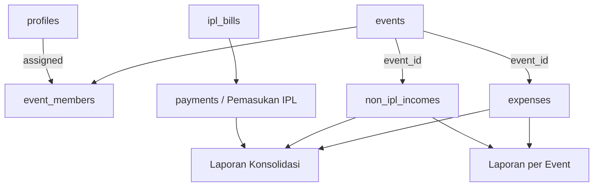

# Rencana Fitur Pemasukan Non-IPL dan Keuangan Event

> Sistem: Portal Warga Palm Village
> Status: Draft untuk review
> Tanggal: 1 Agustus 2026
> Ruang lingkup: Event/kegiatan, pemasukan non-IPL, pengeluaran event, dan laporan keuangan event

## 1. Tujuan

Fitur ini menambahkan pencatatan pemasukan yang tidak berasal dari tagihan IPL. Pemasukan non-IPL dibagi menjadi dua konteks:

1. Pemasukan umum non-IPL, misalnya donasi umum, penjualan aset, pendapatan sewa fasilitas, atau pemasukan lain yang tidak terkait event.
2. Pemasukan event/kegiatan, yang wajib terhubung ke satu event tertentu.

Fitur juga memperluas pengeluaran agar dapat dibedakan antara pengeluaran umum Palm Village dan pengeluaran event. Setiap event memiliki pengelola tersendiri dengan akses yang dibatasi berdasarkan assignment.

## 2. Keputusan Desain Utama

### 2.1. Role event bukan role global

`Anggota Koordinator Event` dan `Bendahara Event` tidak ditambahkan ke enum role global `profiles.role`. Keduanya disimpan sebagai assignment pada event melalui tabel relasi `event_members`.

Alasannya:

- Satu pengguna dapat menjadi Bendahara Event A dan Anggota Koordinator Event B.
- Hak akses otomatis berakhir ketika assignment dicabut atau event diarsipkan.
- Bendahara Event tidak memperoleh akses ke event lain atau ke pemasukan umum non-IPL.
- Role global yang sudah ada (`admin`, `bendahara`, `pengurus`, `warga`) tidak perlu diubah.

### 2.2. Pengelolaan master event

Sebagai default least-privilege:

- Admin dapat membuat, mengubah, mengarsipkan, dan mengatur anggota event.
- Bendahara dapat melihat seluruh event dan mengelola seluruh transaksi event, tetapi tidak mengubah master event atau assignment.
- Bendahara Event dan Anggota Koordinator Event hanya melihat master event yang ditugaskan kepadanya.
- Informasi event yang memang dipublikasikan untuk warga dapat tetap memakai mekanisme event/pengumuman publik yang terpisah dari panel keuangan.

### 2.3. Penghapusan bersifat soft delete

Event, pemasukan, dan pengeluaran yang sudah pernah masuk laporan tidak dihapus permanen. Aksi hapus mengisi `deleted_at` dan `deleted_by`, sehingga:

- histori audit tetap tersedia;
- saldo laporan lama tidak kehilangan jejak;
- data dapat dipulihkan oleh Admin jika diperlukan;
- foreign key tidak rusak.

## 3. Kondisi Sistem Saat Ini

Sistem production saat ini sudah mempunyai:

- tabel `events` dengan kolom dasar judul, deskripsi, tanggal, lokasi, dan pembuat;
- tabel `expenses` untuk pengeluaran umum;
- tabel `payments` yang khusus terhubung ke `ipl_bills` sebagai pemasukan IPL;
- tabel `audit_logs`;
- penyimpanan bukti pengeluaran melalui Google Drive;
- endpoint laporan `running-balance` dan `monthly-finance`;
- halaman Pengeluaran dan Laporan Keuangan.

Kesenjangan yang perlu ditutup:

- belum ada tabel pemasukan non-IPL;
- belum ada relasi pemasukan/pengeluaran terhadap event;
- belum ada assignment pengelola event;
- laporan hanya menghitung pemasukan IPL dan pengeluaran umum;
- hak akses masih berbasis role global, belum berbasis assignment event.

## 4. Arsitektur Domain



### 4.1. Perluasan tabel `events`

Tabel yang sudah ada tetap digunakan dan ditambahkan kolom:

| Kolom | Tipe konseptual | Keterangan |
| --- | --- | --- |
| `event_code` | text unique | Kode singkat event untuk filter dan audit |
| `end_date` | timestamptz nullable | Tanggal selesai bila event lebih dari satu hari |
| `status` | enum | `draft`, `active`, `completed`, `cancelled`, `archived` |
| `deleted_at` | timestamptz nullable | Penanda soft delete |
| `deleted_by` | uuid nullable | Admin yang menghapus/mengarsipkan |

Kolom `event_date` yang sudah ada dipertahankan sebagai tanggal mulai agar migrasi kompatibel.

### 4.2. Tabel `event_members`

Tabel ini menyimpan assignment per event:

| Kolom | Keterangan |
| --- | --- |
| `id` | Primary key UUID |
| `event_id` | Event yang dikelola |
| `profile_id` | Pengguna yang ditugaskan |
| `assignment_role` | `coordinator_member` atau `event_treasurer` |
| `assigned_by` | Admin yang memberi assignment |
| `assigned_at` | Waktu assignment |
| `revoked_at` | Waktu pencabutan akses, nullable |
| `revoked_by` | Admin yang mencabut akses, nullable |

Satu pengguna hanya memiliki satu assignment aktif pada event yang sama. `event_treasurer` sudah mencakup akses baca, sehingga tidak perlu assignment ganda sebagai coordinator.

### 4.3. Tabel `non_ipl_incomes`

Tabel baru untuk pemasukan non-IPL:

| Kolom | Keterangan |
| --- | --- |
| `id` | Primary key UUID |
| `income_date` | Tanggal pemasukan |
| `scope` | `general` atau `event` |
| `event_id` | Wajib untuk scope `event`, null untuk `general` |
| `category` | Kategori pemasukan |
| `source_name` | Nama pembayar/sumber dana |
| `amount` | Nominal positif |
| `payment_method` | `cash`, `bank_transfer`, atau `other` |
| `reference_number` | Nomor referensi opsional |
| `description` | Keterangan transaksi |
| `receipt_*` | Metadata file bukti mengikuti pola Google Drive pada expenses |
| `recorded_by` | Penginput transaksi |
| `created_at`, `updated_at` | Audit waktu |
| `deleted_at`, `deleted_by` | Soft delete |

Constraint wajib:

- `scope = 'event'` mengharuskan `event_id` terisi.
- `scope = 'general'` mengharuskan `event_id` null.
- `amount > 0`.

### 4.4. Perluasan tabel `expenses`

Tabel `expenses` tetap dipakai agar data dan endpoint lama kompatibel. Tambahan kolom:

| Kolom | Keterangan |
| --- | --- |
| `scope` | `general` atau `event`, default `general` |
| `event_id` | Wajib jika scope event |
| `deleted_at`, `deleted_by` | Soft delete dan audit |

Seluruh data expenses lama di-backfill menjadi `scope = 'general'` dan `event_id = null`.

## 5. Matriks Hak Akses

| Aksi | Admin | Bendahara | Bendahara Event | Anggota Koordinator Event | Koordinator Palm Village tanpa assignment | Warga |
| --- | :---: | :---: | :---: | :---: | :---: | :---: |
| Lihat semua master event | Ya | Ya | Tidak | Tidak | Tidak | Tidak melalui panel pengelolaan |
| Buat/ubah/hapus master event | Ya | Tidak | Tidak | Tidak | Tidak | Tidak |
| Kelola assignment event | Ya | Tidak | Tidak | Tidak | Tidak | Tidak |
| Lihat keuangan semua event | Ya | Ya | Tidak | Tidak | Tidak | Tidak |
| CRUD transaksi event yang di-assign | Ya | Ya | Ya | Tidak | Tidak | Tidak |
| Lihat transaksi/laporan event yang di-assign | Ya | Ya | Ya | Ya | Tidak | Tidak |
| CRUD pemasukan umum non-IPL | Ya | Ya | Tidak | Tidak | Tidak | Tidak |
| CRUD pengeluaran umum | Ya | Ya | Tidak | Tidak | Tidak | Tidak |
| Lihat laporan konsolidasi penuh | Ya | Ya | Tidak | Tidak | Tidak | Tidak |

Catatan:

- `admin_viewer` tetap read-only untuk kebutuhan demo dan tidak pernah mendapat izin mutasi.
- Pemeriksaan hak akses wajib dilakukan di backend dan RLS, bukan hanya menyembunyikan tombol di frontend.

## 6. Alur Pengguna

### 6.1. Membuat event dan assignment

1. Admin membuka menu Event/Kegiatan.
2. Admin membuat event dan mengisi judul, kode, tanggal, lokasi, deskripsi, dan status.
3. Admin memilih profil aktif sebagai Anggota Koordinator Event atau Bendahara Event.
4. Sistem menyimpan assignment dan audit log.
5. Pengguna yang ditugaskan melihat event pada daftar event miliknya.

### 6.2. Mencatat pemasukan non-IPL umum

1. Admin/Bendahara membuka menu Pemasukan Non-IPL.
2. Memilih jenis `Umum / Non-Event`.
3. Mengisi tanggal, kategori, sumber dana, nominal, metode, keterangan, dan bukti opsional.
4. Sistem memvalidasi bahwa `event_id` kosong.
5. Transaksi masuk laporan konsolidasi sebagai pemasukan non-IPL umum.

### 6.3. Mencatat pemasukan event

1. Admin/Bendahara memilih event mana pun; Bendahara Event hanya melihat event assignment-nya.
2. Memilih jenis `Event/Kegiatan` dan event yang aktif/selesai tetapi belum diarsipkan.
3. Mengisi detail dan bukti transaksi.
4. Backend memverifikasi akses ke event sebelum menyimpan.
5. Transaksi masuk ke laporan event dan laporan konsolidasi tanpa dihitung sebagai IPL.

### 6.4. Mencatat pengeluaran event

Alurnya mengikuti halaman Pengeluaran saat ini, dengan tambahan pilihan scope dan event. Bendahara Event hanya dapat memilih event assignment-nya. Anggota Koordinator Event tidak melihat tombol tambah/edit/hapus.

## 7. API yang Direncanakan

### Event dan assignment

- `POST /events/list`
- `POST /events/detail`
- `POST /events/create`
- `POST /events/update`
- `POST /events/delete` (soft delete)
- `POST /events/members/list`
- `POST /events/members/assign`
- `POST /events/members/revoke`
- `POST /events/my-access`

### Pemasukan non-IPL

- `POST /incomes/list`
- `POST /incomes/create`
- `POST /incomes/update`
- `POST /incomes/delete` (soft delete)

### Pengeluaran

- Endpoint expenses yang ada diperluas untuk menerima `scope` dan `event_id`.
- List wajib memfilter data sesuai akses pengguna.

### Laporan

- `POST /reports/event-finance`
- `POST /reports/financial-summary`
- Endpoint `running-balance` dan `monthly-finance` diperluas agar memisahkan IPL, non-IPL umum, event, dan pengeluaran.

Semua endpoint mutasi wajib menghasilkan `audit_logs`.

## 8. Rancangan UI dan Navigasi

### Menu Keuangan & IPL

- Matriks Bayar
- Verifikasi Bayar
- Pemasukan Non-IPL
- Pengeluaran
- Laporan Keuangan

### Menu Event/Kegiatan

- Daftar Event
- Event Saya, untuk pengguna yang memiliki assignment
- Detail Keuangan Event
- Pengelolaan Anggota, hanya Admin

### Filter penting

- Rentang tanggal/bulan
- Scope `Umum` atau `Event`
- Event
- Kategori
- Metode pembayaran
- Status aktif/terhapus untuk Admin

Frontend mengambil capability dari backend (`my-access`) agar menu dan tombol sesuai assignment. Capability frontend hanya untuk UX; keputusan final tetap di backend/RLS.

## 9. Laporan Keuangan

Laporan konsolidasi memisahkan komponen berikut:

```text
Saldo Awal
+ Pemasukan IPL
+ Pemasukan Non-IPL Umum
+ Pemasukan Event
- Pengeluaran Umum
- Pengeluaran Event
= Saldo Akhir
```

Laporan event menampilkan:

- total pemasukan event;
- total pengeluaran event;
- saldo/net event;
- rincian transaksi dan bukti;
- filter tanggal dan kategori;
- identitas penginput;
- ekspor CSV/PDF mengikuti pola laporan yang sudah ada.

Transaksi event tidak boleh dicatat ulang sebagai IPL atau pemasukan umum.

## 10. Keamanan, Audit, dan Integritas

- JWT/profile aktif wajib untuk seluruh endpoint.
- Backend tidak menerima role/capability dari request sebagai sumber kebenaran.
- Assignment diverifikasi dari database pada setiap operasi event.
- RLS menjadi defense-in-depth untuk SELECT/INSERT/UPDATE/DELETE.
- Record soft-deleted dikecualikan dari laporan normal.
- File bukti memakai pola Google Drive yang sudah ada, dengan validasi MIME dan ukuran.
- Event yang diarsipkan tidak menerima transaksi baru, tetapi transaksi lama tetap dapat dilihat.
- Update menggunakan pemeriksaan `updated_at` atau versi untuk mencegah overwrite diam-diam.
- Audit log mencatat before/after untuk perubahan nominal, tanggal, scope, event, dan assignment.

## 11. Kompatibilitas dan Migrasi

- Tidak mengubah tabel `payments`; alur IPL dan Midtrans tetap terpisah.
- Tidak mengubah enum role global.
- Data expenses lama tetap valid sebagai pengeluaran umum.
- Laporan lama harus tetap menghasilkan nominal yang sama sebelum pemasukan/event baru ditambahkan.
- Migrasi database harus idempotent dan memiliki skrip verifikasi serta rollback operasional.

## 12. Tahapan Implementasi

1. Finalisasi requirement dan matriks akses.
2. Migrasi schema, constraint, index, helper permission, dan RLS.
3. Backfill serta pengujian kompatibilitas expenses lama.
4. API event dan assignment.
5. API pemasukan non-IPL dan perluasan API expenses.
6. Agregasi laporan konsolidasi dan event.
7. Data service, mock data, dan capability frontend.
8. Halaman Event/Kegiatan.
9. Halaman Pemasukan Non-IPL dan perluasan Pengeluaran.
10. Laporan event dan laporan konsolidasi.
11. Audit, pengujian lintas role, UAT, dan dokumentasi operasional.

## 13. Di Luar Ruang Lingkup Versi Awal

- Pembayaran event melalui Midtrans/QRIS.
- Penjualan tiket dan kuota peserta.
- Refund otomatis.
- Rekonsiliasi bank otomatis.
- Approval berlapis atas transaksi.
- Pengiriman notifikasi eksternal kepada anggota event.

Fitur tersebut memerlukan persetujuan dan task terpisah.
