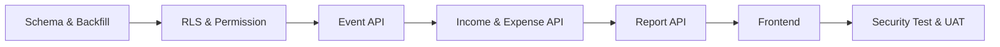

# Task Implementasi Pemasukan Non-IPL dan Keuangan Event

> Sistem: Portal Warga Palm Village
> Status: Belum dikerjakan — menunggu persetujuan implementasi
> Tanggal: 1 Agustus 2026

## 1. Prinsip Urutan Pengerjaan

Task dikerjakan berurutan dari database dan keamanan menuju API, UI, laporan, lalu UAT. UI tidak boleh dikerjakan sebelum kontrak data dan otorisasi server-side stabil.

## 2. Daftar Task Berurutan

| Urutan | Task ID | Tugas | Dependency | Status |
| ---: | --- | --- | --- | --- |
| 1 | EVT-001 | Bekukan keputusan domain dan RBAC | - | Pending |
| 2 | EVT-002 | Buat migrasi enum dan perluasan events | EVT-001 | Pending |
| 3 | EVT-003 | Buat tabel event_members | EVT-002 | Pending |
| 4 | EVT-004 | Buat tabel non_ipl_incomes | EVT-002 | Pending |
| 5 | EVT-005 | Perluas expenses dan backfill data lama | EVT-002 | Pending |
| 6 | EVT-006 | Buat index, constraint, trigger, soft-delete support | EVT-003–005 | Pending |
| 7 | EVT-007 | Buat helper permission dan RLS | EVT-006 | Pending |
| 8 | EVT-008 | Verifikasi migrasi dan kompatibilitas laporan baseline | EVT-007 | Pending |
| 9 | EVT-009 | Implementasi API master event | EVT-007 | Pending |
| 10 | EVT-010 | Implementasi API assignment event | EVT-009 | Pending |
| 11 | EVT-011 | Implementasi API capability/my-access | EVT-010 | Pending |
| 12 | EVT-012 | Implementasi API pemasukan non-IPL | EVT-011 | Pending |
| 13 | EVT-013 | Perluas API expenses untuk event | EVT-011 | Pending |
| 14 | EVT-014 | Implementasi audit log seluruh mutasi | EVT-009–013 | Pending |
| 15 | EVT-015 | Perluas running balance dan monthly finance | EVT-012–013 | Pending |
| 16 | EVT-016 | Implementasi laporan per event | EVT-015 | Pending |
| 17 | EVT-017 | Tambahkan dataService dan mock data frontend | EVT-009–016 | Pending |
| 18 | EVT-018 | Tambahkan helper capability dan route guard | EVT-011, EVT-017 | Pending |
| 19 | EVT-019 | Buat halaman master Event/Kegiatan | EVT-017–018 | Pending |
| 20 | EVT-020 | Buat UI assignment pengelola event | EVT-019 | Pending |
| 21 | EVT-021 | Buat halaman Pemasukan Non-IPL | EVT-017–018 | Pending |
| 22 | EVT-022 | Perluas halaman Pengeluaran dengan scope event | EVT-017–018 | Pending |
| 23 | EVT-023 | Buat halaman/detail Laporan Keuangan Event | EVT-016–018 | Pending |
| 24 | EVT-024 | Perbarui laporan konsolidasi dan ekspor | EVT-015, EVT-017 | Pending |
| 25 | EVT-025 | Perbarui navigasi, dashboard, dan audit log UI | EVT-019–024 | Pending |
| 26 | EVT-026 | Jalankan test database dan IDOR lintas event | EVT-007–016 | Pending |
| 27 | EVT-027 | Jalankan test frontend, build, dan regresi keuangan | EVT-017–025 | Pending |
| 28 | EVT-028 | UAT lintas role dan dokumentasi operasional | EVT-026–027 | Pending |

## 3. Detail Task

### EVT-001 — Bekukan keputusan domain dan RBAC

- Review `event-plan.md` dan `event-requirement.md` bersama owner.
- Konfirmasi bahwa master event dan assignment hanya dikelola Admin.
- Konfirmasi bahwa role event tetap assignment-scoped, bukan enum role global.
- Konfirmasi soft delete sebagai arti dari aksi hapus.
- Konfirmasi kategori dan metode pembayaran awal.
- Catat perubahan keputusan sebelum migrasi dibuat.

Output: requirement disetujui dan matriks akses final.

### EVT-002 — Migrasi enum dan perluasan `events`

- Tambahkan enum/status event atau constraint setara.
- Tambahkan `event_code`, `end_date`, `status`, `deleted_at`, dan `deleted_by`.
- Backfill `event_code` untuk event existing secara deterministik.
- Pertahankan `event_date` sebagai tanggal mulai.
- Tambahkan unique index event code aktif.

Output: migration idempotent tanpa menghapus data event existing.

### EVT-003 — Tabel `event_members`

- Buat tabel assignment beserta foreign key.
- Tambahkan role assignment `coordinator_member` dan `event_treasurer`.
- Tambahkan partial unique index untuk satu assignment aktif per profile/event.
- Simpan actor dan waktu assign/revoke.
- Tambahkan trigger `updated_at` bila model memakai update assignment.

Output: assignment historis dan aktif dapat dibedakan.

### EVT-004 — Tabel `non_ipl_incomes`

- Buat tabel dan constraint nominal positif.
- Tambahkan scope general/event dan constraint event ID kondisional.
- Tambahkan field sumber dana, metode, referensi, deskripsi, attachment, actor, dan soft delete.
- Samakan field attachment dengan pola Google Drive expenses.

Output: tabel pemasukan siap dipakai API.

### EVT-005 — Perluasan `expenses`

- Tambahkan `scope`, `event_id`, `deleted_at`, dan `deleted_by`.
- Backfill seluruh row existing sebagai `general`.
- Tambahkan constraint relasi scope/event.
- Pastikan response endpoint lama tetap kompatibel.

Output: total pengeluaran historis tidak berubah.

### EVT-006 — Index, constraint, dan trigger

- Index transaksi pada `(scope, event_id, date, deleted_at)`.
- Index assignment aktif pada event/profile/role.
- Trigger `updated_at` untuk table baru.
- Cegah transaksi baru pada event deleted/archived melalui API dan, bila layak, trigger database.
- Validasi foreign key delete behavior tidak menghapus histori keuangan.

### EVT-007 — Permission helper dan RLS

- Buat helper SQL untuk `current_profile_id`, global role, assignment aktif, dan capability event.
- Buat policy SELECT/INSERT/UPDATE/DELETE untuk event, event_members, non_ipl_incomes, dan expenses.
- Batasi execute privilege fungsi security-definer.
- Pastikan `admin_viewer`/read-only tidak dapat mutasi.
- Tambahkan test matrix untuk seluruh role.

Output: request lintas event ditolak di database.

### EVT-008 — Verifikasi migrasi

- Simpan baseline jumlah row dan total expenses per bulan.
- Terapkan migrasi di environment pengujian.
- Bandingkan baseline sesudah backfill.
- Uji rollback operasional dan backup.
- Jalankan advisor keamanan/performa database.

Gate: jangan lanjut ke API bila baseline berubah tanpa penjelasan.

### EVT-009 — API master event

- Implement list/detail dengan filter status dan akses.
- Implement create/update/delete untuk Admin.
- Delete mengarsipkan/soft-delete.
- Validasi payload, event code, tanggal, dan actor.
- Tambahkan response error 400/403/404/409 yang konsisten.

### EVT-010 — API assignment

- Implement list anggota untuk Admin dan anggota event terkait sesuai kebutuhan baca.
- Implement assign/update/revoke hanya untuk Admin.
- Tolak profil nonaktif/unapproved.
- Revoke harus efektif pada request berikutnya.

### EVT-011 — API capability `my-access`

- Kembalikan global capability dan daftar event assignment.
- Untuk setiap event kirim `can_view`, `can_manage_finance`, dan `can_manage_event`.
- Jangan menerima capability dari client pada endpoint lain.
- Cache hanya bila invalidasi assignment terjamin.

### EVT-012 — API pemasukan non-IPL

- Implement list dengan filter scope, event, tanggal, kategori, dan pagination.
- Implement create/update/delete dengan pemeriksaan akses server-side.
- Implement upload bukti Google Drive mengikuti pola expenses.
- Jangan izinkan Bendahara Event mengubah transaksi ke event lain.
- Exclude soft-deleted row dari response normal.

### EVT-013 — API expenses event-aware

- Perluas list/create/update/delete agar menerima scope dan event ID.
- Pertahankan kompatibilitas payload lama sebagai scope general.
- Terapkan permission general vs event.
- Pastikan cleanup/penggantian file tidak menghilangkan file sebelum database sukses.

### EVT-014 — Audit mutasi

- Log event, assignment, income, dan expense create/update/delete.
- Simpan ringkasan before/after untuk field finansial.
- Jangan log JWT, credential, atau isi file.
- Tambahkan filter action baru pada halaman Logs.

### EVT-015 — Laporan konsolidasi

- Perbarui agregasi `running-balance` dan `monthly-finance`.
- Pisahkan pemasukan IPL, non-IPL general, event, pengeluaran general, dan event.
- Pastikan transaksi soft-deleted tidak dihitung.
- Pastikan query tidak menggandakan row akibat join event_members.
- Tambahkan rekonsiliasi rumus saldo akhir.

### EVT-016 — Laporan per event

- Implement ringkasan income, expense, net, dan transaction count.
- Implement rincian dan filter tanggal/kategori.
- Terapkan permission event pada query sebelum agregasi.
- Sediakan data ekspor CSV/PDF.

### EVT-017 — Data service dan mock data

- Tambahkan service event, assignment, income, event expense, capability, dan report.
- Normalisasi response production/demo dengan bentuk yang sama.
- Tambahkan mock event dengan assignment lintas role untuk pengujian UI.
- Jangan menambahkan logic event ke alur Midtrans/IPL.

### EVT-018 — Helper capability dan route guard

- Buat helper event-scoped, bukan menaikkan hierarchy role global.
- Route guard memeriksa akses menu dasar.
- Komponen tetap memeriksa capability per event.
- Backend tetap menjadi sumber keputusan akhir.

### EVT-019 — Halaman master Event/Kegiatan

- List/filter event.
- Detail event, status, tanggal, dan lokasi.
- Tombol create/edit/delete hanya Admin.
- Tampilan read-only untuk Bendahara dan assigned member.
- Event deleted/archived tidak muncul pada selector transaksi baru.

### EVT-020 — UI assignment pengelola

- Selector profile aktif/approved.
- Pilihan Anggota Koordinator Event atau Bendahara Event.
- Daftar assignment aktif dan histori revoke untuk Admin.
- Konfirmasi sebelum revoke.
- Refresh capability sesudah perubahan.

### EVT-021 — Halaman Pemasukan Non-IPL

- Form scope general/event.
- Event selector berdasarkan capability.
- Field tanggal, kategori, sumber, nominal, metode, referensi, deskripsi, dan file.
- List dengan filter dan total.
- Tombol edit/delete berdasarkan capability record.
- Preview bukti memakai pola yang sudah stabil pada aplikasi.

### EVT-022 — Halaman Pengeluaran event-aware

- Tambahkan scope dan event selector.
- Pertahankan tampilan pengeluaran general existing.
- Filter event dan label scope pada list.
- Terapkan read-only untuk Anggota Koordinator Event.
- Pastikan Admin/Bendahara tetap dapat mengelola semua scope.

### EVT-023 — UI laporan event

- Summary cards pemasukan, pengeluaran, dan net.
- Tabel rincian dan bukti.
- Filter event/tanggal/kategori.
- Export CSV/PDF.
- Pengguna event-scoped tidak dapat memilih event lain.

### EVT-024 — UI laporan konsolidasi

- Pisahkan komponen pemasukan/pengeluaran pada summary dan chart.
- Tambahkan detail non-IPL dan event.
- Pertahankan tampilan IPL existing.
- Batasi laporan konsolidasi penuh untuk Admin/Bendahara.

### EVT-025 — Navigasi, dashboard, dan log UI

- Tambahkan menu Pemasukan Non-IPL dan Event/Kegiatan.
- Tampilkan menu Event Saya bila assignment tersedia.
- Perbarui active path dan dashboard quick action.
- Tambahkan label audit action event/income.
- Pastikan admin demo tetap read-only.

### EVT-026 — Test database/API/security

- Uji RLS semua tabel dengan role matrix.
- Uji IDOR: event treasurer A mencoba event B.
- Uji request langsung coordinator untuk create/update/delete.
- Uji revoke assignment saat session masih aktif.
- Uji soft delete, archived event, duplicate assignment, dan invalid scope.
- Uji upload failure dan rollback metadata database.

### EVT-027 — Test frontend dan regresi

- Unit test helper capability dan normalizer.
- Component test selector event dan visibility tombol.
- Build production.
- Regresi Expenses existing, Reports existing, IPL, bukti file, dan admin_viewer.
- Pastikan tidak ada perubahan pada endpoint Midtrans.

### EVT-028 — UAT dan dokumentasi operasional

- Jalankan skenario Admin, Bendahara, Bendahara Event, Anggota Koordinator Event, dan user tanpa assignment.
- Validasi laporan event dan konsolidasi dengan dataset terkontrol.
- Dokumentasikan cara membuat event, assign anggota, revoke, koreksi, dan soft delete.
- Dokumentasikan backup, restore, dan cleanup file.
- Catat hasil UAT dan issue tersisa sebelum deployment.

## 4. Checklist UAT Minimum

- [ ] Admin membuat Event A dan Event B.
- [ ] Admin assign User 1 sebagai Bendahara Event A.
- [ ] Admin assign User 2 sebagai Anggota Koordinator Event A.
- [ ] Bendahara Event A dapat CRUD pemasukan/pengeluaran Event A.
- [ ] Bendahara Event A tidak dapat melihat atau mengubah Event B.
- [ ] Anggota Koordinator Event A dapat melihat tetapi tidak dapat mutasi.
- [ ] Admin/Bendahara dapat CRUD transaksi seluruh event.
- [ ] Hanya Admin dapat CRUD master event dan assignment.
- [ ] Hanya Admin/Bendahara dapat CRUD pemasukan umum non-IPL.
- [ ] Pemasukan/pengeluaran event tampil pada laporan Event A.
- [ ] Laporan konsolidasi memisahkan seluruh komponen kas.
- [ ] Soft delete menghapus transaksi dari laporan aktif dan mempertahankan audit.
- [ ] Expenses lama dan laporan IPL tidak berubah setelah migrasi.
- [ ] Upload dan preview bukti berhasil.
- [ ] Build production berhasil tanpa error.

## 5. Definition of Done

Fitur dinyatakan selesai apabila:

1. Seluruh acceptance criteria pada `event-requirement.md` lulus.
2. RLS dan API sama-sama menolak akses lintas event.
3. Baseline laporan historis tetap konsisten.
4. Audit log tersedia untuk seluruh mutasi.
5. UAT semua role ditandatangani.
6. Tidak ada credential yang masuk source control.
7. Perubahan belum dipush hingga owner memberikan instruksi eksplisit.
