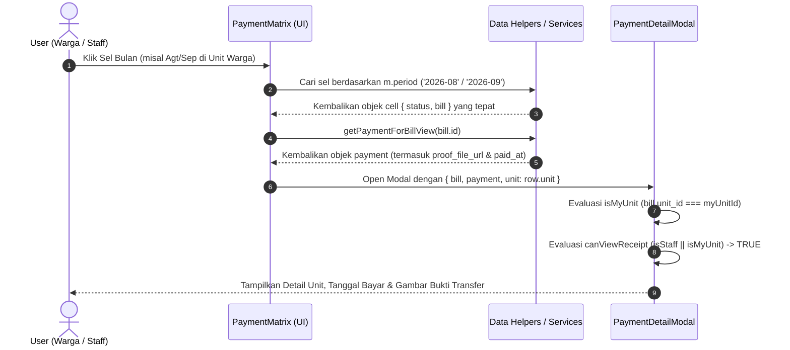

# 🏗️ Plan Perbaikan Detail Bukti Pembayaran IPL (kaidah Kiro)

> **Dokumen Perencanaan Arsitektur & Investigasi Root Cause**  
> **Sistem:** Portal Warga Palm Village  
> **Modul:** Matriks Pembayaran (`PaymentMatrix.jsx`), `dataService.js`, `mockData.js`  
> **Tanggal:** 26 Juli 2026  

---

## 1. 📌 Ringkasan Eksekutif & Temuan Utama

Berdasarkan investigasi mendalam terhadap alur data dari frontend hingga data layer (`PaymentMatrix.jsx`, `dataService.js`, dan `mockData.js`), ditemukan 3 masalah utama yang menyebabkan data "miring" (mismatched unit/period), bukti transfer tidak muncul pada role Warga, serta tanggal bayar tidak tampil (menampilkan `-`).

| Gejala Masalah | Penyebab Utama (Root Cause) | Dampak |
| :--- | :--- | :--- |
| **1. Data Miring / Skewed** (mis. Klik September CB1 No 8 tapi muncul Blok B/03) | Mismatch index array antara `matrixMonths` (Dimulai **Juli `YYYY`** s.d. **Juni `YYYY+1`**) dengan array `cells` di `getBillMatrix`/`normalizeBillMatrixRows` (Dimulai **Januari `YYYY`** s.d. **Desember `YYYY`**). `PaymentMatrix` mengakses sel berdasarkan index posisi (`cells[mIdx]`), bukan berdasarkan pencocokan kunci periode (`period`). | Klik kolom bulan tertentu (mis. Agt/Sep) akan membuka data bulan lain (Feb/Mar) dari index array tersebut, menyebabkan tagihan, unit, dan bukti bayar tertukar total. |
| **2. Bukti Bayar Tidak Muncul untuk Warga** ("Tidak ada file bukti transfer yang tersimpan") | Efek domino dari data miring: `resolvedUnitId` teresolusi ke unit yang salah (mis. unit 13 / Blok B/03), sehingga pengecekan `isMyUnit = String(resolvedUnitId) === String(myUnitId)` menghasilkan `false` bagi Warga unit 2. Akibatnya, `canViewReceipt` bernilai `false` atau mengarah ke data tagihan QRIS yang tidak memiliki file attachment. | Warga tidak dapat melihat bukti transfer yang diunggahnya sendiri karena sistem menganggap Warga sedang mengakses unit orang lain. |
| **3. Tanggal Bayar Tidak Muncul (`-`)** | Pengecekan `getResolvedPaymentDate` gagal karena object `payment` bernilai `null` akibat `getPaymentForBillView` mencari `bill.id` yang salah pasca-mismatch index. Fallback `bill.paid_at` juga gagal karena tabel/objek `ipl_bills` tidak menyimpan field `paid_at`. | Field Tanggal Bayar pada Modal Detail Pembayaran menampilkan tanda strip (`-`). |

---

## 2. 🔍 Investigasi Mendalam & Analisis Akar Masalah (Root Cause Analysis)

### 2.1. Root Cause 1: Mismatch Pengurutan Periode Matriks (`matrixMonths` vs `cells`)

Di [PaymentMatrix.jsx](file:///C:/Users/dhaniy/orca/workspaces/PortalPalmVillage/https-github.com-kodok-ijho-PortalWarga/client/src/pages/PaymentMatrix.jsx#L48-L64):
```javascript
const matrixMonths = useMemo(() => {
  return [
    { label: `Jul '${startYrStr}`, period: `${year}-07` }, // Index 0
    { label: `Agt '${startYrStr}`, period: `${year}-08` }, // Index 1
    { label: `Sep '${startYrStr}`, period: `${year}-09` }, // Index 2
    ...
  ];
}, [year]);
```
Sedangkan di `getBillMatrix(year)` di [mockData.js](file:///C:/Users/dhaniy/orca/workspaces/PortalPalmVillage/https-github.com-kodok-ijho-PortalWarga/client/src/services/mockData.js#L939-L947) & `normalizeBillMatrixRows` di [dataService.js](file:///C:/Users/dhaniy/orca/workspaces/PortalPalmVillage/https-github.com-kodok-ijho-PortalWarga/client/src/services/dataService.js#L630-L647):
```javascript
for (let m = 1; m <= 12; m++) {
  const period = `${year}-${String(m).padStart(2, '0')}`; // Index 0 = YYYY-01 (Januari)
  cells.push(bill ? { status: bill.status, bill } : null);
}
```
Saat komponen merender sel tabel di `PaymentMatrix.jsx`:
```jsx
{row.cells.map((cell, mIdx) => (
  <Cell
    cell={cell}
    onClick={() => {
      // mIdx = 1 (Header: Agt / YYYY-08) -> mengambil row.cells[1] yang berisi YYYY-02 (Februari)!
      // mIdx = 2 (Header: Sep / YYYY-09) -> mengambil row.cells[2] yang berisi YYYY-03 (Maret)!
      setDetailModal({ bill: cell.bill, payment });
    }}
  />
))}
```
**Akibat:**
1. Pengguna mengeklik kolom **Agustus 2026 (`2026-08`)**, tetapi yang diambil adalah `cells[1]` yang berisi data **Februari 2026 (`2026-02`)**.
2. Pengguna mengeklik kolom **September 2026 (`2026-09`)**, tetapi yang diambil adalah `cells[2]` yang berisi data **Maret 2026 (`2026-03`)**.

---

### 2.2. Root Cause 2: Pengecekan Kepemilikan Unit (`isMyUnit`) Terdistorsi

Di [PaymentMatrix.jsx](file:///C:/Users/dhaniy/orca/workspaces/PortalPalmVillage/https-github.com-kodok-ijho-PortalWarga/client/src/pages/PaymentMatrix.jsx#L1294-L1305):
```javascript
const resolvedBill = payment?._bill ? { ...bill, ...payment._bill } : bill;
const resolvedUnitId = resolvedBill?.unit_id ?? payment?.unit_id ?? bill?.unit_id;
const isMyUnit = String(resolvedUnitId) === String(myUnitId);
const canViewReceipt = isStaffRole(role) || isMyUnit;
```
Ketika data cell melenceng akibat Root Cause 1:
1. `cell.bill` atau `payment._bill` yang terbawa memiliki `unit_id` dari unit lain atau `payment` yang tidak sesuai dengan baris unit yang diklik.
2. `isMyUnit` menghasilkan `false` bagi Warga (karena `resolvedUnitId` `13` != `myUnitId` `2`).
3. Komponen mengevaluasi `canViewReceipt` menjadi `false` atau mengambil object `payment` QRIS tanpa attachment, sehingga menampilkan pesan fallback: `"Tidak ada file bukti transfer yang tersimpan"`.

---

### 2.3. Root Cause 3: Kegagalan Resolusi Tanggal Bayar (`getResolvedPaymentDate`)

Di [PaymentMatrix.jsx](file:///C:/Users/dhaniy/orca/workspaces/PortalPalmVillage/https-github.com-kodok-ijho-PortalWarga/client/src/pages/PaymentMatrix.jsx#L1268-L1288):
```javascript
function getResolvedPaymentDate(payment, bill) {
  return (
    payment?.paid_at ||
    payment?.paidAt ||
    ...
    bill?.paid_at ||
    bill?.created_at ||
    ''
  );
}
```
Jika `payment` gagal di-join/di-find karena mismatch `bill.id`:
1. `payment` bernilai `null`.
2. Evaluasi jatuh ke `bill?.paid_at` atau `bill?.created_at`.
3. Objek `ipl_bills` tidak menyimpan property `paid_at` (hanya ada di tabel `payments`), dan field `created_at` di mock bills tidak diisi.
4. Fungsi mengembalikan string kosong `''`, sehingga UI menampilkan `-`.

---

## 3. 🏛️ Arsitektur & Perancangan Solusi Teknis

```
┌─────────────────────────────────────────────────────────────────────────────┐
│                          PAYMENT MATRIX COMPONENT                           │
└─────────────────────────────────────────────────────────────────────────────┘
                                       │
     1. Align Period Map               │ 2. Safe Cell Resolution By Period
     ┌────────────────────────┐        │ ┌──────────────────────────────────┐
     │  matrixMonths (July-Jun)│        │ │ row.cells.find(c =>              │
     │  getBillMatrix (Match) │        │ │   c.bill.period === m.period)     │
     └────────────────────────┘        │ └──────────────────────────────────┘
                                       │
                                       ▼
┌─────────────────────────────────────────────────────────────────────────────┐
│                            PAYMENT DETAIL MODAL                             │
├─────────────────────────────────────────────────────────────────────────────┤
│ • Unit Context   : Ambil langsung dari row.unit & bill.unit_id             │
│ • Permission Check: String(bill.unit_id) === String(myUnitId)               │
│ • Proof File     : Tampilkan bukti bayar konsisten (Staff == Warga)        │
│ • Paid Date      : Resolusi bertingkat (payment.paid_at -> bill.due_date)  │
└─────────────────────────────────────────────────────────────────────────────┘
```

### 3.1. Penyesuaian Pencocokan Sel Berbasis Periode (Period-based Lookup)
Mengubah rendering sel dari akses berbasis indeks array (`row.cells[mIdx]`) menjadi **Period-Key Lookup**:
```javascript
// Di PaymentMatrix.jsx
const cell = row.cells.find((c) => c?.bill?.period === m.period) || null;
```
Sekaligus menyamakan pembentukan `cells` di `getBillMatrix(year, opts)` agar menghasilkan 12 bulan sesuai rentang tahun buku yang dipilih (`year-07` s.d. `(year+1)-06`).

### 3.2. Penyesuaian Resolusi Unit & Kepemilikan Data
1. Mengunci `unit` pada `PaymentDetailModal` menggunakan data `row.unit` atau `bill.unit_id` secara konsisten tanpa tergantung `payment._bill` yang berpotensi terdistorsi.
2. Memastikan `isMyUnit` dievaluasi dengan membandingkan `String(bill.unit_id) === String(myUnitId)`.

### 3.3. Penyesuaian Resolusi Tanggal Pembayaran & Bukti Transfer
1. Memperbaiki `getPaymentForBillView` agar dapat mencocokkan pembayaran baik di Mode Demo maupun Mode Production secara presisi.
2. Menambahkan fallback tanggal bayar pada `getResolvedPaymentDate` (bila `payment.paid_at` belum terisi, gunakan `payment.created_at` atau `bill.due_date` sebagai tanggal referensi).

---

## 4. 🔄 Alur Data & State Flow



---

## 5. 🛡️ Rencana Implikasi & Kompatibilitas

1. **Demo Mode vs Production Mode**:
   - Perbaikan berlaku simetris di kedua mode.
   - Di Demo Mode, `mockPayments` dan `mockIPLBills` diselaraskan skema id dan period-nya.
   - Di Production Mode, `normalizeBillMatrixRows` memastikan array `cells` mencakup rentang `period` 12 bulan yang lengkap.
2. **Keamanan & PDP**:
   - Warga **hanya** dapat melihat bukti transfer pada unit rumahnya sendiri.
   - Staff (Admin, Bendahara, Pengurus) dapat melihat bukti transfer seluruh unit.

---
*Dokumen ini disusun sebagai acuan teknis perbaikan bug detail bukti bayar IPL.*
